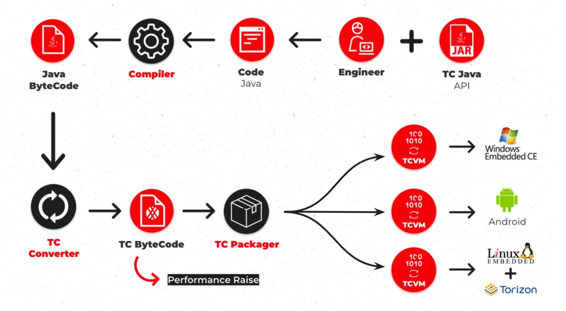
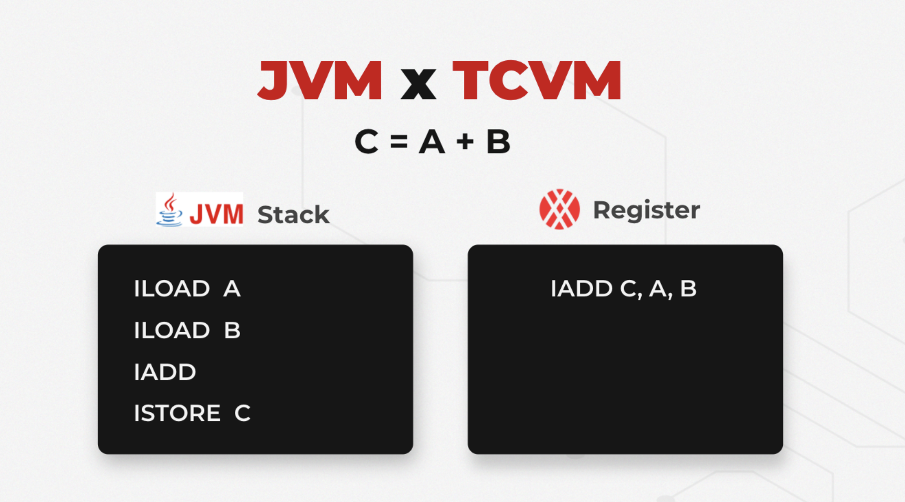
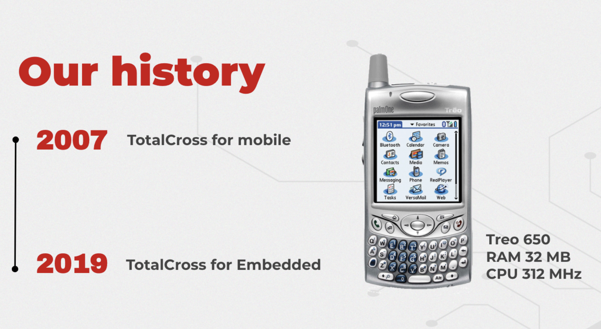
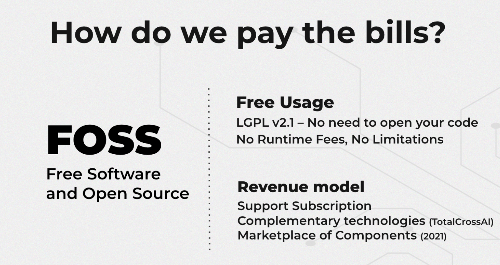
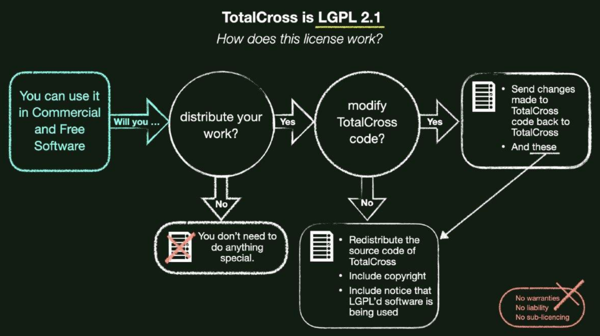

# TotalCross Overview

TotalCross is an open source cross-platform SDK developed to bring speed to GUI creation for embedded devices. TotalCross has the development benefits from Java without the need of Java running on the device, as it uses its own bytecode and virtual machine \(TC bytecode and TCVM\), created specifically for performance enhancement. TotalCross runtime is currently at 5MB to bring mobile grade user experience even for low-end MPUs.

TotalCross is compatible with:

* **Android** 4.0.3 and above \(API level 15\);
* **iOS** 8.0 and above;
* **Windows** XP and above;
* **Windows** CE;
* **Linux** 32 and 64 bits;
* **Linux ARM**
  * Yocto \(ex: [Toradex Boards](https://www.toradex.com/)\)
  * Angstron
  * Debian \(ex: [Raspberry Pi](https://www.raspberrypi.org/)\)


Java was chosen as the development language for TotalCross because it is **one of the largest development communities in the world!** It is on the top three most popular languages, with over **9 million Java developers** worldwide.


## No JVM running on the device

TotalCross only uses Java for coding, because the Java Bytecode is converted to TotalCross Bytecode \(TC Bytecode\) to run on the TotalCross Virtual Machine \(TCVM\).



## Why do I need TotalCross Bytecode and TotalCross Virtual Machine?

Java is widely used for Desktop, Web and Mobile applications but not so much for embedded applications. Embedded system devices usually need low footprint and high performance. That’s where TotalCross comes in. The TC bytecode and TCVM were built to increase the performance and lower the footprint of an application built with Java by deploying it natively. That means that Java won’t need to run on your embedded device.

The Java virtual machine \(JMV\) is stack-based while the TotalCross Virtual Machine \(TCVM\) is register-based. That means that simple functions \(like C = A+ B\) will potentially need **four instructions in JVM** while only **one instruction is needed in TCVM**.



The TotalCross Virtual Machine \(TCVM\) is a shared library written from scratch, and has the following features:

* It interprets a proprietary set of opcodes instead of Java Bytecodes.
* It has support for real multi-threading. Note that the TotalCross API does not support concurrency, which must be implemented by yourself.
* TotalCross class \(tclass\) files store internal information in little endian, the most widely used format of actual microprocessors.
* tclass files are highly optimized to save space. For instance, the constant pool \(where strings, constants, and identifiers are stored\) is shared among all deployed classes, and each class entry is compressed using zlib.
* It supports headless applications \(like daemon applications, without user interface\): just implement the interface totalcross.MainClass and this class will be loaded by the TCVM. The appStarting\(\) and appEnding\(\) methods are called and the application exits.
* Supports the method finalize\(\). This method runs every time the garbage collector \(GC\) finishes its job. There’s a limitation: no objects can be created inside a finally method, otherwise the method will silently abort itself. Optionally, to improve GC’s performance, you can define in your class a public non-static field named dontFinalize that, if present and set to true, will skip the finalize call. In most cases, finalize\(\) is used to ensure that a class that holds system resources \(like file or socket\) and should be closed to release these resources is always closed, either because the programmer forgot to do it himself or because the program was halted by an exception. Note that you must define the field dontFinalize and set it to true when the close method is run for the first time. Otherwise the GC will try to finalize an object that was already closed by the programmer, which may cause trouble. Doing so also speeds up the GC.

## Built to be lean

The TotalCross technology started in 2007 to speed up mobile application development. The main target in that time was the [Palm Treo 650](https://en.wikipedia.org/wiki/Treo_650) which had low computing power with:

* 312 MHz Intel PXA270 processor
* 32 MB \(Non-Volatile File System built-in, flash shared memory\) \(23 MB available\)

From 2019 TotalCross also supports embedded systems devices, providing great UI/UX.



## Licensing

TotalCross SDK is a Free and Open Source Software \(FOSS\) under the LGPL v2.1 license. It means no license and runtime fees even for commercial usage, without needing to open the project source code.  
TotalCross revenue model is not based on license and runtime sales. It is based on services \(support, integrations and GUI design\), complementary technologies and a future marketplace of components.



### Complying with LGPL v2.1



## Graphics, Palette and Color

TotalCross has a graphics engine written from scratch, and some important performance-tailored decisions were taken.

Regardless of the device’s color depth, the screen and images are stored in a 24 bpp RGB array. All drawings are made into a single off screen, which is then converted on the fly to the device’s screen color depth when the updateScreen\(\) method is called. Note that since 2011, no devices with 8 bpp are released to the market; all of them use at least 16 bpp \(65536 colors\).

The Graphics class **supports real clipping**, which allowed us to support containers that automatically show scrollbars if components are placed beyond its limits.

**TotalCross also supports screen rotation and collapsible input area**. If the user interface is implemented using only relative coordinates, **it will automatically reposition itself whenever the screen resolution is changed**.

Note that aControl.setRect\(getClientRect\(\)\) should never be used, otherwise the automatic repositioning will not work. Instead, aControl.setRect\(LEFT, TOP, FILL, FILL\) should be used to produce the same result without affecting the repositioning. If you really have to use getClientRect\(\), you must also override the reposition\(\) method to support screen rotation. \(see the WorldWatch sample\).

Colors are represented by int values in the **0xRRGGBB** format. A null color is represented by the value -1.

## Images

Images in TotalCross supports transparency \(also known as alpha-channel\). The best way to show images is to generate a PNG image from a vectorized image through Photoshop or any other good editor. Prefer creating a big image \(for example, 96x96\), then decrease its size at runtime using Image.getSmoothScaledInstance.

## Inheritance and Delegation event models

TotalCross supports both Inheritance \(Java 1.0\) and Delegation \(Java 1.1\) event models. The Inheritance model will make your code smaller and faster, but there are some situations that require the usage of the Delegation model.

### onEvent

```java
public class MyProgram extends Container{
    Button pushB;
    ​
    public void initUI(){
        add(pushB = new Button("Push me, please"), CENTER, TOP);
    }
    ​
    public void onEvent(Event event){
        switch (event.type){
            case ControlEvent.PRESSED:
            if (event.target == pushB)
            // handle pushB being pressed
            break;
        }
    }
}
```

### Listener

```java
public class MyProgram extends Container{
    Button pushB;
    ​
    public void initUI(){
        add(pushB = new Button("Push me\nPlease"), CENTER, TOP);
        pushB.addPressListener((e) -> {
            // handle pushB being pressed
        });
    }
}
```

## Security

TotalCross applications are currently impossible to be decompiled, because, as mentioned before, TotalCross uses a proprietary set of opcodes instead of Java Bytecodes. The translation between Java Bytecodes to TotalCross opcodes is done automatically when the application is deployed.

However, this also means that you cannot retrieve your application’s source files from the deployed application, so don’t forget to backup your source files!

