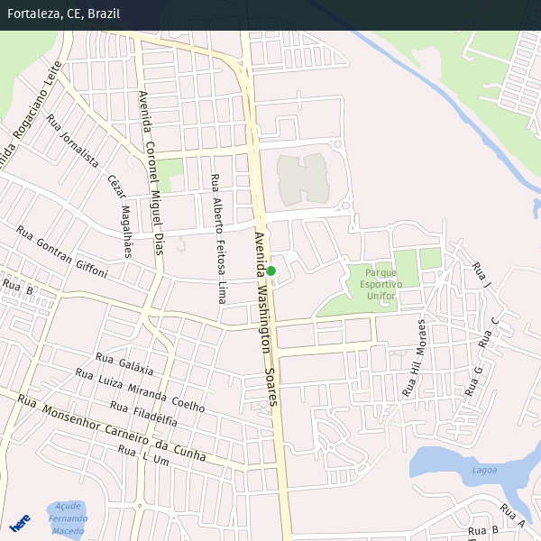
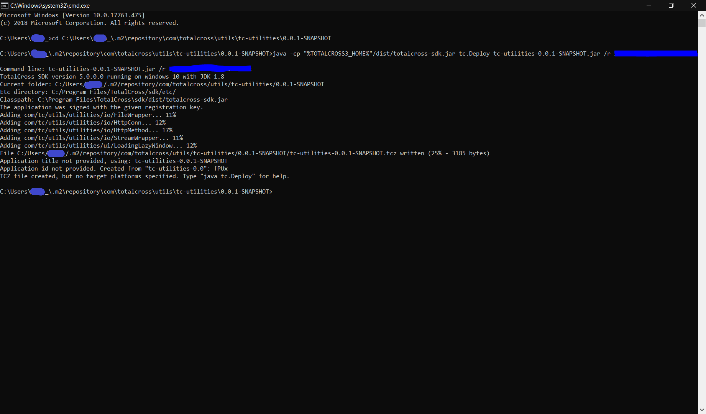
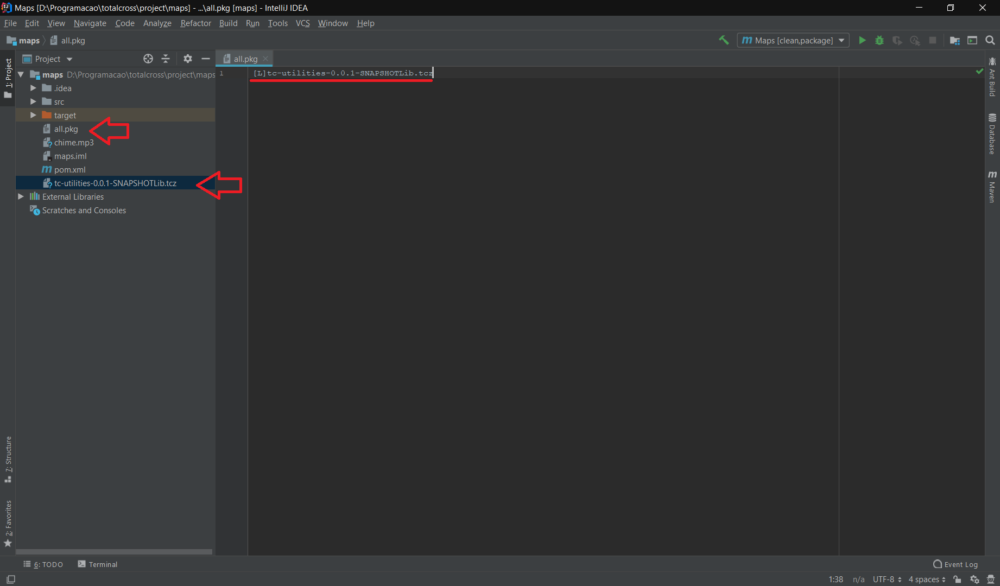
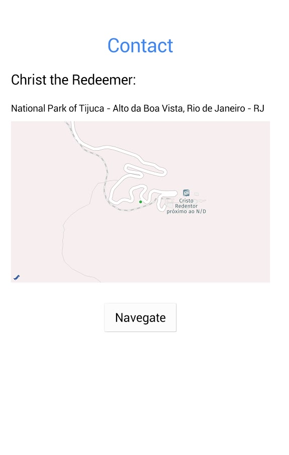

# Static Map

The static map is an image captured by the request of a navigation REST API. This code uses the GOF build pattern.



### Requirements

#### Dependecy

You need to add in your **pom file** within your **dependencies tag** the dependency:


```text
<dependencies>
    .
    .
    .
    <dependency>
        <groupId>com.totalcross.utils</groupId>
        <artifactId>tc-utilities</artifactId>
        <version>0.0.1-SNAPSHOT</version>
    </dependency>
    
</dependencies>
```


After downloading the dependency it will be necessary to generate the tcz of the dependency so that it is included in the deploy

Find the folder that is located in the dependency, usually is: C:\Users\**your\_user**\.m2\repository\com\totalcross\utils\tc-utilities\0.0.1-SNAPSHOT


To generate tcz execute the command java -cp "% TOTALCROSS 3\_HOME%" / dist / totalcross-sdk.jar tc.Deploy tc-utilities-0.0.1-SNAPSHOT.jar / r YOUR\_TC\_KEY 



After tcz is generated, rename the tc-utilities-0.0.1-SNAPSHOT.tcz file to tc-utilities-0.0.1-SNAPSHOTLib.tcz and place it at the root of the project.

At the root of the project create the file named all.pkg and put \[L\] tc-utilities-0.0.1-SNAPSHOTLib.tcz so that this class is included in deploy



#### KEY

in the example below, the class was made considering the [**API HERE**](https://developer.here.com/), to get an **APP ID** and **APP CODE** you have to register on the site and create a project, going into the details of the project you will find this information.


The 3 points are only to represent in a more playful way that there are other dependencies


### Static Map Structures

 in the example below the class was made considering the [**API HERE**](https://developer.here.com/)\*\*\*\*

Create in **util** package a new class **StaticMap**


```text
└── src
    └── main
        └── java
            └── com.your_company_name.your_name_app
                .
                .
                .
                └── util
                    └── StaticMap
                
```



The 3 points are only to represent in a more playful way that there are other package.


### Static Map Code


```java
package <YOUR_PACKAGE_HERE>; // com.your_company_name.your_name_app.util;

import com.tc.utils.utilities.io.HttpConn;
import com.tc.utils.utilities.io.HttpMethod;
import totalcross.io.ByteArrayStream;
import totalcross.io.IOException;
import totalcross.io.Stream;
import totalcross.sys.Convert;
import totalcross.ui.image.Image;
import totalcross.ui.image.ImageException;

public class StaticMap {

    private String appID;
    private String codeID;
    private String andress;
    private int width;
    private int height;
    private int zoom;
    private int format;
    private boolean showMapHeader;
    private String mapStyle;
    private double latitude = Integer.MAX_VALUE;
    private double logitude = Integer.MAX_VALUE;


    public static final int PNG_FORMAT = 0;
    public static final int JPEG_FORMAT = 1;
    public static final int GIF_FORMAT = 2;
    public static final int BMP_FORMAT = 3;
    public static final int PNG8_FORMAT = 4;
    public static final int SVG_FORMAT = 5;

    public static final String ALPS_STYLE = "alps";
    public static final String DREAMWORKS_STYLE = "dreamworks";
    public static final String FLAME_STYLE = "flame";
    public static final String FLEET_STYLE = "fleet";
    public static final String MINI_STYLE = "mini";


    public StaticMap(){
        andress = "";
        latitude = logitude = Integer.MAX_VALUE;
        width = 300;
        height = 300;
        zoom = 14;
        format = PNG_FORMAT;
        showMapHeader = false;
        mapStyle = ALPS_Style;
    }

    public StaticMap(String appID, String codeID){
        this();
        this.appID = appID;
        this.codeID = codeID;
    }


    public Image getImage() {
        Image img = null;

        String req = "https://image.maps.api.here.com/mia/1.6/mapview";
        req += "?app_id=" + appID;
        req += "&app_code=" + codeID;
        if (andress.isEmpty()){
            req += (logitude != Integer.MAX_VALUE && latitude != Integer.MAX_VALUE) ? "&c=" + latitude + "," + logitude : "";
        }else{
            req += "&ci=" + Convert.removeAccentuation(andress).replace("  ", " ").replace(' ', '+');
        }
        req += "&h=" + height;
        req += "&w=" + width;
        req += "&z=" + zoom;
        req += "&f=" + format;
        req += "&i=" + showMapHeader;
        req += "&style=" + mapStyle;

        try {

            HttpConn conn = new HttpConn(req);
            conn.setHttpMethod(HttpMethod.GET);
            Stream stream = conn.connect();

            if (conn.getResponseCode() == 200) {

                byte[] buff = new byte[1024];

                ByteArrayStream bas = new ByteArrayStream(8192);

                while (true) {
                    int n = stream.readBytes(buff, 0, buff.length);
                    if (n <= 0) {
                        break;
                    }
                    bas.writeBytes(buff, 0, n);
                }
                img = new Image(bas.getBuffer());
            }
        } catch (IOException e) {
            e.printStackTrace();
        } catch (ImageException e) {
            e.printStackTrace();
        }
        return img;
    }


    public static class Builder {

        StaticMap staticMap = new StaticMap();

        public Builder(){}

        public Builder(String appID, String codeID) {
            staticMap.appID = appID;
            staticMap.codeID = codeID;
        }

        public StaticMap.Builder setAppID(String appID){
            staticMap.appID = appID;
            return this;
        }

        public StaticMap.Builder setCodeID(String codeID){
            staticMap.codeID = codeID;
            return this;
        }

        public StaticMap.Builder setAdress(String location){
            staticMap.andress = location;
            return this;
        }

        public StaticMap.Builder setHeight(int height){
            staticMap.height = height;
            return this;
        }

        public StaticMap.Builder setWidth(int width){
            staticMap.width = width;
            return this;
        }


        public StaticMap.Builder setZoom(int zoom){
            staticMap.zoom = zoom;
            return this;
        }

        public StaticMap.Builder setFormat(int format){
            staticMap.format = format;
            return this;
        }

        public StaticMap.Builder setShowMapHeader(boolean showMapHeader){
            staticMap.showMapHeader = showMapHeader;
            return this;
        }

        public StaticMap.Builder setMapStyle(String mapStyle){
            staticMap.mapStyle = mapStyle;
            return this;
        }
        public StaticMap.Builder setLocation(double latitude, double logitude){
            staticMap.latitude = latitude;
            staticMap.logitude = logitude;
            return this;
        }

        public StaticMap build(){
            return staticMap;
        }

    }

}
```


#### \*\*\*\*

| Atributes | Description |
| :--- | :--- |
| String AppID | [Key provided by API to identify APP](https://app.gitbook.com/@totalcross/s/playbook/~/drafts/-LeKp9rBA6-LbNYmHT6E/primary/apis/maps/static-map#key) |
| String CodeID | [Key provided by API to identify APP](https://app.gitbook.com/@totalcross/s/playbook/~/drafts/-LeKp9rBA6-LbNYmHT6E/primary/apis/maps/static-map#key) |
| String adress | It receives an address, as in the example: "Av. Washington Soares, 1321 - Edson Queiroz, Fortaleza - CE, 60811-905" |
| double latitude | it receives a latitude  |
| double logitude | it receives a latitude  |
| int width | Image width |
| int height | Image height |
| int zoom | The zoom that is applied in the map photo, going from zero \(Vision farther\) to 21, where 21 will give the view of the whole state and between 0 to 21 it is possible to adjust how close the image is seen. |
| int format | Indicates the format of the image received |
| Boolean mapHeader | Remove or place the map header |
| String mapStyle | Changes the map style received in the image |

### How to use

Within the InitUi \(\), you can declare an image and receive its instance by calling the StaticMap getImage method


```java
public class Maps extends MainWindow {

    public Maps(){
        setUIStyle(Settings.Material);
    }

    @Override
    public void initUI() {
        // Cristo Redentor = -22.951916, -43.2126759;

        double lat = -22.951916;
        double log = -43.2126759;

        int gap = UnitsConverter.toPixels(Control.DP + 16);

        Label lblContact = new Label("Contact");
        lblContact.setForeColor(0x4286f4);
        lblContact.setFont(Font.getFont(false,28));
        add(lblContact, CENTER, TOP + UnitsConverter.toPixels(DP + 50));

        Label lblName = new Label("Christ the Redeemer:");
        lblName.setFont(Font.getFont(false,20));
        add(lblName, LEFT + gap, AFTER + UnitsConverter.toPixels(DP + 20));

        Label lblAdress = new Label("National Park of Tijuca - Alto da Boa Vista, Rio de Janeiro - RJ");
        lblAdress.setFont(Font.getFont(false,14));
        lblAdress.autoSplit = true;
        add(lblAdress, LEFT + gap, AFTER + UnitsConverter.toPixels(DP + 20));

        StaticMap staticMap = new StaticMap.Builder("Fola4mnv4rVDbjzo3Obu", "6Xgu6eVAmLKOPLZXZgy5-Q")
                .setLocation(lat,log)
                .setWidth(Settings.screenWidth - 2 * gap)
                .setHeight(Settings.screenHeight / 3)
                .setZoom(17)
                .build();

        ImageControl imgC = new ImageControl(staticMap.getImage())  ;
        add(imgC, LEFT + gap, AFTER + UnitsConverter.toPixels(DP + 10));

        Button btn = new Button("Navegate");
        btn.addPressListener(e -> {
            String vsEndereco = "geo:"+ lat + "," + log + "?q=" + lat + "," + log;
            Vm.exec("url", vsEndereco,  0, true);
        });
        btn.setFont(Font.getFont(false,18));
        add(btn, CENTER, AFTER + UnitsConverter.toPixels(DP + 30));

    }
}
```




## References

See this link for more information abount [GOF patterns](http://www.w3sdesign.com/).


