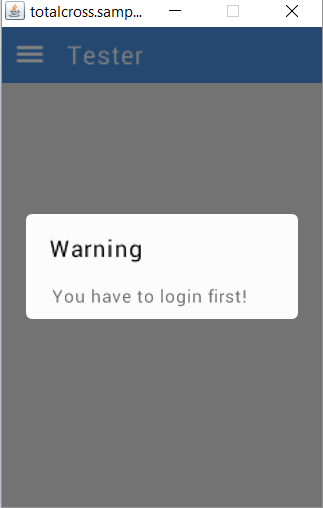
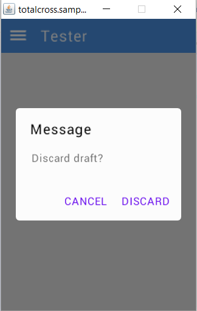
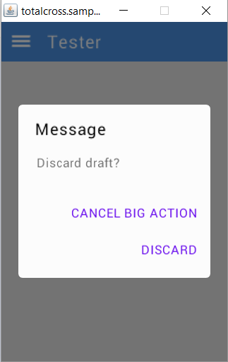
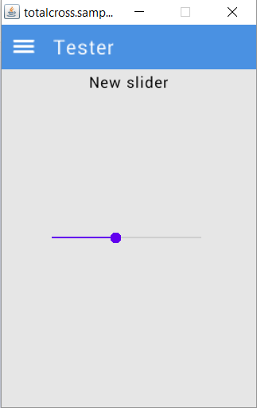
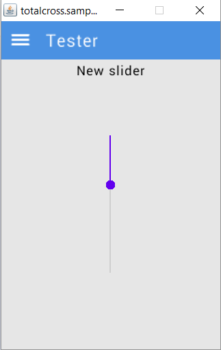
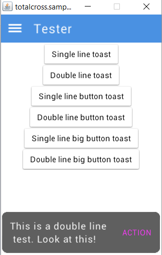
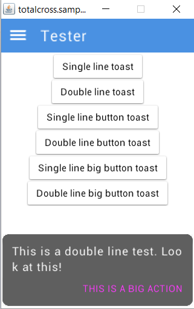

# Material Design Standards

We'll be passing through changes to the base Material Design looks. All of the changes will be listed below.

* [x] Buttons

  * Completely renovated design.
  * Left, right, top, bottom and icon paddings will be added, having their preferred values in Material standards, but also made possible to change by just changing the Button fields: paddingLeft, paddingRight, paddingTop, paddingBottom, and iconPadding.
  * The button will be which one you want from Material Design much more easily, like "Contained Button", "Contained Button with icon", "Outlined Button" and "Text Button".

  **Remember:** You'll always be able to modify all of these values the way you desire.

*  Check
  * Insets and text gap will be added, having their preferred values in Material standards.

    **Remember:** You'll always be able to modify all of these values the way you desire.
*  ComboBox
  * Completely renovated design.
  * Left, right, top and bottom paddings and icon gap will be added, having their preferred values in Material standards, but it is also possible to change them via public attributes.
  * The arrow color, margin, and size will change.
  * The ListBox used to show the options of the ComboBox component will also follow the Material standards.

    **Remember:** You'll always be able to modify all of these values the way you desire.
* \[X\] ListBox
  * Some design adjustments.
  * Left, right, top and bottom paddings will be added, having their preferred values in Material standards.
  * You'll be able to add a right icon now, having a left and right icon at the same time, if you want to. \(Previously, you only could add a left icon\)
  * You'll be able to control the gap between the icon and the item text.
  * The ListBox used on a DropDown context \(like on a ComboBox\) will follow its Material standards, which is different when it's used as a simple list.

    **Remember:** You'll always be able to modify all of these values the way you desire.
* [x] Edit
  * Some design adjustments.
  * **OutlinedEdit** added, having the preferred values in Material standards, but made possible to change via public atributes and methods.
* [ ] Grid
* [ ] ListContainer
* [x] MaterialWindow
* \[X\] MessageBox
  * Completely renovated design.
  * Left, right, top and bottom paddings added, having their preferred values in Material standards, but it is also possible to change them via public attributes.
  * Public gap values between internal elements, so you can change it the way you want.
  * Public text fonts, so you can customize it the way you desire.
  * Here are some images, so you can get the preview:

    

    

    
* [ ] MultiEdit
* [x] ProgressBar
  * Completely renovated design.
  * Now you can change the filled bar size when it's an endless bar.
  * Now when the filled bar reaches the end of the progress bar, it gradually starts appearing at the beginning of the progress bar when the bar is endless.
* \[X\] ProgressBox
  * Completely renovated design.
  * Now the endless bar starts gradually at the beginning while the bar reaches the end of the progress bar.
  * Here are some images, so you can get the preview:

    

    
* [x] PopupMenu
  * Completely renovated design
  * Now you can popup this anywhere you want by using popupAt\(int x, int y\). This can be pretty useful when you want to show some quick options.
  * Now you can change the size of its bounds.
  * Now you can get the ListBox \(which is the menu\) and change its paddings.
* [ ] PushButtonGroup
* [x] RadioButton
* [x] SideMenu
* \[X\] Slider
  * Small adjusts to follow Material Design standards.
  * Now the ticks are drawn behind the slider circle, not above.
  * Now you can choose the ticks color independently with the ticksColor attribute.
  * Now you can choose the bar height with the barHeight attribute.
  * Here are some images, so you can get the preview:

    

    
* \[X\] Switch
  * Small adjusts to follow Material Design standards.
* [ ] TabbedContainer
* \[X\] Toast
  * Completely renovated design.
  * Now you can add a button to it that will be shown at the right, so you can add events to it to do whatever you desire.
  * A bug where the Toast faded out immediately after called is now fixed.
  * Here are some images, so you can get the preview:

    

    

    
* [ ] Tooltip
* [ ] TopMenu

This page will be updated constantly.

