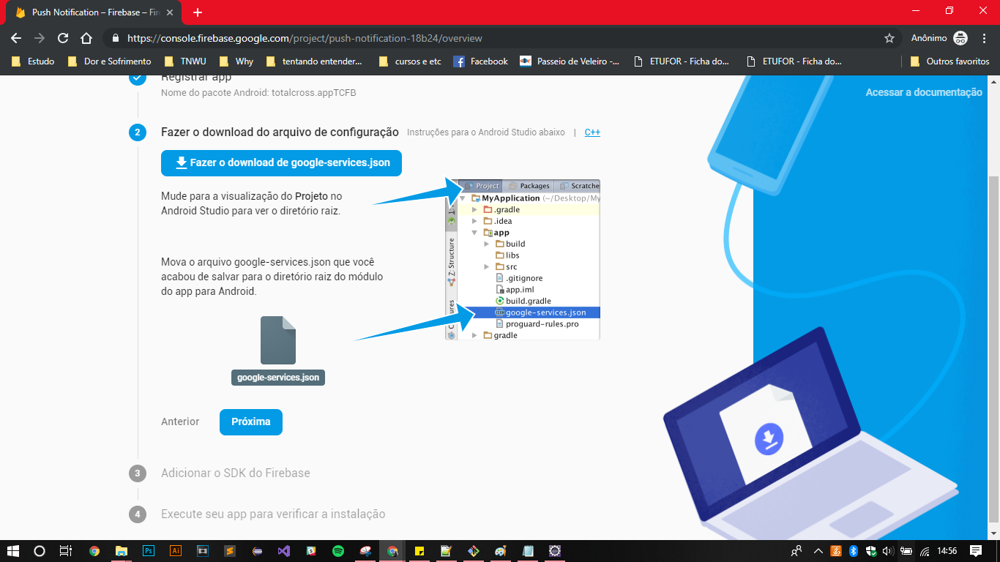

# Push Notification Firebase

We can judge as notifications as and in some cases with the same irritant. But even so, dates remain one of the most efficient ways to interact with your users and ensure their return to your application.

You can use Firebase as a basis to send a notification to the user of your mobile application.

## What is Firebase?

[Firebase](https://firebase.google.com/?gclid=Cj0KCQjw4fHkBRDcARIsACV58_GiXRpyAtn5fhmrMzOek0nBNHGtA9H2KEFg05N8C_qKtm2aPU34FGQaAqrsEALw_wcB) is a platform that offers several services for both mobile and web applications. With this technology, you can incrementally add to your app several functions in a simple and fast way.

When it comes to notification, TotalCross uses the service called **Cloud Messaging**.


[Firebase Cloud Messaging \(FCM\)](https://firebase.google.com/docs/cloud-messaging/?hl=en-us) is a message solution between platforms, allowing you to send notifications reliably and cost-effectively.


Until now, there were no binding to get the Firebase Identitity Token, but **as of TotalCross 3.43 for Android** and **TotalCross 4.1.0 for iOS**, we finally finish these binds!

## Configuring the Environment

### Creating a TotalCross Project.

* Create a **Maven project** called **PushNotification\_Firebase** and configure pom.xml to use TotalCross.

If you **don't know** how to create and configure a Maven project, log in below:



* Create a package called **pushnotification\_firebase**, and then create a class with the same name. This class will be our **MainWindow**.


Within the PushNotification\_Firebase, create a **static String** named **firebaseToken**. And within the method, we will use the command `FirebaseInstanceId.getInstance().GetToken();` to get the token. In addition, we'll add a message to be printed on the console to show the token. In the end, it will look like this:


```java
public static String firebaseToken;

	public PushNotification_Firebase() {
		firebaseToken = FirebaseInstanceId.getInstance().getToken();
		System.out.println("FIREBASE TOKEN: " + firebaseToken);
	}
```



This token is needed to send a unicast message to a single device, or to identify that device so that we can create a group to send messages. So let's start with the basics and then go toward the identification of a single device to send a custom message for it.


* Okay, done that, let's create a static block to set the application ID of your application through the `applicationID` attribute. In android this is called **APP Bundle**. With this, our PushNotification\_Firebase class will look like this:


```java
public class PushNotification_Firebase extends MainWindow {
	public static String firebaseToken;

	public PushNotification_Firebase() {
		firebaseToken = FirebaseInstanceId.getInstance().getToken();
		System.out.println("FIREBASE TOKEN: " + firebaseToken);
	}
	
	static{
		Settings.applicationId = "TCFB";
	}
}
```



the chosen Id must always be a string with 4 letters. This id is very important because the name of our Android project should be totalcross.app . Do not worry, let's get better at the next step! 


* Finally, check if your project has a folder named **target**, otherwise, create a folder named target in the same location as the pom.xml, src, and .settings file.


### Creating a Firebase project

* Go to [Firebase](https://firebase.google.com/) website and click "Go to Console," and then click "Create New Project." Let's call it "Push Notification"


Then you can click on "Create project" and then "Continue".

You will be redirected to an overview of your project, where you will click on the Android icon that is in the banner of the page, as shown in the image below:


* A form will appear for you to fill out. In the first step, Register App, you only need to fill in the name of the Android package. Here you must fill in with **totalcross.app&lt;Settings.applicationID&gt;**  that you filled in the previous step. In this case, it will be called **totalcross.appTCFB**. You can then click Register App.


* The second step is quite simple, just click to download the file **google-services.json** and then copy the file and paste inside the **target** folder, within your project and then click **next**.


If you are deploying to Android and TotalCross can't find google-servoces.json, it will tell you that Firebase won't work with this message:

"Could not find 'google-services.json', thus Firebase will be ignored further on"




* Step 3 is just to Gradle, so we can **click next**
* Step 4 will only be possible when we test, so we can click the "**Skip step**" option.

## Implementation

Now, with the environment set up, we can go back to our `MainWindow`, the PushNotification\_Firebase. Inside it, let's create two more methods: **`onTokenRefresh()`** and **`onMessageReceived()`**.

### Receiving Token

It is through **onTokenRefresh\(\)** that you will be able to receive the Token to later save and associate with a user. Check out the example below:


```java
protected FirebaseInstanceIdService initFirebaseInstanceIdService() {
    return new FirebaseInstanceIdService() {
        @Override
        public void onTokenRefresh() {
            firebaseToken = FirebaseInstanceId.getInstance().getToken();
            System.out.println("Token refresh");
        }
    };
}
```


### Receiving Notification

The `onMessageReceived()` method fires every time the APP receives a notification, so to be more illustrative when testing, we will use this method to print to the console which notification was sent. Just copy the code below


```java
    protected FirebaseMessagingService initFirebaseMessagingService() {
        return new FirebaseMessagingService() {
            @Override
            public void onMessageReceived(RemoteMessage remoteMessage) {
                Vm.debug("I was called");
                System.out.println((String)remoteMessage.getData().get("hello"));
            }
        };
    }
```


### Reviewing PushNotification\_Firebase class \(extends MainWindow\)

And finally, your main class must to be as follows:


```java
package pushnotification_firebase;

import totalcross.firebase.FirebaseMessagingService;
import totalcross.firebase.RemoteMessage;
import totalcross.firebase.iid.FirebaseInstanceId;
import totalcross.firebase.iid.FirebaseInstanceIdService;
import totalcross.sys.Settings;
import totalcross.sys.Vm;
import totalcross.ui.MainWindow;

public class PushNotification_Firebase extends MainWindow {
	public static String firebaseToken;

	public PushNotification_Firebase() {
		firebaseToken = FirebaseInstanceId.getInstance().getToken();
		System.out.println("FIREBASE TOKEN: " + firebaseToken);
	}
	
	static{
		Settings.applicationId = "TCFB";
		Settings.iosCFBundleIdentifier = "totalcross.appABCD";
	}

	@Override
	protected FirebaseInstanceIdService initFirebaseInstanceIdService() {
		return new FirebaseInstanceIdService() {
			@Override
			public void onTokenRefresh() {
				firebaseToken = FirebaseInstanceId.getInstance().getToken();
				System.out.println("Token refresh");
			}
		};
	}

	@Override
	protected FirebaseMessagingService initFirebaseMessagingService() {
		return new FirebaseMessagingService() {
			@Override
			public void onMessageReceived(RemoteMessage remoteMessage) {
				Vm.debug("I was called");
				System.out.println((String) remoteMessage.getData().get("hello"));
			}
		};
	}
}
```


You are ready to send a first message. The ideal is always first, so keep learning how to submit an application!.

## Test


## References

* You can check the complete example in the [GitHub](https://github.com/TotalCross/PushNotification_Firebase).
* It is also possible to send internal notifications from your app to users. To better understand how this is possible, access the notification session \(link below\).



