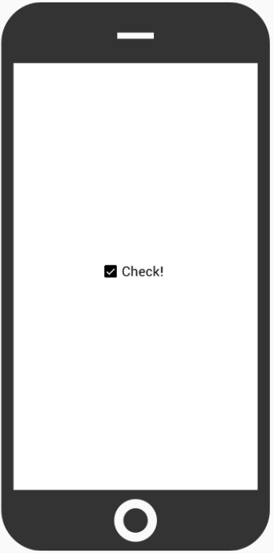
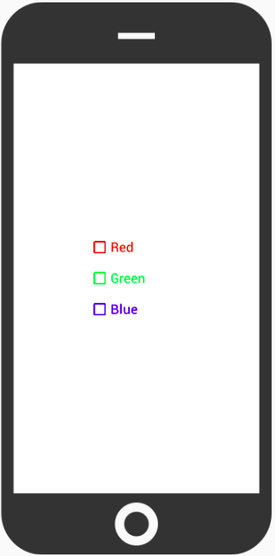
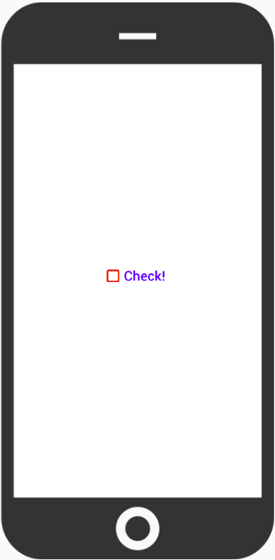
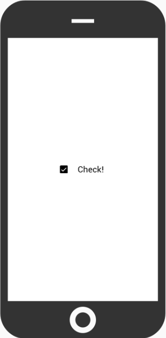

# Check



## Examples

TotalCross includes a wide range of modifications for your `Check`, use `Control` methods.

```java
package com.totalcross; 

import totalcross.ui.MainWindow; 
import totalcross.ui.gfx.Color; 
import totalcross.ui.Check; 
import totalcross.sys.Settings;

public class HelloWorld extends MainWindow {
    public HelloWorld() {
        setUIStyle(Settings.MATERIAL_UI);
    }
    
    @Override
    public void initUI() {
        try {
            Check red = new Check("Red");
            Check green = new Check("Green");
            Check blue = new Check("Blue");
    
            red.setForeColor(Color.RED);
            green.setForeColor(Color.GREEN);
            blue.setForeColor(Color.BLUE);
    
            add(red, LEFT+100, CENTER-40);
            add(green, LEFT+100, CENTER);
            add(blue, LEFT+100, CENTER+40);
        } catch (Exception exception) {
            // Handle exception
        }
    }
}
```



## Box and text with different colors

In some situations, it may be necessary to use different colors for the box and the text.

```java
package com.totalcross; 

import totalcross.ui.MainWindow; 
import totalcross.ui.gfx.Color; 
import totalcross.ui.Check; 
import totalcross.sys.Settings;

public class HelloWorld extends MainWindow {
    public HelloWorld() {
        setUIStyle(Settings.MATERIAL_UI);
    }
    
    @Override
    public void initUI() {
        try {
            Check check = new Check("Check!");
    
            check.checkColor = Color.RED;
            check.textColor = Color.BLUE;
    
            add(check, CENTER, CENTER);
        } catch (Exception exception) {
            // Handle exception
        }
    }
}
```



## Custom left gap

Increase or decrease the spacing between box and text try `check.textLeftGap = 20`



## Responsive text split

Have more responsive texts using `check.autoSplit = true`.  Useful for applications that deal with resizing

## Behind the Class

### Attributes

| Type | Name | Description |
| :--- | :--- | :--- |
| **boolean** | autoSplit | Set to true to let the Check split its text based on the width every time its width changes |
| **int** | checkColor | Set to the color of the check, if you want to make it different of the foreground color |
| **int** | textColor | Sets the text color of the check |
| **int** | textLeftGap | Set gap size between check box and text |

### Methods

| Type | Name | Description |
| :--- | :--- | :--- |
| **Constructor** | Check\(String Text\) | Creates a check control displaying the given text |
| **Boolean** | isChecked\( \) | Returns the checked state of the control |
| **String** | getText\( \) | Gets the text displayed in the check |
| **void** | setChecked\(boolean checked\) | Sets the checked state of the control |
| **void** | setChecked\(boolean checked, boolean sendPress\) | Sets the checked state of the control, and send the press event if desired |
| **void** | setText\(String text\) | Sets the text that is displayed in the check |
| **void** | split\(int maxWidth\) | Splits the text to the given width |

## **References**

* See the [JavaDocs](https://rs.totalcross.com/doc/totalcross/ui/Check.html) for more information.

