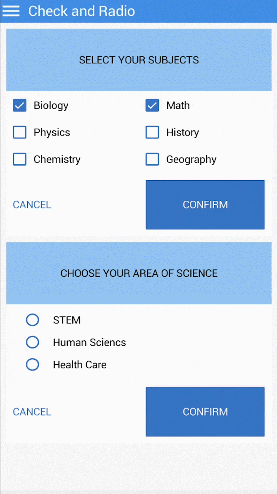

# Check

### Overview

Check \(`CheckBox` in TotalCross\) is a control with a box and a check inside of it when the state is checked



### Source Code


```java
import totalcross.sys.Settings;
import totalcross.ui.Button;
import totalcross.ui.Check;
import totalcross.ui.Container;
import totalcross.ui.Label;
import totalcross.ui.ScrollContainer;
import totalcross.ui.Spacer;
import totalcross.ui.dialog.MessageBox;
import totalcross.ui.event.ControlEvent;
import totalcross.ui.event.PressListener;
import totalcross.ui.gfx.Color;

public class CheckSample extends ScrollContainer {
	private Container c1;
	private Button confirmButtonC1, cancelButtonC1;
	private Check subject1, subject2, subject3, subject4, subject5, subject6;

	private final int H = 25;
	private int gap = 50;

	@Override
	public void initUI() {
		try {
			super.initUI();
			setBackForeColors(0xF7F7F7, 0x000000);
			setScrollBars(false, true);

			c1 = new Container();
			c1.setBackForeColors(Color.WHITE, 0x000000);

			Label lbCheck = new Label("SELECT YOUR SUBJECTS", CENTER);
			lbCheck.setBackForeColors(0x98c7f1, 0x000000);

			subject1 = new Check("Biology");
			subject1.setChecked(true);
			subject2 = new Check("Physics");
			subject3 = new Check("Chemistry");
			subject4 = new Check("Math");
			subject4.setChecked(true);
			subject5 = new Check("History");
			subject6 = new Check("Geography");

			subject1.setForeColor(0x3e72c1);
			subject2.setForeColor(0x3e72c1);
			subject3.setForeColor(0x3e72c1);
			subject4.setForeColor(0x3e72c1);
			subject5.setForeColor(0x3e72c1);
			subject6.setForeColor(0x3e72c1);

			cancelButtonC1 = new Button("CANCEL", (byte) 0);
			cancelButtonC1.transparentBackground = true;
			cancelButtonC1.setBackForeColors(0xF7F7F7, 0x3e72c1);

			confirmButtonC1 = new Button("CONFIRM");
			confirmButtonC1.setBackForeColors(0x3e72c1, 0xFFFFFF);
			confirmButtonC1.borderColor = 0x3e72c1;

			add(c1, LEFT + gap, TOP + gap, FILL - gap, WILL_RESIZE);
			int w = c1.getWidth() / 2 - gap;
			int c1m = Settings.screenWidth / 2;
			c1.add(lbCheck, LEFT, TOP, FILL, PREFERRED + fmH * 8);
			c1.add(subject1, LEFT + gap, AFTER + gap, PREFERRED, PREFERRED + H);
			c1.add(subject2, LEFT + gap, AFTER + gap * 2, PREFERRED, PREFERRED + H);
			c1.add(subject3, LEFT + gap, AFTER + gap * 2, PREFERRED, PREFERRED + H);
			c1.add(subject4, c1m, SAME, PREFERRED, PREFERRED + H, subject1);
			c1.add(subject5, c1m, SAME, PREFERRED, PREFERRED + H, subject2);
			c1.add(subject6, c1m, SAME, PREFERRED, PREFERRED + H, subject3);
			c1.add(confirmButtonC1, RIGHT - gap, AFTER + gap * 2, w, PREFERRED, subject6);
			c1.add(cancelButtonC1, LEFT + gap, CENTER_OF, confirmButtonC1);
			c1.add(new Spacer(), CENTER, AFTER, 10, gap / 2, confirmButtonC1);
			c1.resizeHeight();

			cancelButtonC1.addPressListener(new PressListener() {
				@Override
				public void controlPressed(ControlEvent e) {
					subject1.setEnabled(true);
					subject2.setEnabled(true);
					subject3.setEnabled(true);
					subject4.setEnabled(true);
					subject5.setEnabled(true);
					subject6.setEnabled(true);
					subject1.setChecked(false);
					subject2.setChecked(false);
					subject3.setChecked(false);
					subject4.setChecked(false);
					subject5.setChecked(false);
					subject6.setChecked(false);
				}
			});
			confirmButtonC1.addPressListener(new PressListener() {
				@Override
				public void controlPressed(ControlEvent e) {
					subject1.setEnabled(false);
					subject2.setEnabled(false);
					subject3.setEnabled(false);
					subject4.setEnabled(false);
					subject5.setEnabled(false);
					subject6.setEnabled(false);
				}
			});

		} catch (Exception e) {
			MessageBox.showException(e, true);
		}
	}
}
```



This sample code is only from the **`CheckBox`**, to see the complete sample, including the Radio, go to [github](https://github.com/TotalCross/TCSample/blob/master/src/main/java/totalcross/sample/components/ui/CheckRadioSample.java)


### Attributes

| Type | Name | Description |
| :--- | :--- | :--- |
| **boolean** | autoSplit | Set to true to let the Check split its text based on the width every time its width changes |
| **int** | checkColor | Set to the color of the check, if you want to make it different of the foreground color |
| **int** | textColor | Sets the text color of the check |

### Methods

| Type | Name | Description |
| :--- | :--- | :--- |
| **Constructor** | Check\(String Text\) | Creates a check control displaying the given text |
| **String** | getText\( \) | Gets the text displayed in the check |
| **Boolean** | isChecked\( \) | Returns the checked state of the control |
| **void** | setChecked\(boolean checked\) | Sets the checked state of the control |
| **void** | setChecked\(boolean checked, boolean sendPress\) | Sets the checked state of the control, and send the press event if desired |
| **void** | setText\(String text\) | Sets the text that is displayed in the check |
| **void** | split\(int maxWidth\) | Splits the text to the given width |

### **References**

* See the [JavaDocs](https://rs.totalcross.com/doc/totalcross/ui/Check.html) for more information.

