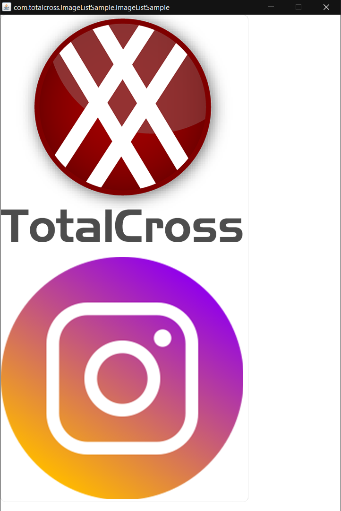

# ImageList

### Overview

This control will have a list of images that will be displayed 



### Source Code


```java
import totalcross.io.IOException;
import totalcross.sys.Settings;
import totalcross.ui.ImageList;
import totalcross.ui.MainWindow;
import totalcross.ui.image.Image;
import totalcross.ui.image.ImageException;


public class ImageList extends MainWindow {

    public ImageList(){
        setUIStyle(Settings.Material);
    }

    @Override
    public void initUI() {

        try {
            ImageList imageList = new ImageList();
            imageList.add(new Image("images/logo.png"));
            imageList.add(new Image("images/insta_icon.png"));

            add(imageList, LEFT, TOP);
        } catch (ImageException e) {
            e.printStackTrace();
        } catch (IOException e) {
            e.printStackTrace();
        }
    }
}

```



Do not forget **to create a folder** called "_**images**_" inside _**/src/main/resources**_ and **save the images inside it \[images\].**


### Methods

| Type | Name | Description |
| :--- | :--- | :--- |
| **Constructor** | ImageList\(\) | Create a new instance |
| **Constructor** |  ImageList\(Object\[\] items\) | Create a new instance already with a filled array |
| **int** | getPreferredWidth\(\) | Returns the preferred Width |
| **int** | getPreferredHeight\(\) | Returns the preferred height |

### References

* See the [Java Docs](https://rs.totalcross.com/doc/totalcross/ui/ImageList.html) for more information.

