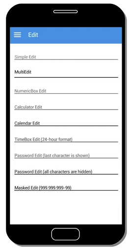

# Multi Edit

### Overview

A MultiEdit is a field used to show or alter text in various disposed line



### Source Code


```java
import totalcross.sys.Settings;
import totalcross.ui.MainWindow;
import totalcross.ui.MultiEdit;

public class MultiEditSample extends MainWindow {
	public MultiEditSample() {
		setUIStyle(Settings.MATERIAL_UI);
		Settings.uiAdjustmentsBasedOnFontHeight = true;
	}

	public void initUI() {
		MultiEdit multiEdit = new MultiEdit();
		multiEdit.caption = "MultiEdit";
		add(multiEdit, LEFT + 100,CENTER, FILL - 100, DP + 48);
	}
}
```


### Attributes

| Type | Name | Description |
| :--- | :--- | :--- |
| **boolean** | autoSelect | When true, the text will be selected when the MultiEdit is foccused |
| **String** | caption | The MultiEdit's placeholder text |
| **boolean** | justify | Justify the text when the MultiEdit is not editable |
| **boolean** | drawDots | If true, a dotted line will be drawn on each line |

### Methods

| Type | Name | Description |
| :--- | :--- | :--- |
| **Constructor** | MultEdit\( \) | Creates a MultiEdit for user input with the default size and spacing |
| **Constructor** | MultiEdit\(int rowCount, int spaceBetweenLines\) | Creates a MultiEdit for user input with the passed row quantity and line spacing. |
| **Constructor** | MultiEdit\(String mask, int rowCount, int spaceBetweenLines\) | Creates a MultiEdit for user input with the passed row quantity and line spacing, but with a mask. |
| **void** | setEditable\(boolean on\) | Will enable or disable the MultiEdit. Can be used as a way to make sure the user don't modify something that was already saved on server and can't be modified without proper authorization |
| **String** | getText\( \) | Returns the text within the MultiEdit |
| **void** | setMaxLength\(int length\) | Is used to limit the characters number the user can digit on the text field |

### **References**

* See the [MultiEdit Java Docs ](https://rs.totalcross.com/doc/totalcross/ui/MultiEdit.html)for more information.

