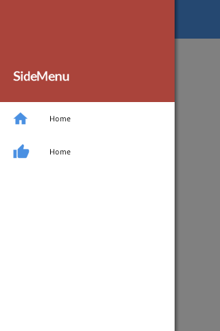

# Side Menu

## Overview

**The SideMenu component is a navigation drawer that slides on the side of the current view. By default, slide from the left, but the side can be replaced. The sideMenu is customized through containers and specifications that allow you to set the SideMenu object or through the SideMenuContainer class.**

**The sideMenu, as an important part of the user interface, have their own standards. Therefore it is recommended to review the** [**Material Design**](http://www.totalcross.com/blog/material-o-layout-da-google/) **for more information and to enjoy the component better. To learn how to design notifications and their interactions, read what MaterialDesing talks about** [**Menus**](https://material.io/guidelines/components/menus.html)**.**



## **Creating SideMenu**

**First, you create the `SideMenuContainer`object and inside the `initUI()` you instantiate the objects corresponding to the items, through the `SideMenuContainer.Item` and there you pass the characteristics you want, such as caption, icon, presenter.**

**After that, you instantiate your `SideMenuContainer`object and point to the `SideMenuContainer.item` that you created earlier.**

**And then just customize the header of your Side** **Menu through `topMenu.header.`**

**Finally just pass the other information you want on your `sideMenuContainer` object, such as font color, bar size and so on.**  


### **Content Needed to Create a SideMenu**

* **`sideMenuContainer`**
* **`sideMenuContainer.Item`**
  * **Capition**
  * **Image or IconType**
  * **Presenter**
* **`TopMenu.Header`**
* **`Icon _Menu.`**

### **Optional SideMenu Settings and Content**

**Inside the sideMenuContainer.Item you can still have:**

* **Caption**
* **Image or IconType \(advise using MaterialIcon\)**
* **Color**
* **Boolean showTitle**
* **Presenter**

**And you can even specify directly in the sideMenuContainer.topMenu:**

* **`.drawSeparators = boolean` - To place or not the lines separating the items**
* **`.itemHeightFactor = int` - To say the item's size.**

## **Usage**


```java
public void initUI(){
		SideMenuContainer.Item home = new SideMenuContainer.Item("Home", MaterialIcons._HOME, 0x4A90E2, ()-> {return new Home();});
		SideMenuContainer.Item sample = new SideMenuContainer.Item("Home", MaterialIcons._THUMB_UP, 0x4A90E2, ()-> {return new Sample();});
		SideMenuContainer sideMenu = new SideMenuContainer(null, home, sample);
		
		sideMenu.topMenu.header = new Container(){
			public void initUI(){
				setBackColor(0xaa443b);
				
				Label title = new Label("SideMenu", CENTER, Color.WHITE, false);
				title.setFont(Font.getFont("Lato Bold", false, this.getFont().size+5));
				title.setForeColor(Color.WHITE);
				add(title, LEFT+45, BOTTOM-45, PARENTSIZE+40, DP+56);
			}
		};
		
		sideMenu.setBarFont(Font.getFont(Font.getDefaultFontSize()+2));
		sideMenu.setBackColor(0x4A90E2);
		sideMenu.setForeColor(Color.WHITE);
		sideMenu.setItemForeColor(Color.BLACK);
		sideMenu.topMenu.drawSeparators = false;
		sideMenu.topMenu.itemHeightFactor = 3;
		
		Icon icon = new Icon(MaterialIcons._MENU);
		icon.setBackColor(Color.WHITE);
		add(icon, CENTER, TOP);
		add(sideMenu, LEFT, TOP, PARENTSIZE, PARENTSIZE);
	}
```


## **References**

* **To see the complete example, just click** [**here**](https://github.com/TotalCross/SideMenuSample)

\*\*\*\*

