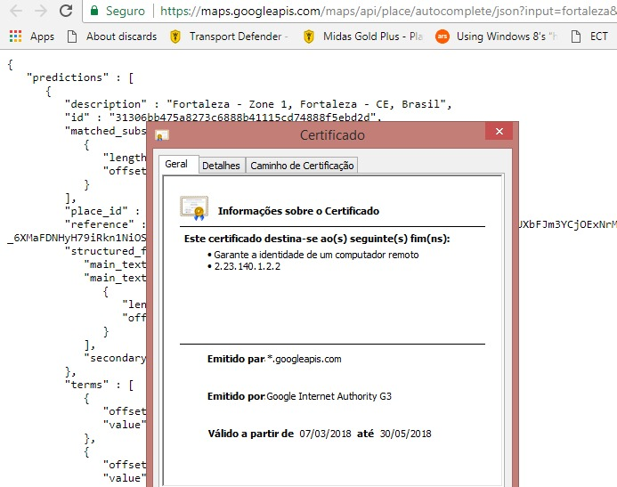
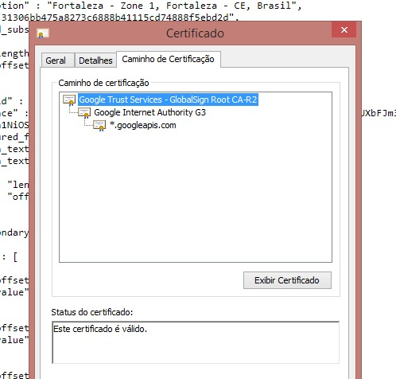

# HTTPS and SSL

## Overview

The TotalCross SSL native library is a wrapper library of the great axTLS package. The axTLS embedded SSL project written by Cameron Rich is a highly configurable client/server TLSv1 library designed for platforms with small memory requirements \(click [here ](http://axtls.cerocclub.com.au/index.htm)for more details\).

The original package supports:

* Linux;
* Win32;
* Solaris; 
* Cygwin.

This native library adds support for **SSL** **\(Secured Sockets Layer\)** communications to secure data transfers between authenticated devices and/or servers.

## Security background

For general information about the features of **TLS** \(**Transport Layer Security**\) and its usage, you may read the [Wiki pag](http://en.wikipedia.org/wiki/Transport_Layer_Security). If you are lucky, you may even read a good translation in your personal language.

The english version provides a basic protocol description for everyone. For those who want to go further, the reference is the [TLS protocol version 1.0 RFC 2246](http://tools.ietf.org/html/rfc2246).

Basically, TLS **allows secured and authenticated communication between two components generally so-called client & server**. It relies on X509 certificates, their associated **private keys** to encrypt and associated public keys to decrypt exchanged data. The certificates could be self signed or signed by an Authority known as **CA \(Certification Authority\)** that have to be trusted.

Insofar the subject of SSL based security is well documented on the web, we won’t go further in the TLS description and invite people interrested in diving more deeply in secured communications to read the plenty of articles, books and HOWTOs available on the Internet. For general information about the features of TLS \(Transport Layer Security\) and its usage, you may read the [Wiki page](http://en.wikipedia.org/wiki/Transport_Layer_Security). If you are lucky, you may even read a good translation in your personal language.

## Authenticate Certificates

o connect to the Google API, if it is an HTTPS protocol, you will need to indicate that the SSL / TLS certification issuer is reliable.

### **But how does certificate authentication work?**

When you trust a certification, you are actually confining the issuer to it. This is because certification acts as a chain. You say that the certifying entity is reliable and therefore, all the certificates generated by it, are.

An example of this is GlobalSign, a certification authority \(CA\). It issues a root certificate to Google and with this, Google can issue other certificates through it.

The root certificate is called the Google G3 Authority. Therefore, for HTTPS to work you need to trust the certificate or anyone in the certification chain.

### **Step by step**

* Open the URL in the browser and click on the padlock that appears \(next to the URL\) and then on "Valid", just below "Certificate". There you will find the data, such as the name of the issuer and with this, you will, in your code, indicate the issuer as reliable. ****



* To find the certificate, simply go through the certification path and click on view certificate and then in detail and then copy to file.




* After you click Copy to File, you will see some options, click the one that has "base64 encoded".


* Once saved, grab the .cer file and place it inside the Authorities class in loop execution.  


  
  ```java
  //Load all know cases
  for(int c = Authorities.certificates.lenght - 1; c >= 0; c++){
  }
  ```
  

## Generating security material

We will concentrate on the more general deployment of X509 client or server certificates signed by a Certification Authority \(CA\) \(click [here](http://en.wikipedia.org/wiki/X.509%20) for more details\). 

First we will have to create our own CA, that could be replaced by any "well known" commercial CA such as Verisign, Thawte, etc, if you have the need for a public authority.

We will use [openssl ](www.openssl.org)as security engine to generate the security material involved in certificate based authentication/encryption. It’s a well spread SSL implementation providing powerfull tools to create and manage all kinds of security materials available on many platforms.

## Create a private CA

Generate a self signed certificate that will be used as Certification Authority \(CA\). The authority will be valid for 10 years \(approx 3650 days\).

```php
bash$ openssl req -new -x509 -days 3650 -keyout cakey.pem -out cacert.pem
Generating a 1024 bit RSA private key
.++++++
.....++++++
writing new private key to ’cakey.pem’
Enter PEM pass phrase: xxxxx
Verifying - Enter PEM pass phrase: xxxxx
-----
You are about to be asked to enter information that will be incorporated into your certificate request.
What you are about to enter is what is called a Distinguished Name or a DN.
There are quite a few fields but you can leave some blank
For some fields there will be a default value,
If you enter ’.’, the field will be left blank.
-----
Country Name (2 letter code) [AU]:BR
State or Province Name (full name) [Some-State]:Rio de Janeiro state
Locality Name (eg, city) []:Rio de Janeiro
Organization Name (eg, company) [Internet Widgits Pty Ltd]:SuperWaba Ltda
Organizational Unit Name (eg, section) []:SuperWaba dev. department
Common Name (eg, YOUR name) []:SuperWaba Sample CA
Email Address []:guich@superwaba.com.br
```

The first entry is the private key password. The private key is used to sign other certificates to assert they are authentic. The private key is protected by a password as a further security because the CA private key is a main secret that have to be protected.

Next you will have to fill in X500 attributes describing the certificate subject. In our case, we enter information describing the SuperWaba CA \(Certification Authority\). Any agent trusting this CA, will authenticate certificates that have been signed by it through the CA embedded public key.

We now have two files, **cakey.pem** containing an encrypted version of the CA private key protected by a password and cacert.pem containing an X509 certificate embedding the CA public key that could be redistributed.

Finally, you have to create a text file named **ca.srl** with the content "00" for certicate signing counting, just execute the following command:

```php
bash$ echo “00” > ca.srl
```

## Create a client or server X509 certificate

First, you have to generate a new private key. SSL supports unencrypted and aes128/256 encrypted private keys.

```text
bash$ openssl genrsa -aes128 -out mykey.pem 512
```

You may replace **-aes128** by **-aes256** for a stronger cipher, or remove **-aes128** at all to generate a private key that is not encrypted. When you ask for an encrypted key, you have to enter a password used in the ciphering. The last option represents the key size in bits, values between 512 and 4096 bits for a higher security are accepted, but always keep in mind that higher security implies longer processing times especially critical on embedded devices.

Next you have to generate a certificate request. This file could be transmitted to one of the commercial CA companies for signing or could be signed by our previously created private CA.

```text
bash$ openssl req -new -out my.req -key mykey.pemAdd -x509
```

if you want to generate a self signed certificate if you don’t want to use a CA at all \(in this case, you may name the file **mycert.pem** rather than **my.req**\). Insofar, the **out** file will contain a finalized self-signed certificate rather than a certificate request.

Enter all information describing your client or your server component. The certificate request will be stored in the file **my.req.**

Finally, we will sign the certificate with the CA.

```text
bash$ openssl x509 -CA cacert.pem -CAkey cakey.pem -CAserial ca.srl -req -in my.req -out mycert.pem -days 1460
```

## Principle of an X509 authentication/encryption

X509 authentication/encryption is based on public/private key encryption that have a great characteristic. Indeed, the data ciphered by either key could only be deciphered by the other one.

A software component that has to be authenticated, such as a secured server, may now be configured to deliver to any client the previously generated certificate \(contained in **mycert.pem**\). It also has to load the associated certificate private key. That private key is used to cipher data transmited to the client. On the other side, the client uses the public key embedded in the accepted server certificate to decipher the data from the server and cipher the data to be sent back to the server so that the server can decipher with its private key. If the client is configured to trust any certificate that have been signed by the signing CA, it will be able to authenticate any certificate using the CA public key.

The SSL package supports both PEM and DER encrypted materials.

[**DER** ](http://en.wikipedia.org/wiki/Distinguished_Encoding_Rules)is an ASN.1 encoding of information, [PEM](http://en.wikipedia.org/wiki/Privacy_Enhanced_Mail) is a **base64** encoding of a DER encoded data with a header "-----BEGIN " and a trailer "-----END " followed by a material type name. A PEM file may be de-encrypted or encrypted with AES128 or AES256 ciphers only.

LiteSSL also supports the pkcs8 encoding that is a private key encryption format. But it supports only one ciphering algorithm that is PBE-SHA1-RC4-128. Here is the command line to convert a PEM encoded private key into a pkcs8 encoded format. Always use the .p8 file suffix to identify the pkcs8 format.

```text
bash$ openssl pkcs8 -topk8 -in mykey.pem -inform PEM -out mykey.p8
-outform DER -v1 PBE-SHA1-RC4-128
```

bash$ openssl pkcs8 -topk8 -in mykey.pem -inform PEM -out mykey.p8

-outform DER -v1 PBE-SHA1-RC4-128You will have to enter a password, that will be required to use the private key.

LiteSSL also supports pkcs12 that is a certificate/private key encryption format. But it supports only one ciphering algorithm that is PBE-SHA1-RC4-128. Here is the command line to convert certificate and its associate encoded private key into a pkcs12 encoded format. Always use the **.p12** file suffix to identify the pkcs12 format.

```text
bash$ openssl pkcs12 -export -in server.pem -out server.p12 -name
"myserver" -inkey server.key -certpbe PBE-SHA1-RC4-128 -keypbe
PBE-SHA1-RC4-128
```

You will have to enter a password, that will be required to use the private key embedded in the pkcs12 encoded file.

## Restrictions

The Applet version is implemented on top of SUN’s JSSE. This TLS implementation has some limitations that prevent the use of some security material formats supported by SSL on devices. Thus, private keys have to be in pkcs8 format only. Moreover, they can’t be password protected. You have to add the -nocrypt option to the command line provided above to convert a PEM encoded private key to pkcs8 encoding.

## SSL usage

The **SSLUtil** class provides functions to get information about the TLS stack layer.

The first class to instantiate is **SSLClient** or **SSLServer** \(not currently supported\). This class represents an SSL client or server context both inheriting from the **SSLCTX** class that provides many SSL context common services. The main feature concerns the security material loading. Use **objLoad\( \)** to load material from files or memory. The arguments of this function are the material type \(CA, X509 certificate, private keys, etc\), the filename or the memory containing the material, and finally a password for private keys loading if they are password based encrypted.

To succeed the handshake with a server, you have to trust its self-signed certificate or trust the CA certificate who signed the server’s certificate. 

Use:

* **`objLoad(SSL_OBJ_X509_CACERT, “cacert.pem”, null)`** to trust the server’s signing CA. If the server requires client authentication, you will have to send your own client certificate;
* **`objLoad(SSL_OBJ_X509_CERT, “mycert.pem”, null)`** to load your client certificate; 
* **`objLoad(SSL_OBJ_RSA_KEY,“mykey.pem”, “pass”`\)** to load the client certificate associated private key protected by the **pass** password.

Next, you have to call **`connect()`** on the context instance to create an SSL instance linked with a previously created socket. 

The SSL handshake starts immediatly to try to establish an authenticated/ciphered communication.

The SSL handshake succeeded if the `connect()` call returns an SSL instance and the **`handshakeStatus()`** function call on that instance returns **SSL\_OK**. Consequently, you may check the subject of the peer certificate with the **`getCertificateDN()`**call to identify it and the context could be used to write and read ciphered data until the “dispose” call terminates the SSL communication. The peer receives a protocol alert to signal a link shutdown.

The SSL write of data returns the amount of bytes written or an error if the writing failed. The SSL read of data may return **SSL\_OK** that indicates that the read is not yet terminated and may be called again to achieve the reading of a block of decipherable data.

## References

* For more details, check out the **totalcross.net.ssl** package [JavaDocs](https://rs.totalcross.com/doc/index.html).

