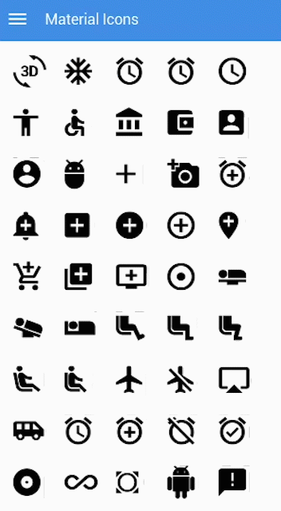

# Material Icons

### Overview

Material Icons are the patterns of icons created by [Google - Material Design](https://blog.totalcross.com/en/material-o-layout-da-google/). They are designed to be used in your Web/iOS/Android projects.   
  
Material Icons are available in a wide variety of densities and sizes, with more than **900 icons**, as well as being Open Code.


To use the icons, import the _**`MaterialIcons`**_ class:

`import totalcross.ui.icon.MaterialIcons; Icon icon = new Icon(MaterialIcons.values());`




### Source Code


```java
import totalcross.sys.Settings;
import totalcross.ui.Container;
import totalcross.ui.MainWindow;
import totalcross.ui.icon.Icon;
import totalcross.ui.icon.MaterialIcons;

public class MaterialIconSample extends MainWindow {

	public MaterialIconSample() {
		setUIStyle(Settings.MATERIAL_UI);
		Settings.uiAdjustmentsBasedOnFontHeight = true;
	}

	public void initUI() {
		final int ICON_WIDTH = 64;

		int cols = (int) (Math.min(Settings.screenWidth, Settings.screenHeight)
				/ (ICON_WIDTH * Settings.screenDensity));
		Container c = new Container() {
			@Override
			public void initUI() {
				for (int i = 0, j = 0; i < MaterialIcons.values().length; i++, j++) {
					Icon icon = new Icon(MaterialIcons.values()[i]);
					icon.setFont(icon.getFont().adjustedBy(10));
					add(icon, (j % cols) == 0 ? LEFT : AFTER, (j % cols) == 0 ? AFTER : SAME, PARENTSIZE + (100 / cols),
							DP + ICON_WIDTH);
				}
				resizeHeight();
			}
		};
		add(c, CENTER, TOP + 100, (int) (cols * ICON_WIDTH * Settings.screenDensity), WILL_RESIZE);
	}


```


### **References**

* Learn more about Material Design with [our Blog Post](https://blog.totalcross.com/en/material-o-layout-da-google/).
* Learn more about how [Material Icons](https://material.io/tools/icons/) works.
* See the [TotalCross JavaDocs ](https://rs.totalcross.com/doc/index.html)for more information.

