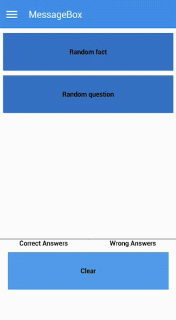

# MessageBox

### Overview

MessageBox is a popup element that shows a title, a text and one or more buttons.



### Source Code


```java
anybutton.addPressListener(new PressListener() {
    @Override
    public void controlPressed(ControlEvent e) {
        mb = new MessageBox("Did you know?", someMessage, new String[]{"Nice!"});
        mb.setRect(CENTER, CENTER, SCREENSIZE + 50, SCREENSIZE + 30);
        mb.setBackForeColors(Colors.P_300, Colors.ON_P_300);
        mb.popup();
    }
});
```



Because it is an extensive example, we chose to exemplify the essential: how to use a **`MessageBox`**. To see the complete example, [click here](https://github.com/TotalCross/TCSample/blob/master/src/main/java/totalcross/sample/components/ui/MessageBoxSample.java).


### Attributes

| Type | Name | Description |
| :--- | :--- | :--- |
| **PushButtonGroup** | btns | The messagebox button group |
| **boolean** | yPosition | Messagebox vertical position |
| **int\[ \]** | buttonKeys | A int array that maps the button id |

### Methods

| Type | Name | Description |
| :--- | :--- | :--- |
| **Constructor** | MessageBox\(String title, String msg\) | Constructs a message box with the text and one "Ok" button |
| **Constructor** | MessageBox\(String title, String text, String\[\] buttonCaptions\): | Constructs a message box with the text and the specified button captions |
| **Constructor** | MessageBox\(String title, String text, String\[\] buttonCaptions, boolean allSameWidth\) | Constructs a message box with the text and the specified button captions; The boolean specify if the buttons will have the same width |
| **Constructor** | MessageBox\(String title, String text, String\[\] buttonCaptions, boolean allSameWidth, int gap, int insideGap\) | Constructs a message box with the text and the specified button captions; The boolean specify if the buttons will have the same width; The ints specify the external and internal gaps |
| **Constructor** | MessageBox\(String title, String text, String\[\] buttonCaptions, int gap, int insideGap\) | Constructs a message box with the text and the specified button captions; The ints specify the external and internal gaps |
| **Constructor** | MessageBox\(Image image, String title, String text, String\[\] buttonCaptions, int gap, int insideGap\) | Constructs a message box with the given text, button captions and image; The ints specify the external and internal gaps |
| **Constructor** | MessageBox\(Image image, String title, String text, String\[\] buttonCaptions, boolean allSameWidth, int gap, int insideGap\) | Constructs a message box with the given text, button captions and image; The boolean specify if the buttons will have the same width; The ints specify the external and internal gaps |
| **Constructor** | Builder\( \) | Instances the MessageBox Builder. You can use it to make your MessageBox easily. |
| **Builder** | setTitle\(String title\) | Sets the MessageBox title. |
| **Builder** | setBaseContainer\(Container baseContainer\) | This is the content that will be placed between the title and the buttons. You can put anything here. After you set this, the message will not appear since you're putting a Container above it. |
| **Builder** | setBaseContainerInsets\(int left, int right, int top, int bottom\) | Sets the insets of the Container \(The container that will be your content\). |
| **Builder** | setImage\(Image image\) | Sets the image that is displayed on the top of the MessageBox. |
| **Builder** | setMessageBoxInsets\(int left, int right, int top, int bottom\) | Sets the insets of the MessageBox. |
| **Builder** | setButtons\(String\[\] buttonCaptions\) | Sets the buttons that will appear on the MessageBox. |
| **Builder** | setButtonsMargin\(int margin\) | Sets the margins of the buttons. |
| **Builder** | setTitleContGap\(int gap\) | Sets the gap between the title and the Container \(MessageBox's content\). |
| **Builder** | setContButtonGap\(int gap\) | Sets the gap between the Container \(MessageBox's content\) and the buttons. |
| **int** | getPressedButtonIndex\( \) | Returns the pressed button index |
| **void** | setDelayToShowButton\(int ms\) | Sets the show button delay |
| **void** | setIcon\(Image icon\) | Set a icon in the title aligned at left |
| **void** | setText\(String text\) | Set a text after the popup of the messagebox |
| **void** | setUnpopDelay\(int unpopDelay\) | Set a delay to the unpop animation |

### **References**

* See also the [quick video tutorial](https://www.youtube.com/watch?v=KJZyy9n5WZw) on how to create a MessageBox. 
* See the [JavaDocs](https://rs.totalcross.com/doc/totalcross/ui/MessageBox.html) fore more information.

