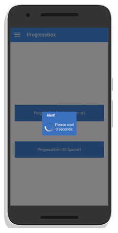

# Progress Box

### Overview

Progress Box is a popup box with title, text, one or more buttons and a Spinner to demonstrate loading



### Source Code


```java
import totalcross.sample.util.Colors;
import totalcross.ui.Button;
import totalcross.ui.ButtonMenu;
import totalcross.ui.Container;
import totalcross.ui.ProgressBar;
import totalcross.ui.Spinner;
import totalcross.ui.dialog.MessageBox;
import totalcross.ui.dialog.ProgressBox;
import totalcross.ui.gfx.Color;

public class ProgressBoxSample extends Container {
  private ButtonMenu menu;
  private ProgressBox pb;
  private int count;

  @Override
  public void initUI() {
    try {
      super.initUI();
      String[] items = {"ProgressBox (Android Spinner)", "ProgressBox (iOS Spinner)"};
      pb = new ProgressBox("Alert!", "null", items, true);
      

      Button bAndroid = new Button("Android Style");
      bAndroid.setBackForeColors(Colors.P_600, Colors.ON_P_600);
      bAndroid.addPressListener((e) -> {
          Spinner.spinnerType = Spinner.ANDROID;
          
          ProgressBoxSample.this.addTimer(1000);
          count = 4;
          
          pb = new ProgressBox("Alert!", "Please wait " + count + " seconds.");
          pb.setBackForeColors(Colors.P_700, Colors.ON_P_700);
          pb.popup();          
      });
      add(bAndroid, CENTER, CENTER - 60, 200 + DP, 40 + DP);
      
      Button bIOS = new Button("IOS Style");
      bIOS.setBackForeColors(Colors.P_600, Colors.ON_P_600);
      bIOS.addPressListener((e) -> {
          Spinner.spinnerType = Spinner.IPHONE;
          
          ProgressBoxSample.this.addTimer(1000);
          count = 4;
          
          pb = new ProgressBox("Alert!", "Please wait " + count + " seconds.");
          pb.setBackForeColors(Colors.P_700, Colors.ON_P_700);
          pb.popup();          
      });
      add(bIOS, CENTER, AFTER + 20, 200 + DP, 40 + DP);
      
      this.addTimerListener((e) -> {
    	  if(count >= 0) {
    		  pb.setText("Please wait " + count + " seconds.");
    		  count--;
    	  } else {
    		  pb.unpop();
    		  this.removeTimer(e);
    	  }
      });
      
    } catch (Exception ee) {
      MessageBox.showException(ee, true);
    }
  }
}
```


### Methods

| Type | Name | Description |
| :--- | :--- | :--- |
| **Constructor** | ProgressBox\(String title, String msg\) | Creates a ProgressBox with text and an Ok Button |
| **Constructor** | ProgressBox\(String title, String text, String\[ \] buttonCaptions\) | Creates a ProgressBox with text and the specified Button |
| **Constructor** | ProgressBox\(String title, String text, String\[ \] buttonCaptions, boolean allSameWidth\) | Creates a ProgressBox with text and the specified Buttons. The boolean sets the buttons to have the same width |
| **Constructor** | ProgressBox\(String title, String text, String\[ \] buttonCaptions, boolean allSameWidth, int gap, int insideGap\) | Creates a ProgressBox with text and the specified Buttons. The boolean sets the buttons to have the same width. The integers specify the external and internal spacing, respectively. |
| **Constructor** | ProgressBox\(String title, String text, String\[ \] buttonCaptions, int gap, int insideGap\) | Creates a ProgressBox with text and the specified Buttons. The integers specify the external and internal spacing, respectively |
| **void** | onPopup\( \) | Method called immediately before showing the ProgressBox |

### **References**

* See also our [quick tutorial video](https://www.youtube.com/watch?v=pSSNNXl6_98) showing how to create a Progress Box.
* See the [JavaDocs](https://rs.totalcross.com/doc/index.html) for more informations.

