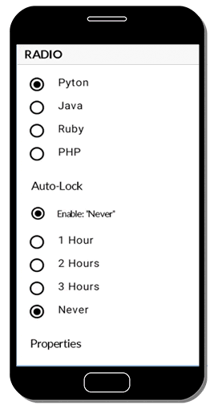

# Radio

### Overview

A `Radio` button is a button that can be either checked or unchecked. A user can tap the button to check or uncheck it. It can also be checked from the template using the checked property   
  
Use an element with a RadioGroupController attribute to group a set of radio button. When radio buttons are inside a RadioGroupController, just one radio in the group can be checked at any time. If a radio button is not placed in a group, they will all have the ability to be checked at the same time




To see the complete sample, go to [github](https://github.com/TotalCross/RadioSample)


### Source Code


```java
import totalcross.sys.Settings;
import totalcross.ui.Bar;
import totalcross.ui.Check;
import totalcross.ui.Label;
import totalcross.ui.MainWindow;
import totalcross.ui.Radio;
import totalcross.ui.RadioGroupController;
import totalcross.ui.ScrollContainer;
import totalcross.ui.event.ControlEvent;
import totalcross.ui.event.PressListener;
import totalcross.ui.font.Font;
import totalcross.ui.gfx.Color;

public class RadioButton extends MainWindow{
	
	public RadioButton(){
		super("", BORDER_NONE);
		setUIStyle(Settings.Material);
		Settings.uiAdjustmentsBasedOnFontHeight = true;
		setBackForeColors(Color.WHITE, Color.BLACK);
		
		Bar h1 = new Bar("  RADIO");
		h1.canSelectTitle = false;
		h1.setFont(Font.getFont("Lato Bold", false, h1.getFont().size+3));
		h1.setBackForeColors(0XF8F8F8,Color.BLACK);		
		add(h1, LEFT,TOP,FILL,PREFERRED-50);
		
	}
	
	public void initUI(){
		ScrollContainer sc = new ScrollContainer(false, true);
	    add(sc,LEFT,AFTER,FILL,FILL);
	    
	    RadioGroupController radioGroup = new RadioGroupController();

	    Radio pyton = new Radio("Pyton", radioGroup);
	    pyton.setChecked(true);
	    sc.add(pyton, LEFT+100, AFTER+100 ,PREFERRED+100,PREFERRED+25);
	    
	    Radio java = new Radio("Java", radioGroup);
	    sc.add(java, LEFT+100, AFTER+50 ,PREFERRED+100,PREFERRED+25);

	    Radio ruby = new Radio("Ruby", radioGroup);
	    sc.add(ruby, LEFT+100, AFTER+50 ,PREFERRED+100,PREFERRED+25);
	    
	    Radio php = new Radio("PHP", radioGroup);
	    sc.add(php, LEFT+100, AFTER+50 ,PREFERRED+100,PREFERRED+25);

	    Label autolock = new Label("Auto-Lock");
	    autolock.setFont(Font.getFont("Lato Regular", false, autolock.getFont().size+3));
	    sc.add(autolock, LEFT+100, AFTER+100, FILL, PREFERRED+25);
	    
	    final Radio enable = new Radio("Enable: ''Never'' ");
	    enable.setChecked(true);
	    enable.setFont(Font.getFont("Lato Regular", false, Font.NORMAL_SIZE-2));
	    sc.add(enable, LEFT+123, AFTER+100 ,PREFERRED+100,PREFERRED+25);
	    
	    RadioGroupController radioGroup2 = new RadioGroupController();
	    
	    Radio rd1 = new Radio("1 Hour", radioGroup2);
	    rd1.setChecked(true);
	    sc.add(rd1, LEFT+100, AFTER+100 ,PREFERRED+100,PREFERRED+25);
	    
	    Radio rd2 = new Radio("2 Hours", radioGroup2);
	    sc.add(rd2, LEFT+100, AFTER+50 ,PREFERRED+100,PREFERRED+25);
	    
	    Radio rd3 = new Radio("3 Hours", radioGroup2);
	    sc.add(rd3, LEFT+100, AFTER+50 ,PREFERRED+100,PREFERRED+25);
	    
	    final Radio never = new Radio("Never", radioGroup2);
	    sc.add(never, LEFT+100, AFTER+50 ,PREFERRED+100,PREFERRED+25);
	    
	    enable.addPressListener(new PressListener(){
	    	public void controlPressed(ControlEvent e){
	    		boolean b = enable.isChecked();
	    		never.setEnabled(b);	
	        }
	    });
	    
	    Label properties = new Label("Properties");
	    properties.setFont(Font.getFont("Lato Regular", false, properties.getFont().size+3));
	    sc.add(properties, LEFT+100, AFTER+100, FILL, PREFERRED+25);
	    
	    Radio simple = new Radio("Simple Radio");
	    simple.setChecked(true);
	    sc.add(simple, LEFT+100, AFTER+100 ,PREFERRED+100,PREFERRED+25);
	    
	    Radio bcolor = new Radio("Background Color");
	    bcolor.setBackColor(Color.YELLOW);
	    bcolor.textColor = Color.BLUE;
	    bcolor.checkColor = uiMaterial ? Color.BLACK : Color.YELLOW;
	    sc.add(bcolor, LEFT+100, AFTER+50 ,PREFERRED+100,PREFERRED+25);
	    
	    Radio fcolor = new Radio("Foreground Color");
	    fcolor.setForeColor(Color.darker(Color.GREEN));
	    fcolor.checkColor = Color.GREEN;
	    sc.add(fcolor, LEFT+100, AFTER+50 ,PREFERRED+100,PREFERRED+25);
	}
}
```


### Attributes

| Type | Name | Description |
| :--- | :--- | :--- |
| **int** | checkColor | Set to the color of the check, if you want to make it different of the foreground color |
| **boolean** | leftJustify | Set to true to left justify this control if the width is above the preferred one |
| **int** | checkColor | Sets the text color of the check |

### Métodos

| Tipo | Nome | Descrição |
| :--- | :--- | :--- |
| **Constructor** | Radio\(String Text\) | Creates a radio control displaying the given text |
| **Constructor** | Radio\(String text, RadioGroupController radioGroup\) | Creates a radio control with the given text attached to the given RadioGroupController |
| **RadioGroupController** | getRadioGroup\( \) | Returns the RadioGroupController that this radio belongs to, or null if none |
| **String** | getText\( \) | Gets the text displayed in the radio |
| **boolean** | isChecked\( \) | Returns the checked state of the control |
| **void** | setChecked\(boolean checked\) | Sets the checked state of the control |
| **void** | setChecked\(boolean checked, boolean sendPress\) | Sets the checked state of the control, and send the press event if desired |
| **void** | setText\( \) | Sets the text |

### **References**

* See also our [quick tutorial video](https://www.youtube.com/watch?v=7kFNoUWJ1YU) showing how to use Radios. 
* See the [JavaDocs](https://rs.totalcross.com/doc/totalcross/ui/Radio.html) for more information.

