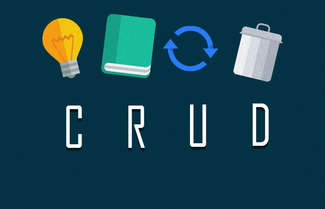
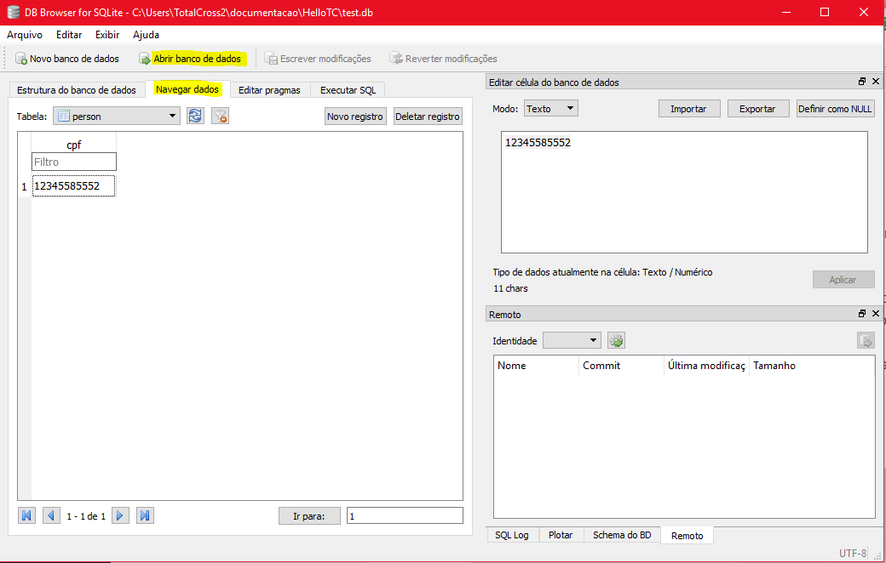

# Local Database - SQLite

## Overview

To store data locally, TotalCross uses the database named SQLite. The same used in native development for Android.

[SQLite](https://www.sqlite.org/index.html) is an open source SQL database that stores data in a text file on a device. TotalCross comes with the implementation of the SQLite database.


One of the differentials of TotalCross is that it allows SQLite **to be built into** the platform so that the developer does **NOT** have to worry about the version of SQLite and the compatibility of the OS version with the database.


SQLite supports all relational database features. To access this database, you do not need to establish any type of connection to it, such as JDBC, ODBC and others. 

To understand how TotalCross works with SQLite, let's create a simple project in the next steps!


Let's now learn how to do CRUD \(Create, Read, Update, Delete\) with SQLite in TotalCross




## Creating a TotalCross Project with SQLite


Remember that the link to download the source code is in the topic References at the end of this session. 


Let's use the Maven project we created in the chapter  "[Your Frist TotalCross App](https://learn.totalcross.com/learn-totalcross/getting-started/first-totalcross-app)" called HelloTC. If you do not have it there and you want to create a [Maven project from the start](https://learn.totalcross.com/learn-totalcross/getting-started), that's fine! 

### Project Structure

As you will learn better from the chapters in the suggested [Architecture ](https://learn.totalcross.com/guideline/suggested-architecture)and [Design Patterns](https://learn.totalcross.com/guideline/suggested-design-patterns), TotalCross suggests following the MVC and DAO standard in creating your applications. 

So let's start by creating three packages: 

* **ui** - Where will all UI classes stay.
* **util** - Here is the SQLite database creation class
* **dao** - This is the package that will save all Data Access Object \(DB\).

Once this is done, our project will be structured as follows:

```text
- HelloTC
  - src
    - main
        - java
            - dao
            - ui
            - util 
```

### Creating the local database

Inside the **package util** we will create a class called **DatabaseManager** and we will create a `static` object of type `SQLiteUtil` called **sqliteUtil**. 

That done, inside a static block we will initialize the sqliteUtilpassando as argument `Settings.appPath` and the name of our database in quotation marks. It is important to remember to always put "**.db**" next to the name.

Now let's go to our `Statement` \(interface used to execute SQL command\) to establish the connection with our database and then pass the command to create the cpf table.


Prior knowledge of SQLite is required to better work with the creation of your application's local database. We recommend this [pdf](http://sd.blackball.lv/library/The_Definitive_Guide_to_SQLite_2nd_edition.pdf) for you learn more


After that, we finished the first part. Here's how it went:


```java
public class DatabaseManager {

	public static SQLiteUtil sqliteUtil;

	static {
		try {
			sqliteUtil = new SQLiteUtil(Settings.appPath, "test.db");
			Statement st = sqliteUtil.con().createStatement();
			st.execute("create table if not exists person (cpf varchar)");
			st.close();

		} catch (SQLException e) {
			e.printStackTrace();
		}
	}
}
```


Now let's create a static method to return our connection to the database so we can use it inside the DAO package when we manipulate data.


```java
public static Connection getConnection() throws SQLException {
	return sqliteUtil.con();
}
```


And ready. Here's how our connection class with the database below:


```java
public class DatabaseManager {

	public static SQLiteUtil sqliteUtil;

	static {
		try {
			sqliteUtil = new SQLiteUtil(Settings.appPath, "test.db");
			Statement st = sqliteUtil.con().createStatement();
			st.execute("create table if not exists person (cpf varchar)");
			st.close();

		} catch (SQLException e) {
			e.printStackTrace();
		}
	}

	public static Connection getConnection() throws SQLException {
		return sqliteUtil.con();
	}
}

```


#### Inserting data into the table

**Inside our DAO** package we will create a **CPFDAO class**. Let's call it this because it is the name of our table in the database + DAO as the default name to say that that class corresponds to an access object to the database, in this case the CPF. 

Once this is done, we will create a method for registering the CPF in the local database. For this method, just ask as an argument the CPF of type Stringe then create a connection with the bank and execute the SQLite command passing it as text in the `.executeUpdate`.


```java
public void insertCPF(String cpf) throws SQLException {
	boolean success = false;
	Connection dbcon = DatabaseManager.getConnection();
	String sql = "insert into person values(?)";
	PreparedStatement ps = dbcon.prepareStatement(sql);
	ps.setString(1, cpf);

	int i = ps.executeUpdate();
	ps.close();

	if (i > 0) {
		success = true;
	} else {
		success = false;
	}
	return success;
}
```


### Reading local data

To make the data of a table not SQLite is very simple, just execute the **Select** command through a `executeQuery`to return the data from the table and then create a `While` to traverse all rows of the returned table and store that data within a `ArrayList`. 

In the code below you will be able to return all the data registered in the local database. The call and display part for the user is in the [UI topic](https://totalcross.gitbook.io/playbook/learn-totalcross/how-to-store-data-sqlite#overview).


```java
public ArrayList<String> getCPF() throws SQLException {
		ArrayList<String> cpfs = new ArrayList<>();

		try {
			Connection dbcon = DatabaseManager.getConnection();
			Statement st = dbcon.createStatement();
			ResultSet rs = st.executeQuery("select * from person");

			while (rs.next()) {
				String cpf = rs.getString("cpf");
				cpfs.add(cpf);
			}
			rs.close();
			st.close();
		} catch (java.sql.SQLException e) {
			e.printStackTrace();
		}

		return cpfs;
	}
```


### Updating Data

To update the data is also very simple, just pass the SQLite command called Update with the value of the old field and the current field. If you want to better understand how this command works in SQLite, we recommend this [article](http://www.sqlitetutorial.net/sqlite-update/).


```java
public void updateCPF(String cpf_novo, String cpf_old) throws SQLException {
		Connection dbcon = DatabaseManager.getConnection();
		String sql = "UPDATE person SET cpf = " + cpf_old
                + " WHERE cpf = "+ cpf_novo;
		PreparedStatement ps = dbcon.prepareStatement(sql);
		ps.executeUpdate();
		ps.close();	
}
```


### Deleting Data

To delete a record, simply execute the command [Delete](http://www.sqlitetutorial.net/sqlite-delete/) and pass through the `PreparedStatement` the value to be deleted and run through the `executeUpdate`


```java
public void deleteCPF(String cpf) throws SQLException {
	Connection dbcon = DatabaseManager.getConnection();
	String sql = "DELETE from person where cpf = ?";
	PreparedStatement ps = dbcon.prepareStatement(sql);
	ps.setString(1, cpf);
	ps.executeUpdate();
}
```


## User Interface

In this chapter, our focus is not the user interface but rather learn the basics about SQLite and apply it with TotalCross. Knowing this, let's put here the interface code that we use to build this basic example. If you have any doubts about this most graphic part, we recommend giving a quick read on the [Components ](https://totalcross.gitbook.io/playbook/components/accordion-container)section in our documentation.


Remembering that everything related to interfaces goes inside the **UI package**


### Initial Screen 

Where we call the method to register the CPF


```java
package com.totalcross.sample.ui;

import java.util.ArrayList;

import com.totalcross.sample.dao.CPFDAO;

import totalcross.sql.SQLException;
import totalcross.ui.Button;
import totalcross.ui.Container;
import totalcross.ui.Edit;
import totalcross.ui.Label;
import totalcross.ui.MainWindow;
import totalcross.ui.dialog.MessageBox;
import totalcross.ui.event.ControlEvent;
import totalcross.ui.event.PressListener;
import totalcross.ui.gfx.Color;
import totalcross.util.InvalidDateException;

public class Inicial extends Container {
	private static Edit maskedEdit;
	private static Button btnOutlined, btnDeletar, btnVerCPF, btnAtualizar;

	public void initUI() {
		Label cpfLabel = new Label("Para cadastrar ou deletar, digite o \nseu CPF:");
		add(cpfLabel, LEFT + 100, AFTER + 50, PREFERRED, Inicial.PREFERRED);

		maskedEdit = new Edit("999.999.999-99");
		btnOutlined = new Button("Cadastrar CPF", Button.BORDER_OUTLINED);
		btnVerCPF = new Button("Ver CPFs Cadastrados", Button.BORDER_OUTLINED);
		btnAtualizar = new Button("Atualizar CPF", Button.BORDER_OUTLINED);
		btnDeletar = new Button("Deletar CPF", Button.BORDER_OUTLINED);

		maskedEdit.caption = "";
		maskedEdit.setMode(Edit.NORMAL, true);
		maskedEdit.setValidChars(Edit.numbersSet);
		maskedEdit.transparentBackground = true;
		maskedEdit.addPressListener(new PressListener() {

			public void controlPressed(ControlEvent event) {
				if (event.target == maskedEdit && maskedEdit.getText().length() == "999.999.999-99".length()) {
					btnOutlined.setEnabled(true);
					btnOutlined.setForeColor(Color.BLUE);
					btnOutlined.repaintNow();
				} else {
					btnOutlined.setEnabled(false);
					btnOutlined.setForeColor(Color.BLACK);
					btnOutlined.repaintNow();
				}

			}
		});

		btnOutlined.setEnabled(false);
		btnOutlined.setBackForeColors(Color.BLACK, Color.WHITE);
		btnVerCPF.setBackForeColors(Color.BLACK, Color.WHITE);
		btnDeletar.setBackForeColors(Color.BLACK, Color.WHITE);
		btnAtualizar.setBackForeColors(Color.BLACK, Color.WHITE);

		add(maskedEdit, SAME, AFTER + 50, PREFERRED, Inicial.PREFERRED);
		add(btnOutlined, LEFT, AFTER + 100, FILL, PREFERRED);
		add(btnVerCPF, LEFT, AFTER + 30, FILL, PREFERRED);
		add(btnAtualizar, LEFT, AFTER + 30, FILL, PREFERRED);
		add(btnDeletar, LEFT, AFTER + 30, FILL, PREFERRED);

		btnDeletar.addPressListener((event) -> {
			try {
				deleteCPF();
			} catch (Exception ee) {
				MessageBox.showException(ee, true);
			}
		});

		btnOutlined.addPressListener((event) -> {
			try {
				doInsert();
			} catch (Exception ee) {
				MessageBox.showException(ee, true);
			}
		});

		btnAtualizar.addPressListener((event) -> {
			try {
				MainWindow.getMainWindow().swap(new Update());
			} catch (Exception ee) {
				MessageBox.showException(ee, true);
			}
		});

		btnVerCPF.addPressListener((event) -> {
			try {
				ArrayList<String> cpfs = new ArrayList<>();
				cpfs = new CPFDAO().getCPF();
				MessageBox mb;
				if (cpfs.size() > 0) {
					for (int i = 0; i < cpfs.size(); i++) {
						mb = new MessageBox((i + 1) + "º CPF Cadastrado", cpfs.get(i));
						mb.setBackForeColors(Color.WHITE, Color.BLACK);
						mb.popup();
					}
				} else {
					mb = new MessageBox("Atenção", "Nenhum CPF foi cadastrado");
					mb.setBackForeColors(Color.WHITE, Color.BLACK);
					mb.popup();
				}

			} catch (Exception ee) {
				MessageBox.showException(ee, true);
			}
		});
	}

	private static void doInsert() throws SQLException, InvalidDateException, java.sql.SQLException {
		if (maskedEdit.getTextWithoutMask() == "") {
			MessageBox mb = new MessageBox("Atenção!", "Preencha o campo CPF");
			mb.setBackForeColors(Color.WHITE, Color.BLACK);
			mb.popup();

		} else {
			// simple example of how you can insert data into SQLite..
			String cpf = maskedEdit.getTextWithoutMask();
			boolean success = new CPFDAO().insertCPF(cpf);

			if (success) {
				MessageBox mb = new MessageBox("Atenção!", "CPF:" + cpf + " foi cadastrado com sucesso!");
				mb.setBackForeColors(Color.WHITE, Color.BLACK);
				mb.popup();
			} else {
				MessageBox mb = new MessageBox("Atenção!", "Erro ao cadastrar");
				mb.setBackForeColors(Color.WHITE, Color.BLACK);
				mb.popup();
			}
		}
	}

	private static void deleteCPF() throws java.sql.SQLException {
		if (maskedEdit.getTextWithoutMask() == "") {
			MessageBox mb = new MessageBox("Atenção!", "Preencha o campo CPF");
			mb.setBackForeColors(Color.WHITE, Color.BLACK);
			mb.popup();

		} else {
			// simple example of how you can insert data into SQLite..
			String cpf = maskedEdit.getTextWithoutMask();
			new CPFDAO().deleteCPF(cpf);

			MessageBox mb = new MessageBox("Atenção!", "CPF:" + cpf + " foi deletado!");
			mb.setBackForeColors(Color.WHITE, Color.BLACK);
			mb.popup();

		}
	}
}
```


1. Notice that at l**ine 69** is where we call the **CPFDAO\(\).InsertCPF** \(cpf\) and register the CPF entered in the local database.
2. At **line 70** we call the **getCPF\(\)** method to read the database data and assign the result to the cpfs array..
3. At **line 135** we call the **deleteCPF\(cpf\)** method to delete the CPF that was typed. 

### Update Screen


```java
package com.totalcross.sample.ui;

import com.totalcross.sample.dao.CPFDAO;

import totalcross.ui.Button;
import totalcross.ui.Container;
import totalcross.ui.Edit;
import totalcross.ui.Label;
import totalcross.ui.dialog.MessageBox;
import totalcross.ui.gfx.Color;

public class Update extends Container {
	private Label cpfLabel, cpfLabel1;
	private Button btnupdate;
	private Edit maskedEdit, maskedEditCPF;

	public Update() {

	}

	public void initUI() {
		cpfLabel = new Label("CPF atual:");
		cpfLabel1 = new Label("Novo CPF:");

		maskedEdit = new Edit("999.999.999-99");
		maskedEdit.caption = "";
		maskedEdit.setMode(Edit.NORMAL, true);
		maskedEdit.setValidChars(Edit.numbersSet);
		maskedEdit.transparentBackground = true;

		maskedEditCPF = new Edit("999.999.999-99");
		maskedEditCPF.caption = "";
		maskedEditCPF.setMode(Edit.NORMAL, true);
		maskedEditCPF.setValidChars(Edit.numbersSet);
		maskedEditCPF.transparentBackground = true;

		btnupdate = new Button("Atualizar", Button.BORDER_OUTLINED);
		btnupdate.setBackForeColors(Color.BLACK, Color.WHITE);

		add(cpfLabel, LEFT + 100, TOP + 50, PREFERRED, Update.PREFERRED);
		add(maskedEdit, SAME, AFTER + 50, PREFERRED, Inicial.PREFERRED);

		add(cpfLabel1, LEFT + 100, AFTER + 50, PREFERRED, Update.PREFERRED);
		add(maskedEditCPF, SAME, AFTER + 50, PREFERRED, Inicial.PREFERRED);

		add(btnupdate, LEFT, AFTER + 100, FILL, PREFERRED);
		btnupdate.addPressListener((event) -> {
			try {
				updateCPF();
			} catch (Exception ee) {
				MessageBox.showException(ee, true);
			}
		});

	}

	private void updateCPF() throws java.sql.SQLException {
		if (maskedEdit.getTextWithoutMask() == "" || maskedEditCPF.getTextWithoutMask() == "") {
			MessageBox mb = new MessageBox("Atenção!", "Preencha Todos os Campos");
			mb.setBackForeColors(Color.WHITE, Color.BLACK);
			mb.popup();

		} else {
			// simple example of how you can insert data into SQLite..
			String cpf_antigo = maskedEdit.getTextWithoutMask();
			String cpf_novo = maskedEditCPF.getTextWithoutMask();
			new CPFDAO().updateCPF(cpf_antigo, cpf_novo);

			MessageBox mb = new MessageBox("Atenção!", "CPF:" + cpf_antigo + " foi atualizado para: " + cpf_novo);
			mb.setBackForeColors(Color.WHITE, Color.BLACK);
			mb.popup();
		}
	}

}
```


## Viewing local data

To obtain the data registered in a SQLite database it is necessary to download a program called [DB Browser For SQLite](https://sqlitebrowser.org/). 

* After downloading and installing the program, simply run the file below to **Open the database** and then select the .**db** file that is i**nside your project**.
* Click "**Browse Data**" and then you will be seeing all the records of your SQLite database!



## References

* The entire project can be accessed through our [GitHub](https://github.com/TotalCross/CRUD_SQLite)
* [SQLite Tutorial](http://www.sqlitetutorial.net/)

