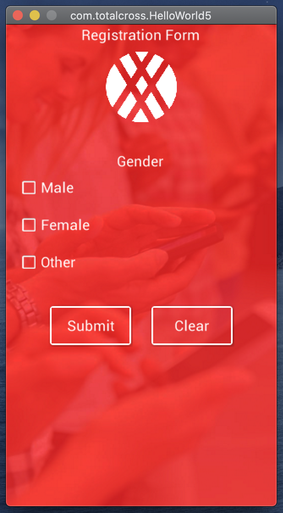

# 3. Hello World

Creating your first application is simple and should take you about 5 minutes.



**Step 1:** Open VSCode _Command Palette_ \(CTRL+Shift+P on Windows, ⇧⌘**P** on Mac\), type **TotalCross** and select **TotalCross: Create new Project**_._ 


**Step 2:** __Create a folder called _HelloWorld_ and select it.

**Step 3:** Fill in the prompted questions. _GroupId_ is the domain of your company domain backwards as in `org.wikipedia` for `wikipedia.org`. Feel free to leave is as`com.totalcross` for this tutorial if you wish. 


**Step 4:** _ArtifactId_ is the name of your application, for this example type `HelloWorld`. Select the latest version of TotalCross SDK and choose whatever platform you intend to deploy your application.


**Step 5:** A new window will open with your project. Right click the`RunHelloWorldApplication.java`  file inside `src> main> com> totalcross` and choose __**Run**. The TotalCross simulator will open with your brand new application.





### Packaging



**Step 1:** Open VSCode _Command Palette_ \(CTRL+Shift+P on Windows, ⇧⌘**P** on Mac\) and search for **TotalCross: Package.**

**Step 2:** When the packaging process is finished the target program will take place inside the folder _target/install/&lt;platform&gt;._



### Deploy & Run


Deployment is currently working _**only for linux arm programs**_. This feature performs the implementation and execution of the platform via ssh.




**Step 1:** Open VSCode _Command Palette_ \(CTRL+Shift+P on Windows, ⇧⌘**P** on Mac\) and search for **TotalCross: Deploy&Run**. If you just want to deploy, choose the option **TotalCross: Deploy**. ****

**Step 2:** Fill in the device information.


**Step 3:** See the result on the screen or with VNC.



### Stepping up your Hello World program

This part will teach you how to create a form by adding images, text fields, select boxes and buttons in 20 steps. 

Your starting point is the Hello World Program you just created. 

**Step 1:** Inside the ****`HelloWorld/src/main/resources` folder create an `images` folder. Now save [these image files](https://github.com/TotalCross/my-first-app-medium/tree/master/src/main/resources/images) inside the new `images` folder.

**Step 2:** Open the file `HelloWorld.java` found inside  `HelloWorld > src > main > java > com > totalcross` . Remove lines 3, 14 and 15:

```java
package com.totalcross;
import totalcross.ui.MainWindow;
import totalcross.ui.Label;
import totalcross.sys.Settings;

public class HelloWorld extends MainWindow {
    
    public HelloWorld() {
        setUIStyle(Settings.MATERIAL_UI);
    }

    @Override
    public void initUI() {
        Label helloWord = new Label("Hello World!");
        add(helloWord, CENTER, CENTER);
    }
}
```

Your file should now look like this:

```java
package com.totalcross;
import totalcross.ui.MainWindow;

import totalcross.sys.Settings;

public class HelloWorld extends MainWindow {
    
    public HelloWorld() {
        setUIStyle(Settings.MATERIAL_UI);
    }

    @Override
    public void initUI() {

    }
}
```

**Step 3:** Scroll Container is a component used to make your app responsive. To use this component you first need to import its library. On line 3 type: `import totalcross.ui.ScrollContainer;`

**Step 4:** Now you are ready to declare your variable `private ScrollContainer sc;` \(line 8\). Next, define it inside a try/catch block in the constructor method \(lines 15-20\).

```java
package com.totalcross;
import totalcross.ui.MainWindow;
import totalcross.ui.ScrollContainer;
import totalcross.sys.Settings;

public class HelloWorld extends MainWindow {
    
    private ScrollContainer sc;
    public HelloWorld() {   
        setUIStyle(Settings.MATERIAL_UI);
    }
    
    @Override
    public void initUI() {
        try {
            ScrollContainer scrollContainer = new ScrollContainer(false,true);
        }
        catch (Throwable error) {
            error.printStackTrace();
        }
    }
}
```


The ScrollContainer component arguments were set to `(false, true)`, which means the horizontal scroll is disabled and the vertical scroll is enable. If you switch true and false the opposite will happen. If both arguments are set to true, both vertical and horizontal scrolling will be enabled. Leave the component with no arguments if you want to disable scroll bars.


**Step 5:** Use the add method to add a screen. This method has to be configured with the object to be inserted on the screen and the position variables respectively, object \(scrollContainer\), horizontal position \(LEFT\), vertical position \(TOP\), width \(FILL\), and height \(FILL\), as shown on line 17.

```java
package com.totalcross;
import totalcross.ui.MainWindow;
import totalcross.ui.ScrollContainer;
import totalcross.sys.Settings;

public class HelloWorld extends MainWindow {
    
    private ScrollContainer scrollContainer;
    public HelloWorld() {   
        setUIStyle(Settings.MATERIAL_UI);
    }
    
    @Override
    public void initUI() {
        try {
            scrollContainer = new ScrollContainer(false,true);
            add(scrollContainer, LEFT, TOP, FILL, FILL); 
        }
        catch (Throwable error) {
            error.printStackTrace();
        }
    }
}
```

**Step 6:** Next import the image library.

```java
import totalcross.ui.image.Image;
```

**Step 7:** Now you will add two images, one as the app background and one as logo. Create two objects to receive these images. 

```java
private Image imgBack, imgLogo;
```

**Step 8:** Import the images as shown below inside the try block.

```java
imgBack = new Image("images/imagem-template-01.png");
imgLogo = new Image("images/logo-branca.png");
```

**Step 9:** Import the Image Control library to change image parameters. , it is necessary to use another `ImageControl` object adding its library.

```java
import totalcross.ui.ImageControl;
```

**Step 10:** Instantiate two `ImageControl` objects.

```java
private ImageControl background, logo;
```

**Step 11:** Define the following image configurations as shown bellow: 

```java
background = new ImageControl(imgBack);
// Maintains the proportion
background.scaleToFit = true;
// Allows you to resize
background.strechImage = true; 

logo = new ImageControl(imgLogo);
logo.scaleToFit = true;
logo.strechImage = true;
// Make background transparent 
logo.transparentBackground = true;
// Scale image
logo.tempHwScale = 0.6; 
```

**Step 12:** Add the images to the container.

```java
scrollContainer.add(background, LEFT, TOP);
scrollContainer.add(logo, CENTER , TOP-15);
```

**Step 13:** The Label component is used to add text to the application. You will use two labels, one to add a title to the application and one to label a question. Import the library and instantiate the objects as shown bellow:

```java
// Import library
import totalcross.ui.Label;

...

// Declaring variable
private Label Title, Gender;
```

**Step 14:** As the background is predominantly red image, it is necessary to change the color of some objects. To do this, import the `Color` library and make the changes shown:

```java
// Import library
import totalcross.ui.gfx.Color;

...

// Defining characteristics
Title = new Label("Registration Form");
Title.transparentBackground = true; 
// Make background transparent
Title.setForeColor(Color.WHITE); 

// Changes the color of the object
Gender = new Label("Gender");
Gender.transparentBackground = true;
Gender.setForeColor(Color.WHITE);

// Including in the container
scrollContainer.add(Title, CENTER, TOP);
scrollContainer.add(Gender, CENTER, AFTER+125);
```

**Step 15:** Next you will import the Check component and use it to select gender in the form. Import the library and create three object instances, as show: 

```java
// Import library
import totalcross.ui.Check;
// Declare variables
private Check subject1, subject2, subject3;
```

**Step 16:** Define the three objects you just created to hold the options "Male", "Female", and "Other" respectively. Edit their look to have a transparent background and set the color to white. The Check component has a wave effect by default. To remove this behaviour, the `effect` _****_method must be null. This step is shown below:

```java
// Defining characteristics
subject1 = new Check("Male");
subject1.transparentBackground = true;
subject1.setForeColor(Color.WHITE);
subject1.effect = null; 

// Turn off click effect
subject2 = new Check("Female");
subject2.transparentBackground = true;
subject2.setForeColor(Color.WHITE);
subject2.effect = null;

subject3 = new Check("Other");
subject3.transparentBackground = true;
subject3.setForeColor(Color.WHITE);
subject3.effect = null;
```

**Step 17:** Add `PREFERRED` __to the `add` methods. The object’s borders will wrap to accommodate only the checkbox and the text.

```java
// Including in the container
scrollContainer.add(subject1, LEFT+15, AFTER-5 , PREFERRED, PREFERRED+25);
scrollContainer.add(subject2, LEFT+15, AFTER-5 , PREFERRED, PREFERRED+25);
scrollContainer.add(subject3, LEFT+15, AFTER-5 , PREFERRED, PREFERRED+25);
```

**Step 18:** Add two buttons, one to complete the registration and one to clear the form.

```java
import totalcross.ui.Button;

private Button Finish,Clear;
```

**Step 19:** Change the colours of the buttons to contrast with the red background.

```java
Finish = new Button("Submit");
Finish.setForeColor(Color.WHITE);
Finish.borderColor = Color.WHITE; 
// Changes the border color
Finish.transparentBackground = true;

Clear = new Button("Clear");
Clear.setForeColor(Color.WHITE);
Clear.borderColor = Color.WHITE;
Clear.transparentBackground = true;

scrollContainer.add(Finish, CENTER-60, AFTER+25, 100, 50);
scrollContainer.add(Clear, CENTER+60, SAME, 100, 50);
```

**Step 20:** Save your changes. Right-click `RunHelloWorldApplication.java` from the Explorer area in Visual Studio Code and select Run. The simulator will open with your application.



## **See more**

Trouble? Find the full code [here](https://github.com/TotalCross/my-first-app-medium). We have started you with some commonly used components. Check the rest of out documentation and find out what is possible with TotalCross. 

