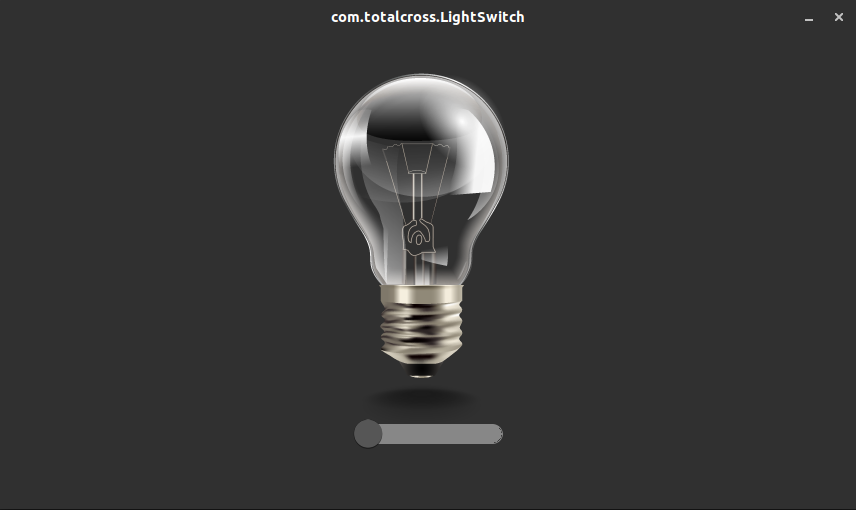
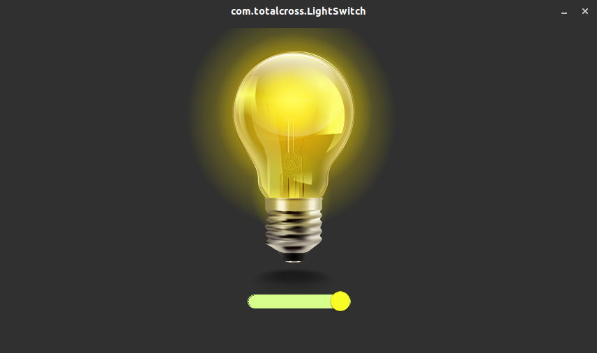

# 3. First embedded project with TotalCross

## 1. Introduction

Our first embedded project using TotalCross will be a simple but elegant interface to control a GPIO pin, that can be used to light an LED or even a relay that can switch on and off a more potent light bulb. To do that we will be learning how to use TotalCross’ Gpiod component, alongside the Switch, and the ImageControl components. The final result should look like this:





## 2. Assembling and testing the hardware

To understand the Gpiod module it is important to understand the libgpiod, which is an interface to manage GPIO in user space, present at the Linux Kernel since version 4.8. So, to start off, let’s assemble our hardware and try out a few of libgpiod command line tools. You will need the following components: 

* An LED
* A 220 Ω resistor \(or any other value up to 470 Ω\)
* A breadboard and jumpers 

In this example we will be using a Raspberry Pi 3, but you can use any other hardware running a Linux distribution with an ARM microprocessor unit, just pay attention to the board’s pinout configuration. We can see at the [Raspberry documentation](https://www.raspberrypi.org/documentation/usage/gpio/) that the pin 40 can be used as GPIO21 and pin 39 can be used as GND, so the hardware configuration will be as it is shown in the figure below: 



Don’t forget to make sure that the short leg on your LED \(which is the negative lead\) is connected to the GND


After the circuit is assembled, let’s test the LED using the gpioset tool from the libgpiod interface. It is important to know that the GPIO chips are mapped into groups of 32 pins, so if you are using GPIO 68, for example, you would need to access chip 2 and pin 4 \(because 32 x 2 + 4 = 68\). In our example, Raspberry 3 has only one chip, so let’s use chip 0 and pin 21. 


As a requirement to use the gpioset tools or TotalCross' Gpiod component, you will need to install the libgpiod-dev package at your board, if it is not installed already. This package contains the required static libraries, headers for this component work on your embedded device. To do that, make sure you have an internet connection in your board and run the following command at its console:

```bash
$ sudo apt-get install -y libgpiod-dev
```


Access your board’s console via SSH or a serial port and try the following command: 

```bash
$ gpioset -m wait gpiochip0 21=1
```

You should see that now your LED is on. This command writes a high value to the GPIO and waits for any user input to set the pin back to its original low state. You can check the [libgpiod page](https://github.com/brgl/libgpiod) on github and maybe try out some other commands. If everything worked fine we are now ready to start writing our TotalCross code! 

## 3. Writing a TotalCross application

### Create a project with the VSCode plugin

Before we start, make sure you have installed VSCode and the TotalCross plugin. Then, press **CTRL + SHIFT + P** and find the “TotalCross: Create New Project” option. You can create a new folder to your project called “LightSwitch”, and then enter “com.totalcross” as your GroupId, and “LightSwitch” again as your ArtifactId. Chose the latest TotalCross version, make sure you check the “-linux\_arm” checkbox and press **Enter** to start your new project. Now, if you open src/main/java/com/totalcross folder at VSCode’s navigator, right click the RunLightSwitchApplication.java file and press enter. You should see TotalCross’ simulator in action, which will now display a white background with the “Hello World” label. You can also press **CTRL + F5** to run it. 

### Adjust the application resolution

The first step is to adjust the application to fit the resolution of your screen. Let’s suppose your device has a 848x480 LCD display. Open the “RunLightSwitchApplication.java” file and enter two additional strings as parameters to the “TotalCrossApplication.run\(\)” method: "/scr" and "848x480". The string following the “/r” parameter contains your TotalCross registration key, so don’t change it. Check out how your display looks now at your simulator. Your file should look like this: 

```java
package com.totalcross;
 
import totalcross.TotalCrossApplication;
 
public class RunLightSwitchApplication {
   public static void main(String [] args) {
       TotalCrossApplication.run(LightSwitch.class, "/scr", "848x480", "/r", "xxxxxxxxxxxxxxxxxxxxxxxx");
   }
}
```

### Set up the images and colors 

At the VSCode's Explorer menu, open the tabs “src” then “main”, right click resources, select “New Folder”, and create a folder called “images”. Right click it and select “Open Containing Folder” to open it at your system. There you can add the two png image files we are going to use at this project: 





Now right click java/com/totalcross, and create a new folder called “util”. Inside it, create two java files: Colors.java and Images.java. Images.java will serve as a helper class to load our image files and return their instances. Add the following code to it:  

```java
package com.totalcross.util;
import totalcross.ui.image.Image;
import totalcross.ui.dialog.MessageBox;

public class Images {

   public static Image iLightOff, iLightOn;

   public static void loadImages() {

       try {
           iLightOff = new Image("images/light-bulb-off.png");
           iLightOn = new Image("images/light-bulb-on.png");

       } catch (Exception e) {
           MessageBox.showException(e, true);
       }
   }
}
```

In Colors.java, we will define the hex code for the colors used at the project, so add the following code to it:

```java
package com.totalcross.util;

public class Colors {

    public static final int COLOR_DARK_GRAY = 0x303030;
    public static final int COLOR_MEDIUM_GRAY = 0x878787;
    public static final int COLOR_LIGHT_GRAY = 0x565656;

    public static final int COLOR_DARK_YELLOW = 0xF7FC26;
    public static final int COLOR_LIGHT_YELLOW = 0xD7FF8C;
}
```

### Create the UI components

First let’s import all the packages we are going to need at the LightSwitch.java class. Add the following lines to it: 

```java
package com.totalcross;

import com.totalcross.util.*;
import totalcross.ui.MainWindow;
import totalcross.ui.Switch;
import totalcross.ui.ImageControl;
import totalcross.io.device.gpiod.GpiodChip;
import totalcross.io.device.gpiod.GpiodLine;
import totalcross.ui.event.ControlEvent;
import totalcross.ui.event.PressListener;
import totalcross.util.UnitsConverter;
import totalcross.sys.Settings;
```

Now let’s implement our main application in the LightSwtich.java file. Note that, by default, the class extends MainWindow class. Every TotalCross application must have one class extending it, as it serves as the main interface between our program and the TotalCross virtual machine \(TCVM\). We will use the constructor method to set the user interface style and set the background color to the application. Add the following lines of code to it: 

```java
public LightSwitch() {
        setUIStyle(Settings.MATERIAL_UI);
        setBackColor(Colors.COLOR_DARK_GRAY);
    }
```

Then let’s create our UI components at the overriden initUI\(\) method. Create the instances to Switch and ImageControl components, set their attributes, and add them to the main window. To do that, we use the add\(\) method, where we can also specify the component’s position and size at the screen. Also notice that we are using the Images util class we created before to load the images and to give a starting state to our ImageControl component.

```java
private Switch swLightSwitch;
private ImageControl icLight;

@Override
public void initUI() {

        Images.loadImages();
        
        //Create switch components
        swLightSwitch = new Switch();
        
        //Set the colors of the switch's parts
        swLightSwitch.colorBallOn = Colors.COLOR_DARK_YELLOW;
        swLightSwitch.colorBallOff = Colors.COLOR_LIGHT_GRAY;
        swLightSwitch.colorBarOn = Colors.COLOR_LIGHT_YELLOW;
        swLightSwitch.colorBarOff = Colors.COLOR_MEDIUM_GRAY;
        
        //Create image control component with initial light off image
        icLight = new ImageControl(Images.iLightOff);
        icLight.scaleToFit = true;
        
        // Position light bulb at the center of the screen,
        // using the original size of the image
        add(icLight, CENTER, CENTER - UnitsConverter.toPixels(DP + 40), 
                PREFERRED, PREFERRED);

        // Position the switch below the image 
        add(swLightSwitch, CENTER, AFTER, UnitsConverter.toPixels(DP + 150), 
                UnitsConverter.toPixels(DP + 30));
    }
```

Now we are going to create a pressListener and add it to our light switch. A pressListener obejct is an event handler that serves as a callback to any pressing event that happens on a component. With it we can check the switch’s state at each press and, based on that, update our image with the new on or off state. Create the following object at your class:

```java
PressListener onSwitchPressed = new PressListener() {
        @Override
        public void controlPressed(ControlEvent controlEvent) {
            if (swLightSwitch.isOn()) {
                icLight.setImage(Images.iLightOn);
            } else {
                icLight.setImage(Images.iLightOff);
            }
        }
    };
```

And add it to the switch component, inside the "initUI\(\)" method: ****

```java
swLightSwitch.addPressListener(onSwitchPressed);
```

The UI is ready to go! You can run the TC simulator to check the result.

### Add GPIO components

Finally, let’s add the Gpiod component, which will actually drive our GPIOs according to the switch's state. First we need to create both GpiodChip and GpiodLine objects at our LightSwitch class and initialize them at our "initUI\(\)" method with the respective chip and pin number \(with the same values we used with the Linux’s libgpiod\). We also need to set the pin as an output, with the “requestOutput” method, and set the initial state as low \(represented by 0\):

```java
private GpiodChip gpioChip;
private GpiodLine pin;

@Override
public void initUI() {

    // Open Gpio chip
    gpioChip = GpiodChip.open(0);

    // Get Gpio line
    pin = gpioChip.line(21);

    // Request line as output and set the initial state to low
    pin.requestOutput("CONSUMER", 0);
    
    ...
```

Then, use the press listener to set values to on and off state:

```java
PressListener onSwitchPressed = new PressListener() {
        @Override
        public void controlPressed(ControlEvent controlEvent) {
            if (swLightSwitch.isOn()) {
                icLight.setImage(Images.iLightOn);
                pin.setValue(1);
            } else {
                icLight.setImage(Images.iLightOff);
                pin.setValue(0);
            }
        }
    };
```

### Deploy the application to your board


Make sure you have installed _libgpiod-dev_ at your board, as explained at the [Assembling and testing the hardware](https://learn.totalcross.com/documentation/get-started/first-embedded-project-with-totalcross#2-assembling-and-testing-the-hardware) __section


To deploy the code to your board, first package the application by pressing **CTRL + SHIFT + P** again and choose “TotalCross: Package”. If everything went ok, you can press **CTRL** + **SHIFT** +  **P** again and now choose “TotalCross: Deploy&Run”. Now enter the user for your board \(eg. “pi”\), the host \(the IP address\), and the password to it. You can select the default folder for the application to be stored at the host and press enter to start the upload. 

If everything worked fine, you now should see the application running at your board like this:


You can try out some modifications and upgrades at the code by your own now, and maybe try out some other [Components](https://learn.totalcross.com/documentation/components). If you want to step up your application ever further, check out the [Guides](https://learn.totalcross.com/documentation/guides) tab, where you can find some tips on how to build a more advanced and scalable architecture to your software, and also how to run external applications using TotalCross. 

### References <a id="references"></a>

* [Source code](https://github.com/TotalCross/LightSwitch)


### 

### 


## 

