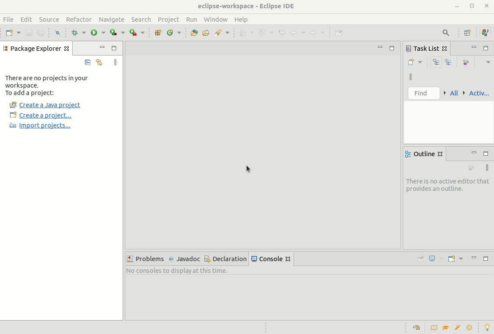
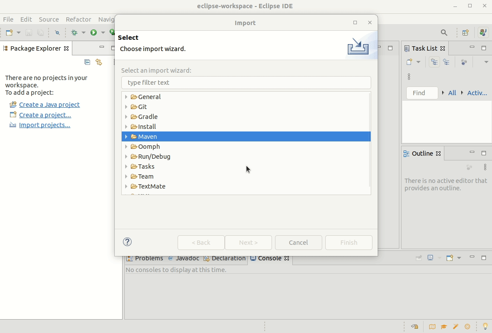
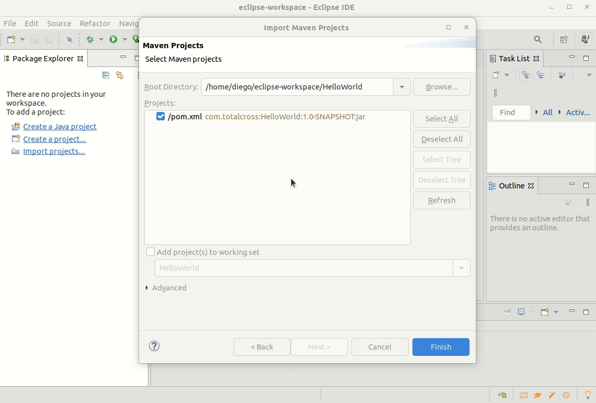
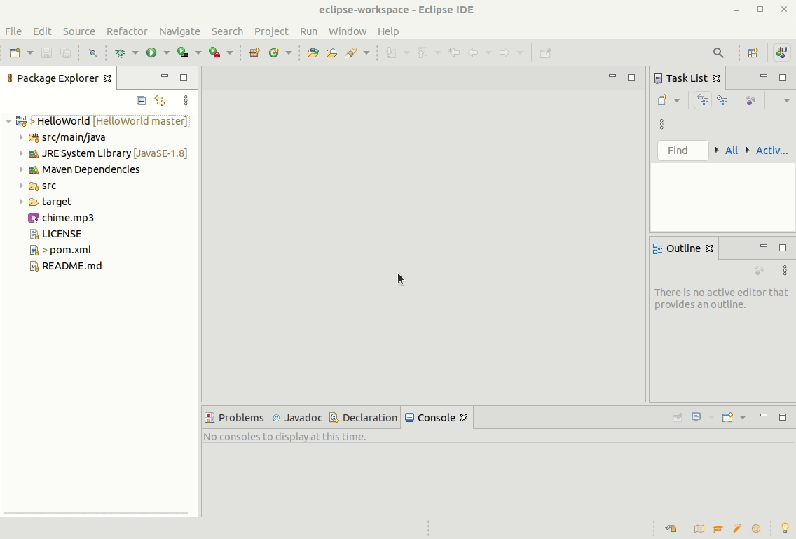
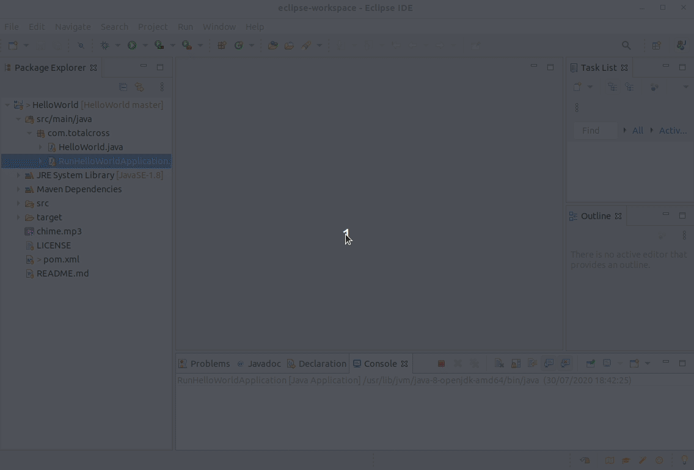
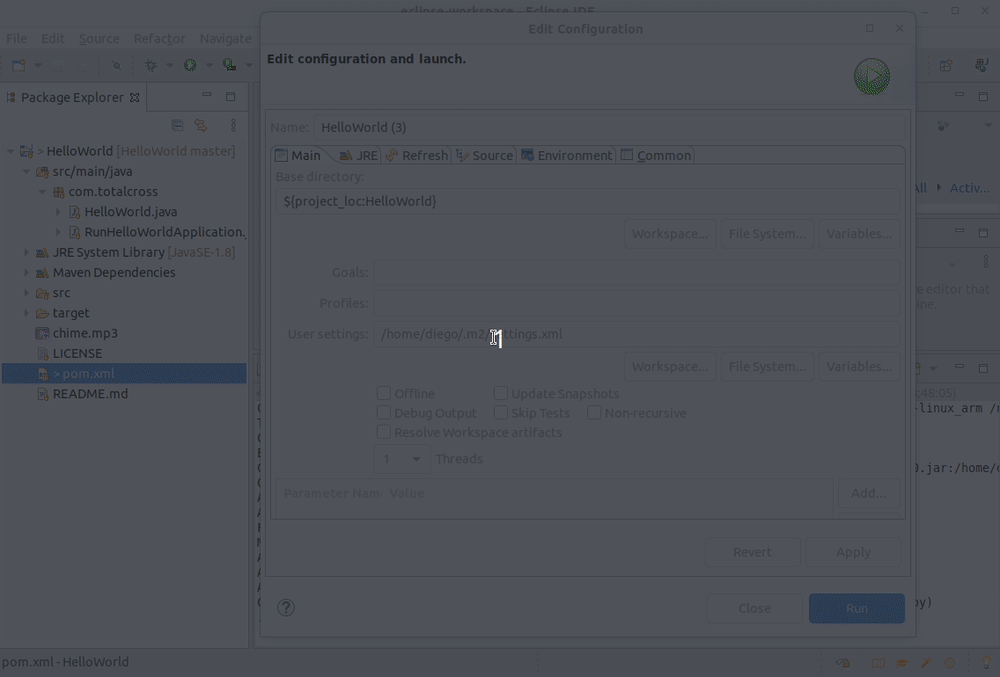
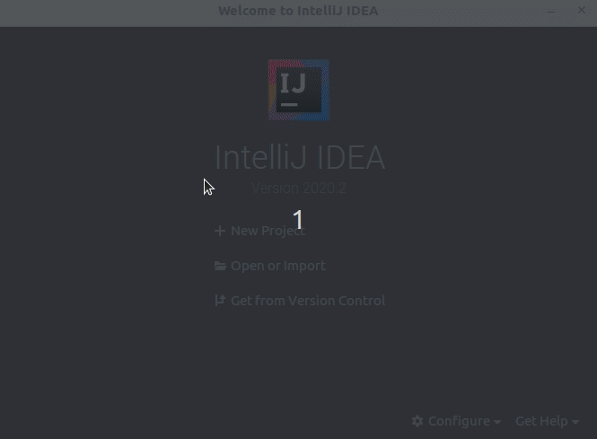
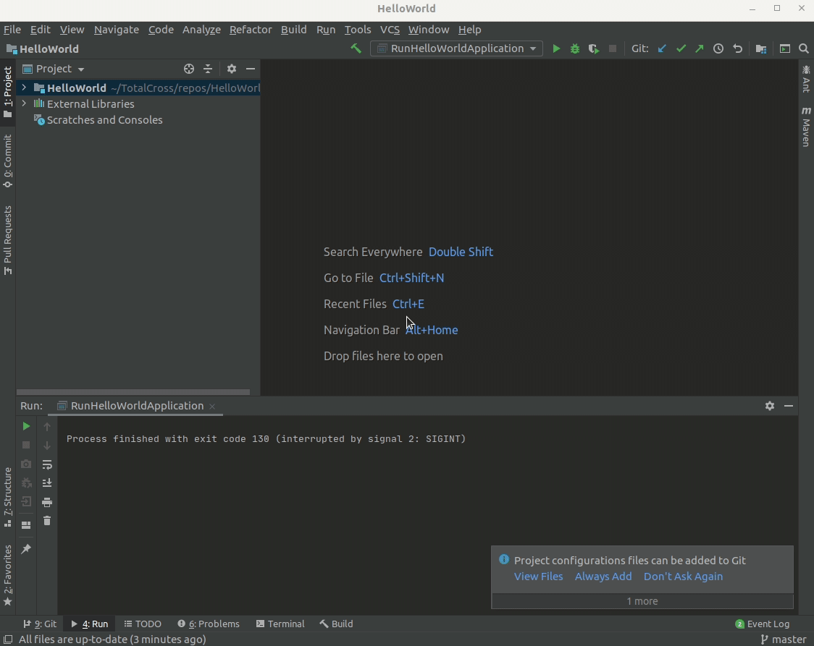
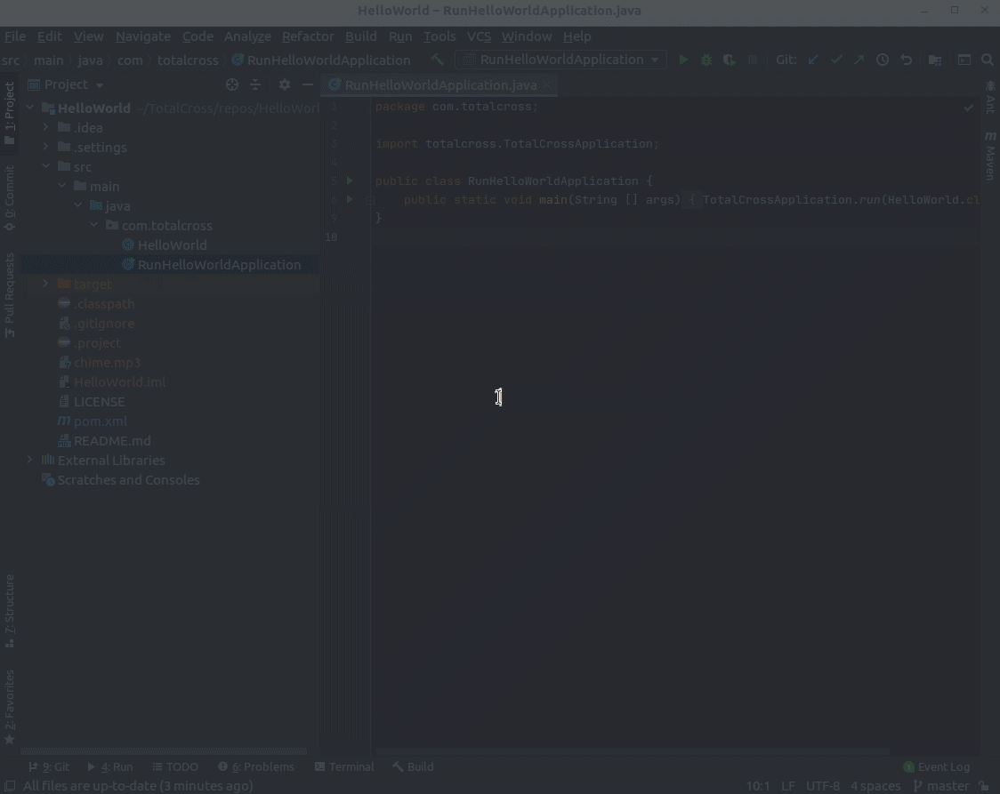
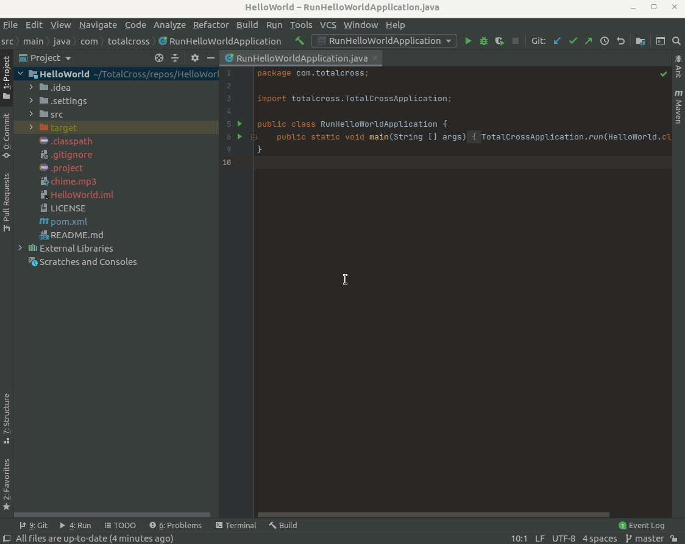

# Environment setup

In the next steps of this getting started you will learn how to configure TotalCross and deploy a HelloWorld application to any device on either VSCode, Eclipse, or IntelliJ IDE. Choose the steps you are most comfortable with and get ready to start!


You can create your TotalCross applications **from any IDE that supports Java and Maven** projects, but we highly recommend s**tarting with** [**Visual Studio Code**](../miscelaneous/installing-visual-studio-code.md), using the official [TotalCross VSCode plugin](https://marketplace.visualstudio.com/items?itemName=totalcross.vscode-totalcross), as it is a very quick and easy process.





Please make sure that your Visual Studio Code is updated, as some issues with the plugin may occur on older versions


## **Install the TotalCross plugin**

**Step 1:** Open Visual Studio Code and go to _Extensions_.

**Step 2:** Type TotalCross in the search bar and click to install.

## Create a Hello World project

**Step 1:** Open VSCode Command Palette \(CTRL + Shift + P on Windows, ⇧⌘**P** on Mac\), type TotalCross and select **TotalCross: Create new Project.**

**Step 2:** Create a folder called _HelloWorld_ and select it.

**Step 3:** Fill in the prompted questions. _GroupId_ is the domain of your company domain backward as in `org.wikipedia` for `wikipedia.org`. Feel free to leave it as com.totalcross for this tutorial if you wish.

**Step 4:** ArtifactId is the name of your application, for this example type _HelloWorld_. Select the latest version of TotalCross SDK and choose whatever platform you intend to deploy your application.

**Step 5:** A new window will open with your project. Right click the `RunHelloWorldApplication.java` file inside `src > main > com > totalcross` and choose **Run**. The TotalCross simulator will open with your brand new application.

## Package your application

**Step 1:** Open VSCode _Command Palette_ \(CTRL+Shift+P on Windows, ⇧⌘**P** on Mac\) and search for **TotalCross: Package.**

**Step 2:** When the packaging process is finished the target program will take place inside the folder _target/install/&lt;platform&gt;._

## Deploy and Run you application


Deployment is currently working _**only for linux arm programs**_. This feature performs the implementation and execution of the platform via ssh.


**Step 1:** Open VSCode _Command Palette_ \(CTRL + Shift + P on Windows, ⇧⌘**P** on Mac\) and search for **TotalCross: Deploy&Run**. If you just want to deploy, choose the option **TotalCross: Deploy**.

**Step 2:** Fill in the device information.

**Step 3:** See the result on a display connected to your device or with a VNC client.




Please make sure that your Eclipse IDE for Java Developers is updated


## Clone the HelloWorld repository

**Step 1:** Clone or download [this repository containing a TotalCross HelloWorld application](https://github.com/TotalCross/HelloWorld)

## Import and run the project from Eclipse IDE

**Step 1:** Open the Eclipse IDE and select `File > Import...`

**Step 2:** At the import menu, select `Maven > Existing Maven Projects`

**Step 3:** Click on `Browse...` __and then select the folder where your _HelloWorld_ repository is located

**Step 4:** Make sure Eclipse has recognized the _pom.xml_ file and then click `Finish`


Don't worry if Eclipse shows an error about not finding marketplace entries to handle _totalcross-maven-plugin_, it won't have any impact in your project. __But if you want to get rid of it, follow the instructions at the [readme file](https://github.com/TotalCross/HelloWorld/blob/master/README.md) from _HelloWorld_ project to update your _pom.xml_ and fix the problem.


**Step 5:** Expand `src/main/java` at the Package Explorer tab, then expand `com.totalcross`, right-click the _RunHelloWordApplication.java_ and choose `Run As > 1. Java Application`. The TotalCross simulator will open with your brand new application.

## Package your application

**Step** **1:** Right-click the _pom.xml_ file and choose`Run As > 2. Maven Build...` 

**Step** **2:** At the `Goals` text field, type in `clean package`, and then hit `Run`

**Step 3:** Maven will resolve all the dependencies that you need and build your application for the platforms configured at the _pom.xml_ file. This project is configured by default to build to Android, Linux \(x86\), and Linux\_arm targets. Fell free to remove platforms you don't want and maybe add others such as iOS or Windows. The generated folders will be located inside your repository at `target/install/<platform>`. You can deploy a folder of any platform directly to your target and run your application anywhere!


You can also follow these steps on YouTube:

[Getting Started with TotalCross using Eclipse IDE: Importing a HelloWorld Maven Project](https://youtu.be/J-3EM2eUDPY)





Please make sure that your IntelliJ IDE is updated


## Clone the HelloWorld repository

**Step 1:** Clone or download [this repository containing a TotalCross HelloWorld application](https://github.com/TotalCross/HelloWorld)

## Import and run the project from IntelliJ IDE

**Step 1:** Open the IntelliJ IDE. From the starting page, select `Open or Import` and open the folder where your _HelloWorld_ repository is located. Open it as a maven project.

**Step 2:** To run your application at the TotalCross simulator, expand `HelloWorld/src/main/java` at the Project tab, then expand `com.totalcross`, right-click the _RunHelloWordApplication_ file and choose `Run 'RunHelloApplication.main()'`. The TotalCross simulator will open with your brand new application.

## Package your application

**Step** **1:** Open IntelliJ's maven extension, right-click the option `Lifecycle > package` and choose `Run Maven Build`

**Step 2:** Maven will resolve all the dependencies that you need and build you application for the platforms configured at the _pom.xml_ file. This project is configured by default to build to Android, Linux \(x86\), and Linux\_arm targets. Fell free to remove platforms you don't want and maybe add others such as iOS or Windows. The generated folders will be located inside your repository at `target/install/<platform>`. You can deploy a folder of any platform directly to your target and run you application anywhere!


You can also follow this steps on YouTube:

[Getting Started with TotalCross using IntelliJ IDE: Importing a HelloWorld Maven Project](https://youtu.be/RqENaIW81oU)




Now that your environment is ready, let's create the first embedded project in the next session:



\*\*\*\*

