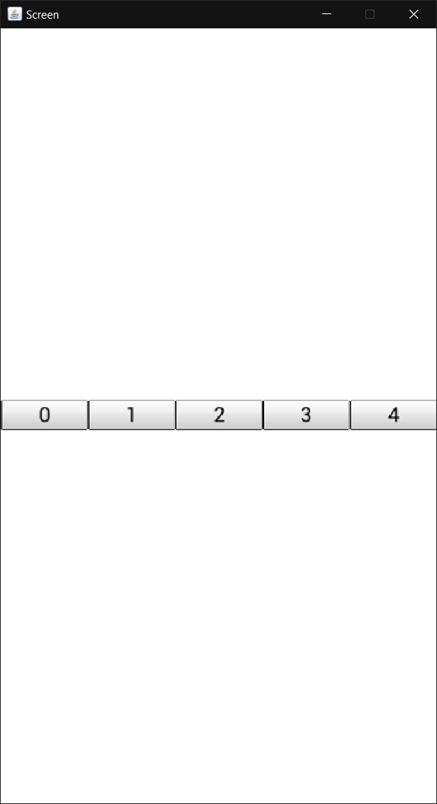
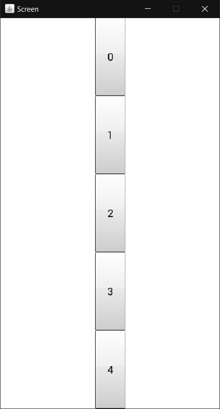

# Relative Positioning

At totalcross, we have two layouts ready to help you set up your application: HBox and VBox. These layouts can be described as 2 boxes where you "stack" your components, be it with a certain space between them or just simply really stacked. Both these layouts are extensions of the LinearBox class. To use them is pretty simple, all you ned to do is instantiate one of them, set its mode and add your components inside.

### Hbox

This layout will group your components horizontally, 


```java
public void initUI() {
    HBox hBox = new HBox(HBox.LAYOUT_FILL, HBox.ALIGNMENT_STRETCH);

    for (int i = 0; i < 5; i++) {
        hBox.add(new Button(i+""));
    }
    add(hBox, LEFT, CENTER, FILL, PREFERRED);
}
```




### Vbox

This layout will group your controllers vertically


```java
public void initUI() {
    VBox vBox = new VBox(VBox.LAYOUT_FILL, VBox.ALIGNMENT_STRETCH);
    
    for (int i = 0; i < 5; i++) {
        vBox.add(new Button(i + ""));
    }
    add(vBox, CENTER, TOP, DP + 50, FILL);
}

```




## Attributes

<table>
  <thead>
    <tr>
      <th style="text-align:left">Type</th>
      <th style="text-align:left">Name</th>
      <th style="text-align:left">
        <p></p>
        <p>Description</p>
      </th>
    </tr>
  </thead>
  <tbody>
    <tr>
      <td style="text-align:left"><b>int</b>
      </td>
      <td style="text-align:left">LinearBox.LAYOUT_STACK_CENTER</td>
      <td style="text-align:left">Organizes the elements around the center.</td>
    </tr>
    <tr>
      <td style="text-align:left"><b>int</b>
      </td>
      <td style="text-align:left">LinearBox.LAYOUT_DISTRIBUTE</td>
      <td style="text-align:left">Distributes the elements along the width or height of the box.</td>
    </tr>
    <tr>
      <td style="text-align:left"><b>int</b>
      </td>
      <td style="text-align:left">LinearBox.LAYOUT_FILL</td>
      <td style="text-align:left">Distribute and scale each element to fill the entire width or height of
        the box.</td>
    </tr>
    <tr>
      <td style="text-align:left"><b>int</b>
      </td>
      <td style="text-align:left">LinearBox.ALIGNMENT_LEFT</td>
      <td style="text-align:left">Aligns each child along the left/top border.</td>
    </tr>
    <tr>
      <td style="text-align:left"><b>int</b>
      </td>
      <td style="text-align:left">LinearBox.ALIGNMENT_RIGHT</td>
      <td style="text-align:left">Aligns each child along the right/bottom border.</td>
    </tr>
    <tr>
      <td style="text-align:left"><b>int</b>
      </td>
      <td style="text-align:left">LinearBox.ALIGNMENT_CENTER</td>
      <td style="text-align:left">Centers each child object.</td>
    </tr>
    <tr>
      <td style="text-align:left"><b>int</b>
      </td>
      <td style="text-align:left">LinearBox.ALIGNMENT_STRETCH</td>
      <td style="text-align:left">Stretches each child object.</td>
    </tr>
    <tr>
      <td style="text-align:left"><b>int</b>
      </td>
      <td style="text-align:left">Hbox.LAYOUT_STACK_LEFT</td>
      <td style="text-align:left">Organizes each element from left to right.</td>
    </tr>
    <tr>
      <td style="text-align:left"><b>int</b>
      </td>
      <td style="text-align:left">Hbox.LAYOUT_STACK_RIGHT</td>
      <td style="text-align:left">Organizes each element from right to left.</td>
    </tr>
    <tr>
      <td style="text-align:left"><b>int</b>
      </td>
      <td style="text-align:left">Vbox.LAYOUT_STACK_TOP</td>
      <td style="text-align:left">Organizes each element from top to bottom.</td>
    </tr>
    <tr>
      <td style="text-align:left"><b>int</b>
      </td>
      <td style="text-align:left">Vbox.LAYOUT_STACK_BOTTOM</td>
      <td style="text-align:left">Organizes each element from bottom to top.</td>
    </tr>
  </tbody>
</table>## Methods

| Type | Name | Description |
| :--- | :--- | :--- |
| **void** | setInsets\(int left, int right, int top, int bottom\) | Sets the internal paddings of this component. |
| **void** | setLayout\(int mode, int alignment\) | Sets the layout mode and alignment of this component. |
| **void** | suspendLayout\(\) | Suspends all layout operations from 'add' calls until a 'resumeLayout' call. |
| **void** | resumeLayout\(\) | Performs all queued layout operations and resumes the default layout behaviour of the 'add' method. |
| **void** | setSpacing\(int spacing\) | Sets the spacing between components. |


