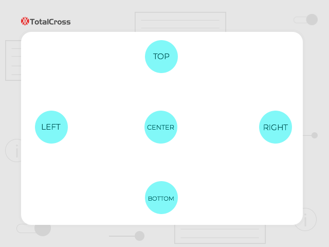
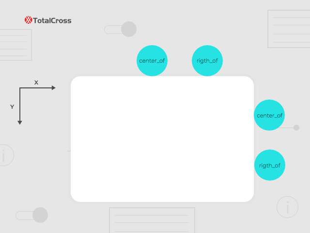
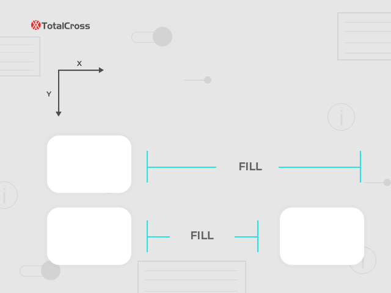

# Manual Positioning

The controls can be added in the container and window and to accomplish this we have some constants defined in the Control class that will aid in the positioning of the controlers

### Positioning on screen

To position a controller on the screen, simply use the ADD method


```java
public void initUI() {
   // control, Positioning on the x axis, Positioning on the y axis) 
    add( new Label("Add a label for this screen"), CENTER, CENTER);
}    
```


The add method has some Overloading 


```text
    add(control, x axis, y axis, width, length)
    add(control, x axis, y axis, int width, int length, relativeControl)
    add(control, x axis, y axis) 
    add(control, x axis, y axis, relativeControl)
```



If no **relative control** is added in the method add, the relative control will be the last control added on the screen.


```java
add( new Label("Add a label for this screen"), CENTER, CENTER, relativeControl);

```



### Positioning on the X axis 

| Constant | Description |
| :--- | :--- |
| BEFORE | allocates control to the left of the relative control |
| CENTER | Place the Control in the middle of the screen with respect to the x-axis |
| AFTER | allocates control to the Rigth of the relative control |
| LEFT | Put the Control on the left |
| RIGHT | Put the Control on the Rigth |
| SAME | They hold the same position as the relative control |
| CENTER\_OF | Allocates the control at the center of the relative control space relative to the x-axis |
| RIGHT\_OF | Allocates the control at the right of the relative control space relative to the x-axis |
| KEEP | Maintain the same relative control position |
| PARENTSIZE | Assigned container size to control |

### Positioning on the Y axis 

| Constant | Description |
| :--- | :--- |
| BEFORE | allocates control to the up of the relative control |
| CENTER | Place the Control in the middle of the screen with respect to the y-axis |
| AFTER | allocates control to the bottom of the relative control |
| TOP | Put the Control on the top |
| BOTTOM | Put the Control on the bottom |
| SAME | They hold the same position as the relative control |
| CENTER\_OF | Allocates the control at the center of the relative control space relative to the y-axis |
| BOTTOM\_OF | Allocates the control at the  bottom of the relative control space relative to the y-axis |
| KEEP | Maintain the same relative control position |
| PARENTSIZE | Assigned container size to control |

### Position with DP

You can also position the control using DP. Just use the `UnitsConverter.toPixels()`

```java
public void initUI() {
        Label lbl1 = new Label("");
        lbl1.setBackColor(Color.RED);

        Label lbl2 = new Label("");
        lbl2.setBackColor(Color.GREEN);
        
        add(lbl1, CENTER, CENTER, WILL_RESIZE , PREFERRED);
        add(lbl2, UnitsConverter.toPixels(DP + 50), UnitsConverter.toPixels(DP + 400), SCREENSIZE, PREFERRED);
}
```

### Control size

| Constant | Description |
| :--- | :--- |
| PREFERRED | The ideal value for the control size is calculated |
| SAME | Same size as relative control |
| FILL | Fills the entire size of the control |
| FIT | Fill the space until you find a control |
| KEEP | Maintains the same relative control |
| WILL\_RESIZE | Assigns the control space to the end of the screen |
| SCREENSIZE | Assigns control size equal to screen size |
| SCREENSIZEMIN | Adjusts the control to receive the smallest dimension between portrait mode and landscape mode |
| SCREENSIZEMAX  | Adjusts the control to receive the largest dimension between portrait mode and landscape mode |
| PARENTSIZE | Assigned container size to control |
| PARENTSIZEMIN | Assigns the size of the smallest container to the control |
| PARENTSIZEMAX | Assigns the size of the largest container to the control |


To achieve greater precision, it is possible to add and subtract values to the parameters passed in the size of the control


### Images







