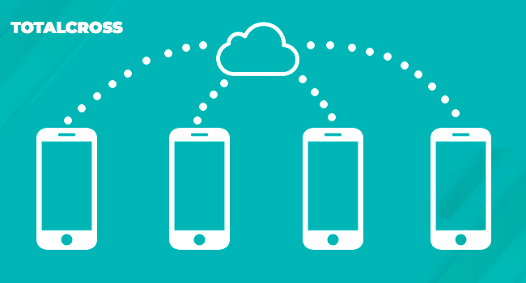

# Web Services

## Overview

In the previous session we explained how to store data locally and now we will learn how to get these local database and send information to an external or receive external database data through a solution used in systems integration and in communication between different applications, call Web Services. 

Through this technology, it is possible that applications that are under development will communicate with applications that have already been developed. In addition to enabling integration between different platforms developed in different programming languages. 

For businesses, Web Services can bring agility to processes and efficiency in communicating between production chains. 

## What are the benefits of Web Services?

Make use of Web Services behind both technical development and your business, such as:

1. Integration of information and systems;
2. Reuse code;
3. Reduction of development time;
4. Greater security;
5. Reduced costs.

## If they are different languages, how is communication between them? 

In order to communicate between two technologies constructed with different languages, a third language is required to function as "universal" and to guarantee communication. There are 3 protocols that play this role: 

* SOAP \(Simple Object Access Protocol\)



* Socket 



* REST \(Representational State Transfer\).

The easiest and most recommended is the Rest, due to the ease to execute it and so is the one that we will demonstrate in the chapter below:



## References

* [Open Soft - Web Service](https://www.opensoft.pt/web-service/)

