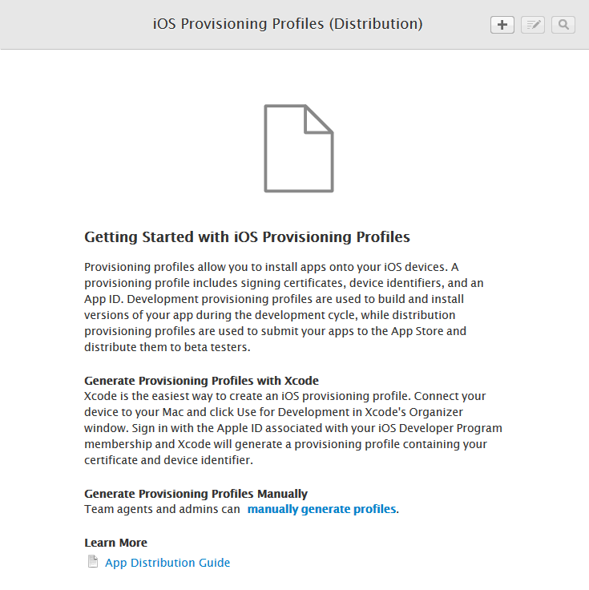
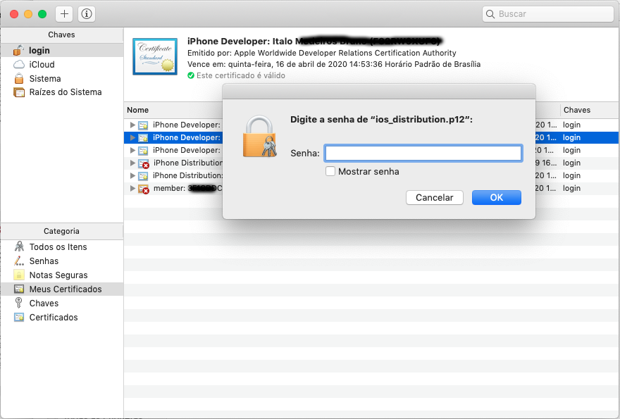

# Deploy iOS

### Generating key store and certificate

#### You need to have openssl installed in your computer.

* If you use Mac OS, this should be installed as default
* If you use Linux, we recomend to install your distro binaries
* If you use Windows, you should install OpenSSL for Windows
* If you use Windows, you may install a git-bash \(like the one embedded within SourceTree\)

First, you need to create your RSA 2048 key-pair with the following command:

 `openssl req -nodes -newkey rsa:2048 -keyout request.key -out request.csr`

You will be prompted with some questions, which you need to supply the answers. You may want to configure the `openssl req` with predefined data. To do so, create a `config` file like the template below:

```text
[ req ]
distinguished_name = req_distinguished_name
prompt = no
[ req_distinguished_name ]
emailAddress = john@webmail.com
commonName = John Doe
countryName = BR
stateOrProvinceName = Rio de Janeiro
localityName = Rio de Janeiro
organizationName = John’s Company
```

Then pass it to the `openssl req` command like the follow:

```text
openssl req -config config -nodes -newkey rsa:2048 -keyout request.key -out request.csr
```


Optionally, you can call openssl without passing a config file using the interactive mode.

```text
openssl req -nodes -newkey rsa:2048 -keyout request.key -out request.csr
```



*  `request.key` is the private key
*  `request.csr` is the public key

Never share your private key `request.key` in a non-secure media. If you must transfer it from your trusted computer to another, do it safely. Some suggestions are:

1. use `scp` to copy this file over `ssh` encryption to your other trusted computer;
2. zip it with a password, forward the file with a pen-drive or in a email, and tell the destinatary the password through another media;
3. upload it with `https` to a trusted server of your own.

If somehow you have shared your private key `request.key` in a unsecure way, please, **BURN IT WITH FIRE BEFORE IT LAYS EGGS OF SECURITY BREACHNESS**. You are warned. You should take your security seriously. Pretty pretty seriously.

Your public key is meant to be shared with the wind. There is no worry about this as long as[P≠NPP \neq NPP̸​=NP](https://en.wikipedia.org/wiki/P_versus_NP_problem).

Now go to the [Apple Developer Page](https://developer.apple.com/account/ios/certificate/) and request a new certificate. Choose accordingly to your needs.

### Creating your certificate

You should now see this screen:


As I need a production certificate for an Enterprise account, I choosed the `In-House and Ad-Hoc`. 

 And then finally to the screen where I now shall upload the generated `.csr`file \(it is the public key, so therefore no worry\):


Now you can download the certificate at any time. This file is commonly named as `ios_distribution.cer`.

### iOS App ID

To generate the provisioning profile, one must have before-hand to register new Apple ID in `Register a new Identifier`:


 In the sample above, I have choosen to go with the `Explicit App ID`, `com.totalcross.tcguide`. 


You cannot enable **Push Notification** service using **Wildcard Apple ID**.



You shall not use **Wildcard Apple ID** if you want to distribute your application with **Enterprise Distribution**. This may leads to trouble when your client tries to upgrade the app you have provided.


 

### Provisioning profile

Now we must generate the provisioning profile:



As I want an enterprise distribution, I must choose the `In-House` provisioning profile:


If you want to test your app in specific iOS devices, you must create a `Development` provisioning file. To do so follow the tutorial: [Using Development certificate to test your application.](using-development-certificate-to-test-your-apps.md)



Now the system will ask you about the App ID, then the certificate, and finally you are prompted with a Profile Name. It can be arbitrary:

You end this step downloading a `.mobileprovision` file.

### Recalling

You have created in your own machine this files:

*  `config (optional)`, so that it will be easy to create your public/private keys
*  `request.key`, your private key
*  `request.csr`, your public key
*  `ios_distribution.cer`, your Apple certificate
*  `.mobileprovision`, one of the most important files so that you can indeed embed this in your app to distribute

### Finishing the basis to compile to iOS with TotalCross

So far, so good. Now we need to create a Publc-Key Cryptography Standard 12 `.p12` file. To create it, we need the intermediary container for public key `.pem` file.

> [This question](https://serverfault.com/q/9708) in ServerFault gives you more details about the files format. Also it was where I got that information above.

To create the `.pem` file, just give this command:

```text
openssl x509 -in ios_distribution.cer -inform DER -out ios_distribution.pem -outform PEM
```

Where:

*  `x509`  is the cryptography standard
*  `-in ios_distribution.cer`  indicates that the input certificate file is named `ios_distribution.cer`
*  `-inform DER`  indicates that the format of the input file is `DER`, so that OpenSSL can do its conversion  AKA _translate from `DER`_
*  `-out ios_distribution.pem`  indicates that the output file name is named `ios_distribution.pem`
*  `-outform PEM`  indicates that the output format is `PEM`  AKA _translate to `PEM`_

With the `.pem` file created, we just need to create the `.p12` file:

```text
openssl pkcs12 -export -inkey request.key -in ios_distribution.pem -out ios_distribution.p12
```

Where:

*  `pkcs12`  is the cryptography standard
* `-export`
*  `-inkey request.key`  which file is the private key? It is `request.key`
*  `-in ios_distribution.pem`  which file is the container for your certificate? `ios_distribution.pem`
*  `-out ios_distribution.p12`  which file I want to save as my PKCS 12 file? `ios_distribution.p12`


**For TotalCross SDK 4.4.1 or earlier and 5.1.3 or earlier:**

You must create two **.p12 files**. The first one **with password** to be added in your keychain \(you can name it ios\_distribution\_with\_password.p12\). The second one **without password** to be used in your **tc.Deploy** through the `/m` parameter.

**For later versions:**

You can create just one **.p12 file with password**  to be added in your keychain. For later versions, we no longer require parameter /m \(Deprecated\) to build your TotalCross ipa.


### Adding your certificate to your Keychain in your macOS


Requires a **p12 file with password**.


Click twice in p12 file. A box with password field will be shown, type your p12 file password in the **field passwor**d and your certificate will be added to your macOS Keychain.



### iOS deployments

#### GENERATING YOUR IPA FILE BY USING TOTALCROSS DEPLOYER


**For TotalCross SDK 4.4.1 or earlier and 5.1.3 or earlier:**

Before executing the following steps, copy your certificate file, `ios_certificate.p12`, and your mobileprovision file, `profile.mobileprovision,` to a separate folder inside workspace directory.


#### Maven

Execute command `mvn package` using the following pom.xml as example:

```markup
<properties>
		<project.build.sourceEncoding>UTF-8</project.build.sourceEncoding>
		<totalcross.activation_key>place holder</totalcross.activation_key>
</properties>
	
<build>
		<finalName>${project.artifactId}</finalName>
		<plugins>
			<plugin>
				<groupId>org.apache.maven.plugins</groupId>
				<artifactId>maven-compiler-plugin</artifactId>
				<version>3.1</version>
				<configuration>
					<source>1.8</source>
					<target>1.8</target>
				</configuration>
			</plugin>
			<plugin>
				<groupId>net.orfjackal.retrolambda</groupId>
				<artifactId>retrolambda-maven-plugin</artifactId>
				<version>2.5.6</version>
				<executions>
					<execution>
						<goals>
							<goal>process-main</goal>
							<goal>process-test</goal>
						</goals>
					</execution>
				</executions>
			</plugin>
			<plugin>
				<groupId>org.codehaus.mojo</groupId>
				<artifactId>exec-maven-plugin</artifactId>
				<version>1.1.1</version>
				<executions>
					<execution>
						<phase>package</phase>
						<goals>
							<goal>java</goal>
						</goals>
						<configuration>
							<mainClass>tc.Deploy</mainClass>
							<arguments>
								<argument>${project.build.directory}/${project.build.finalName}.${project.packaging}</argument>
								<argument>-ios</argument>
								<argument>/p</argument>
								<argument>/r</argument>
								<argument>${totalcross.activation_key}</argument>
								<!-- 
									Parameter /m is just required for versions 4.4.1 or ealier
									and 5.1.3 or ealier.
								 -->
								<argument>/m</argument>
								<argument>{put ios certificate path here}</argument>
							</arguments>
						</configuration>
					</execution>
				</executions>
			</plugin>
		</plugins>
	</build>
```

#### Old style command line

If you rather the old style way of deploying:

`java -cp "%TOTALCROSS3_HOME%"/dist/totalcross-sdk.jar tc.Deploy HelloTC.jar -iphone /m ./ios_certs /p /r YOUR_KEY_HERE`

`"%TOTALCROSS3_HOME%" = is the folder where the TC SDK`

`HelloTC.jar = is the jar of project`

`ios_certs = path to certificate`

#### RESIGNING YOUR APPLICATION

> Requirements:
>
> 1. having XCode updated to version `>=10.0`
> 2. having **Imagemagick** installed
> 3. having Totalcross SDK `>=4.2.1` installed
> 4. having your certificate shown in the list of valid identities returned by executing `security find-identity`:
>
> ```text
> $ security find-identity
>
> Policy: X.509 Basic
>   Matching identities
>   1) XXXXXXXXXXXXXXXXXXXXXXXXXXXXXXXXXXXXXXXX "iPhone Distribution: Your Company"
>   2) XXXXXXXXXXXXXXXXXXXXXXXXXXXXXXXXXXXXXXXX "iPhone Distribution: Your Company 2"
>   3) XXXXXXXXXXXXXXXXXXXXXXXXXXXXXXXXXXXXXXXX "iPhone Developer: Your Name"
>   4) XXXXXXXXXXXXXXXXXXXXXXXXXXXXXXXXXXXXXXXX "iPhone Distribution: Your Company 3"
>
>   Valid identities only
>   1) XXXXXXXXXXXXXXXXXXXXXXXXXXXXXXXXXXXXXXXX "iPhone Developer: Your Name"
>   2) XXXXXXXXXXXXXXXXXXXXXXXXXXXXXXXXXXXXXXXX "iPhone Distribution: Your Company 3"
>      2 valid identities found
> ```

####  Preparing environment

1. Install **Imagemagick** by entering command \(if you don't have brew installed visit [this page](https://brew.sh/) and install it. Its pretty easy!\):

> ```text
> brew install imagemagick
> ```

1. Switch Command Line Developer Tools to CLT XCode directory by executing

> ```text
> sudo xcode-select --switch /Applications/Xcode.app/Contents/Developer
> ```

1. Give execution permission to the sh scripts inside `path/to/your/totalcross_sdk_home/etc/tools/iOSCodesign`

> ```text
> sudo chmod +x tccodesign.sh xcassetsGenerator.sh
> ```

####  Resigning your app.ipa

> Artifacts needed for this step:
>
> 1. the TotalCross generated `.ipa`
> 2. your provisioning profile
> 3. your Certificate name \(`iPhone Distribution: Your Company`\)
> 4. Method, which can be: app-store, ad-hoc, enterprise or development. \(It must match your .mobileprovision type\)
> 5. Your Application Icon
> 6. a Mac OS X computer

Having all of those parameters, you will be able to run the following command:

```text
./tccodesign --ipa path/to/to-be-signed.ipa --icon path/to/icon.png --provision-file path/to/provision-file.mobileprovision --certificate 'iPhone Distribution: XXXX Company YYYYY' -m [ad-hoc | app-store | enterprise | development]
```

<table>
  <thead>
    <tr>
      <th style="text-align:left">Parameters</th>
      <th style="text-align:left">Description</th>
    </tr>
  </thead>
  <tbody>
    <tr>
      <td style="text-align:left">--ipa, -i</td>
      <td style="text-align:left">Represents the path to your ipa file generated by the tc.Deployer that
        you want to be resigned.</td>
    </tr>
    <tr>
      <td style="text-align:left">--icon</td>
      <td style="text-align:left">Represents the path to your application icon. If you ommit it, the totalcross
        icon will be placed.</td>
    </tr>
    <tr>
      <td style="text-align:left">--provision-file, -prov</td>
      <td style="text-align:left">Represents the path your mobileprovision file.</td>
    </tr>
    <tr>
      <td style="text-align:left">--certificate, -c</td>
      <td style="text-align:left">Represents the name of your certificate as shown in your mac keychain
        (you may copy this name from the keychain or from the command <code>security find-identity</code> in
        the list of valid certificates.</td>
    </tr>
    <tr>
      <td style="text-align:left">--method, -m</td>
      <td style="text-align:left">
        <p>Represents the method which you want to distribute your app. They are:</p>
        <ul>
          <li>ad-hoc;</li>
          <li>app-store;</li>
          <li>enterprise;</li>
          <li>development.</li>
        </ul>
      </td>
    </tr>
    <tr>
      <td style="text-align:left">--output, -o (optional)</td>
      <td style="text-align:left">Represents the path in which your resigned ipa file will be placed. If
        you ommit this parameters, your resgined ipa file will be generated inside<code>[tccodesign.sh directory]/build</code>
      </td>
    </tr>
  </tbody>
</table>


Now you're ready to properly install or upload to the apple store your application.


