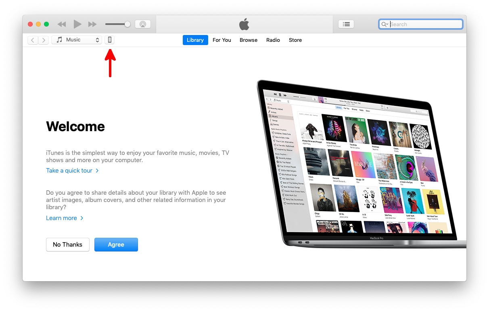
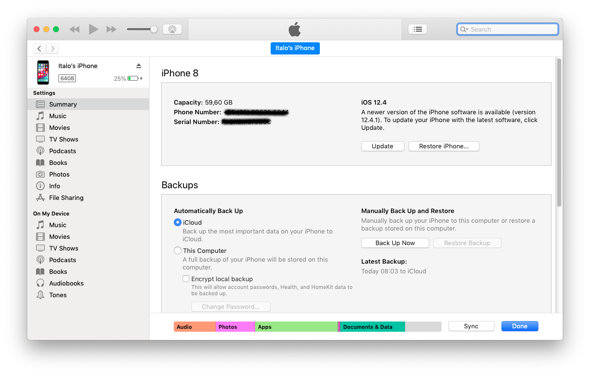

# Using Development certificate to test your apps

In order to test your application file you must resign your application using a Development Certificate and a `mobileprovision` file for development. To do so, create a Development Certificate in the same way you have created your Distribution one \([Creating certificate](https://app.gitbook.com/@totalcross/s/playbook/~/drafts/-Lnn-qXXBj5lBCqiQBQ-/primary/learn-totalcross/deploy-your-app-android-ios-and-windows/deploy-ios#creating-your-certificate)\) and a Development mobileprovision \([Provisioning file](https://app.gitbook.com/@totalcross/s/playbook/~/drafts/-Lnn-qXXBj5lBCqiQBQ-/primary/learn-totalcross/deploy-your-app-android-ios-and-windows/deploy-ios#provisioning-profile)\). 

### Adding devices to your mobileprovision


Applications resigned for development only works on devices registred in the [Apple Developer website](https://developer.apple.com) and in your `mobileprovision`.


First of all, resgistering your device in the Apple Developer website requires you to know your apple device UDID. To retrieve it, follow the steps bellow:

1- Connect your device through a **USB** **port** to a computer running **macOS** or **Windows**.

2- Open the [iTunes](https://www.apple.com/br/itunes/) application. You're going to see a smartphone icon on the top left side of the application. Click on it!

3- You're going to see information about your device. Click on Serial Number and you will be able to see your UDID.    

4- Right click on the UDID value and copy it!

Then, go to [Apple Developer website](https://developer.apple.com/) &gt; Certificates, Identifiers & Profiles &gt; Devices and add your new device pasting the UDID you've just copied. 

Back to the Certificates, Identifiers & Profiles, click on Profiles. Then, click on the Development Provioning file you've created to test your application and Edit it.

You're going to see a list of already registred devices. Check the ones you want to use for testing your application, then click on `save` button and download the new version of your Development mobile provision.


Now, you're ready for testing your TotalCross applications using your development certificate.


