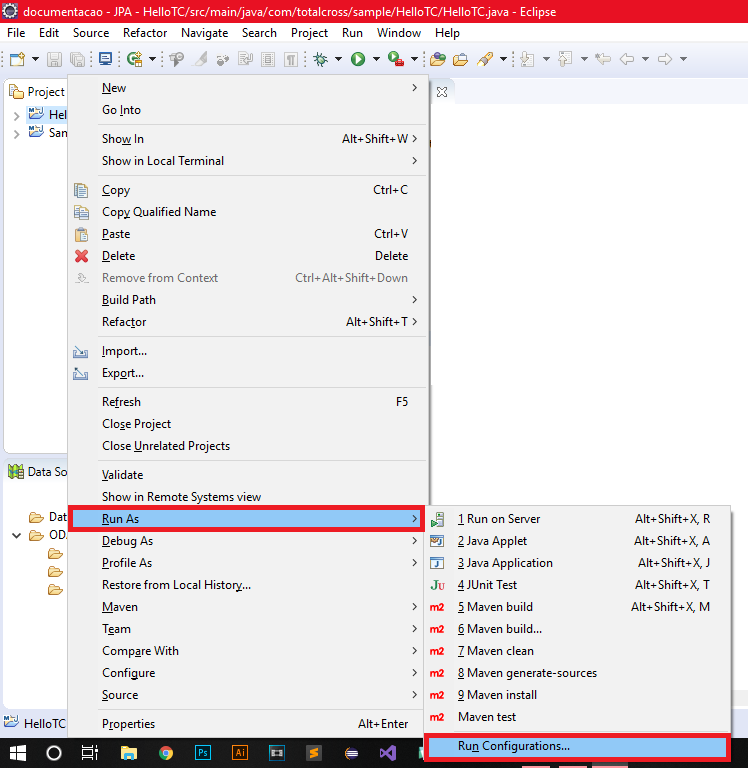
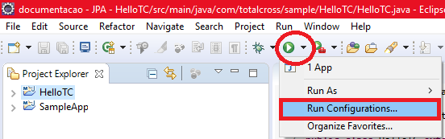
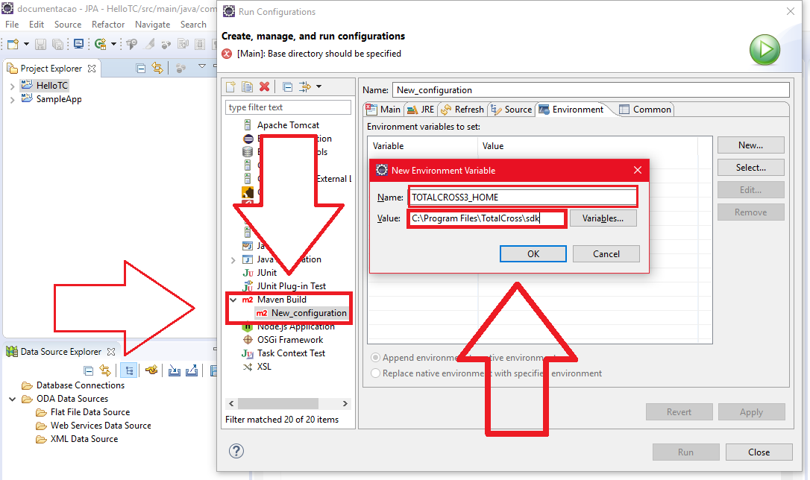

# Eclipse

## Configuring Environment Variable in Eclipse

To set the **TOTALCROSS3\_HOME** \(environment variable that points to the Totalcross SDK\) in Eclipse is pretty simple, as you can see below:

### Step 1: Run Settings

There are two ways to get to the "Run Configurations" option in Eclipse:

* First, just right-click on **your project** and go to "**run as**" and then click "**Run Configurations**";

* The second way is to click on the **green symbol** with the white button inside the **top bar** of the eclipse and then click on "**Run Configurations**".

### Step 2: Maven Build

1. Now just go into **Maven Build** and double-click to open a **new configuration**;
2. Click the "**Environment**" tab and click the "**New**" button;
3. In the **name** write "**TOTALCROSS\_HOME**" and in values ​​put the **path to the TotalCross SDK on your machine** and then click "OK" and then "Apply.". Look at an image below:


But it is worth mentioning, if the other steps to implement the files have already been completed \(such as a configuration of pom.xml, sdk being installed and etc\) you will **not** be able to get the [deploy](https://totalcross.gitbook.io/playbook/learn-totalcross/deploy-your-app-android-ios-and-windows). 


