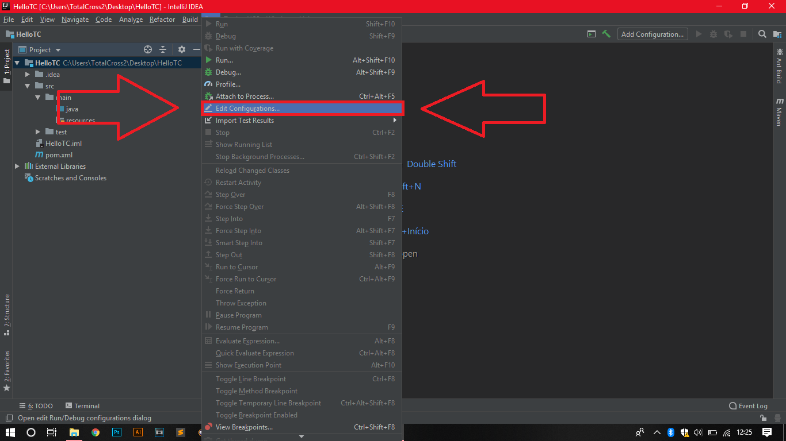

# IntelliJ

## Configuring Environment Variable in IntelliJ

To set the **TOTALCROSS3\_HOME** \(environment variable that points to the Totalcross SDK\) in Eclipse is pretty simple, as you can see below:

### Step 1: Run Settings

1. With your Maven project open, you will click on the "**Run**" option on the **top bar** of IntelliJ
2. Under Download, click "**Edit Configurations"**
3. Click "**Templates**" and then "**Maven**"

### Step 2: Maven  Configuration

1. Click the "**Runner**" tab
2. **Uncheck** "Use project settings"
3. In the "Environment Variables" option you click on the **folder icon**
4. Click the "**+**" symbol to the right of the window.
5. In the Name field you fill in with "**TOTALCROSS3\_HOME**" and in the Value field you **fill in the path to a folder containing the TotalCross SDK**, then click "OK" and then "Apply."


But it is worth mentioning, if the other steps to implement the files have already been completed \(such as a configuration of pom.xml, sdk being installed and etc\) you will **not** be able to get the [deploy](https://totalcross.gitbook.io/playbook/learn-totalcross/deploy-your-app-android-ios-and-windows). 


