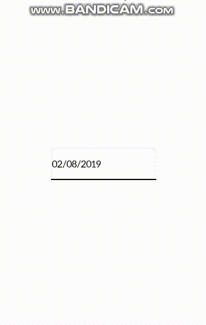

# Creating an Issue

Reporting an issue is one of the most important activities for the software evolution life cycle. This process helps the maintainers to define the most relevant features their product must have and find critical bugs. However, an issue badly reported can leads the maintainers to waste a great amount of time investigating the real cause of the problem reported. For instance, a not well structured will generate doubts causing the developers to waste their time with questions and waiting for the answers \(and if you know what I mean, programmers don't like interacting that much 😅\).   
  
Thus, this guide will teach you the correct way of creating good issues by showing some examples and explaining the most required information an issue must have in order to be solved in short time.


We emphasize the importance of answering questions from the support team **as quickly as possible** so that neither party is left with idle time.


## Issue Structure

To avoid these situations and optimize the resolution time of the problem, we advise that the issues contain the following structure

* Title; 
* Description \(the error and the situation in which it occurs\).
  * Visual representation \(Screenshots / GIF / Video\); 
  * Code to reproduce the error; 
  * Error log.

## Title

When creating the Title, **it is necessary to define the problem in a sentence** so at the first look it is already possible to have an idea of the **severity** \(and in some cases of the **type**\) of the Issue.

Example: 

> **Error opening camera to record video on Moto G Android 6.0**

## Description

After the title, it is now necessary to detail **what the error is and in what situations it occurs**. This makes it easier to identify the cause of the problem and makes it much easier to **reproduce the error and test the solution**.

In the description it is also of utmost importance that it be said which **version of TotalCross is being used, on which devices you are having problems and which version of the operating system.**

Example:

> I'm trying to call the camera in video mode on the Moto G Turbo Edition with Android 6.0, but without success. In this case, I'm with two problems
>
> • When calling the camera in Native mode, even if the Video with Audio option is set, the system opens the camera in Photo mode • When calling the camera in Custom mode when I click the Start button. the program crashes
>
> My question is whether there is any way to force the native camera to go into video mode or if you are forced to use the camera Custom, what can be done about the error that is occurring.
>
> I made an example code that exactly reproduces the above problems:

That done, half of the description is ready but there are still some points of paramount importance. Are they:

### Visual Representation

To give more context to the problem and to accurately illustrate what is happening, it is interesting that screenshots, GIFs or videos be attached to the issue so that we can have a better view of what is happening.

Example:



### Code to reproduce the error

In order to reproduce the error, the code must also be sent. It can be the original of your application or an example \(as long as it faithfully reproduces the error you are getting in the original application\).

Example:

```java
Button btnCameraVideoOnly;
Button btnCamera;
Button btnNativeCameraVideoOnly;
Button btnNativeCamera;

@Override
public void initUI() {
	Button btnExit = new Button("Exit");
	btnExit.paddingLeft = btnExit.paddingRight = 20;
	btnExit.paddingTop = btnExit.paddingBottom = 10;
	btnExit.addPressListener(e -> MainWindow.exit(0));
	add(btnExit, CENTER, CENTER);
	
	btnCameraVideoOnly = new Button("Open Camera w/o Audio");
	btnCameraVideoOnly.paddingLeft = btnExit.paddingRight = 20;
	btnCameraVideoOnly.paddingTop = btnExit.paddingBottom = 10;
	add(btnCameraVideoOnly, CENTER, BEFORE-4);
	
	btnCamera = new Button("Open Camera w/ Audio");
	btnCamera.paddingLeft = btnExit.paddingRight = 20;
	btnCamera.paddingTop = btnExit.paddingBottom = 10;
	add(btnCamera, CENTER, BEFORE-4);
	
	btnNativeCameraVideoOnly = new Button("Open Native Camera w/o Audio");
	btnNativeCameraVideoOnly.paddingLeft = btnExit.paddingRight = 20;
	btnNativeCameraVideoOnly.paddingTop = btnExit.paddingBottom = 10;
	add(btnNativeCameraVideoOnly, CENTER, BEFORE-4);
	
	btnNativeCamera = new Button("Open Native Camera w/ Audio");
	btnNativeCamera.paddingLeft = btnExit.paddingRight = 20;
	btnNativeCamera.paddingTop = btnExit.paddingBottom = 10;
	add(btnNativeCamera, CENTER, BEFORE-4);
}

@Override
public <H extends EventHandler> void onEvent(Event<H> event) {
	try {
		if (event.type == ControlEvent.PRESSED) {
			if (event.target == btnCameraVideoOnly) {
				Camera camera           = new Camera();
				camera.cameraType       = totalcross.ui.media.Camera.CAMERA_CUSTOM;
				camera.captureMode      = totalcross.ui.media.Camera.CAMERACAPTURE_MODE_VIDEOONLY;
				camera.click();
			}
			else if (event.target ==  btnCamera) {
				Camera camera           = new Camera();
				camera.cameraType       = totalcross.ui.media.Camera.CAMERA_CUSTOM;
				camera.captureMode      = totalcross.ui.media.Camera.CAMERACAPTURE_MODE_VIDEOWITHAUDIO;
				camera.click();
			}
			else if (event.target == btnNativeCameraVideoOnly) {
				Camera camera           = new Camera();
				camera.cameraType       = totalcross.ui.media.Camera.CAMERA_NATIVE;
				camera.captureMode      = totalcross.ui.media.Camera.CAMERACAPTURE_MODE_VIDEOONLY;
				camera.click();
			}
			else if (event.target == btnNativeCamera) {
				Camera camera           = new Camera();
				camera.cameraType       = totalcross.ui.media.Camera.CAMERA_NATIVE;
				camera.captureMode      = totalcross.ui.media.Camera.CAMERACAPTURE_MODE_VIDEOWITHAUDIO;
				camera.click();
			}
		}
	} catch (Exception e) {
		e.printStackTrace();
	}
}
```


If the code sent is **private** then just put the issue as **confidential** \(so only our team and the issue creator will have access\) or send it to us via [Slack ](https://totalcrossclients.slack.com/messages)\(Exclusive service channel for mobile clients\).


### Error Log

In addition to the code, it is also necessary to send the Error Log for the code in question, as some errors may occur due to machine configurations \(both computer and mobile phones\) so on one machine it can occur and on others it cannot. The Log also details the error better.

Exemple:

```java
12-16 10:15:45.305 15740 15740 I TotalCross: NON-FATAL EXCEPTION
12-16 10:15:45.305 15740 15740 I TotalCross: java.lang.RuntimeException: setAudioSource failed.
12-16 10:15:45.305 15740 15740 I TotalCross:    at android.media.MediaRecorder.setAudioSource(Native Method)
12-16 10:15:45.305 15740 15740 I TotalCross:    at totalcross.appdtem.CameraViewer.startRecording(CameraViewer.java:206)
12-16 10:15:45.305 15740 15740 I TotalCross:    at totalcross.appdtem.CameraViewer.access$300(CameraViewer.java:37)
12-16 10:15:45.305 15740 15740 I TotalCross:    at totalcross.appdtem.CameraViewer$2.onClick(CameraViewer.java:299)
12-16 10:15:45.305 15740 15740 I TotalCross:    at android.view.View.performClick(View.java:6600)
12-16 10:15:45.305 15740 15740 I TotalCross:    at android.view.View.performClickInternal(View.java:6577)
12-16 10:15:45.305 15740 15740 I TotalCross:    at android.view.View.access$3100(View.java:781)
12-16 10:15:45.305 15740 15740 I TotalCross:    at android.view.View$PerformClick.run(View.java:25912)
12-16 10:15:45.305 15740 15740 I TotalCross:    at android.os.Handler.handleCallback(Handler.java:873)
12-16 10:15:45.305 15740 15740 I TotalCross:    at android.os.Handler.dispatchMessage(Handler.java:99)
12-16 10:15:45.305 15740 15740 I TotalCross:    at android.os.Looper.loop(Looper.java:193)
12-16 10:15:45.305 15740 15740 I TotalCross:    at android.app.ActivityThread.main(ActivityThread.java:6923)
12-16 10:15:45.305 15740 15740 I TotalCross:    at java.lang.reflect.Method.invoke(Native Method)
12-16 10:15:45.305 15740 15740 I TotalCross:    at com.android.internal.os.RuntimeInit$MethodAndArgsCaller.run(RuntimeInit.java:493)
12-16 10:15:45.305 15740 15740 I TotalCross:    at com.android.internal.os.ZygoteInit.main(ZygoteInit.java:870)
```


There are cases in which just by looking at the log the support team can already identify what the problem is and how to solve it.


## References

All examples were taken from real and public issues that are in our repository. Are they:

* [Issue \#639](https://gitlab.com/totalcross/TotalCross/issues/639)
* [Issue \#550](https://gitlab.com/totalcross/TotalCross/issues/550)

If you don't know how to access your application's log while it runs on mobile phones then we recommend the following tutorials:

* [Realtime Debugging for Unity Android Apps - ADB LogCat Tutorial](https://www.youtube.com/watch?v=eI2GOuEMGfQ)
* [ADB ](https://www.youtube.com/watch?v=3wMlCucwGvE)[Tutorial -](https://www.youtube.com/watch?v=3wMlCucwGvE) [How to use ADB](https://www.youtube.com/watch?v=3wMlCucwGvE)

