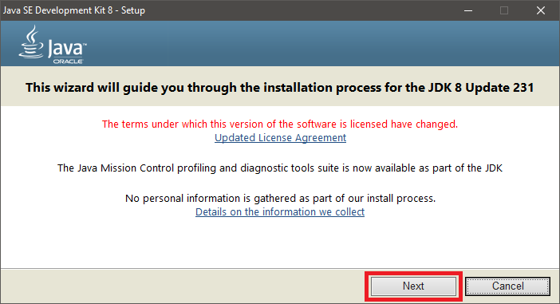
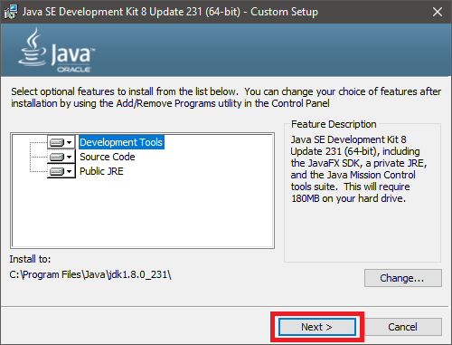
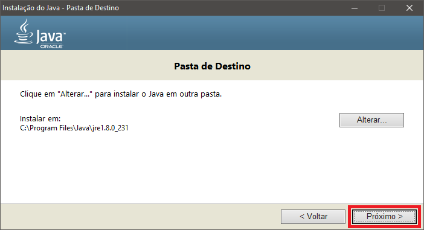
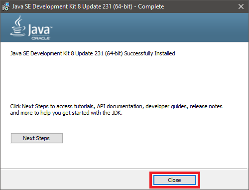

# Java JDK 8

## Introduction

This guide will show you how to install **Java JDK 8** on **Windows**, **Mac OS X** and **Linux**.


The choice of Java as a language for development was not occasional, but due to the fact that of the **21 million existing developers** in the world, **9 million are Java developers**, according to the Global Developers Population and Demographic Study in 2016.   
**It is one of the largest development communities in the world!**


## Guide



**Step 1:** go to ****[**link**](https://www.oracle.com/java/technologies/javase/javase8u211-later-archive-downloads.html). Accept license agreement and download latest Java 8 JDK \(32 or 64 bit\) for Windows:



Requires an Oracle account


**Step 2:** if download is complete, run .exe for install. Click _Next_:



**Step 3:** select the path of JDK installation and click _Next_ :



**Step 4:** select the path of JRE installation and click _Next_ :



**Step 5:** once installation is complete click _Close_ :



**Step 6:** open CMD \(command line prompt\) as administrator;

**Step 7:** set _JAVA\_HOME_ environment variable:

`C:\> setx JAVA_HOME "C:\Program Files\Java\jdk1.8.0_231"`

**Step 8:** add  _JAVA\_HOME_ and subfolders to _PATH_ :

`C:\> setx PATH "%JAVA_HOME%;%JAVA_HOME%\bin;%JAVA_HOME%\lib;%PATH%;"`

**Step 9:** reopen  your CMD \(command line prompt\) and try:

`C:\> echo %JAVA_HOME%`

if response is `C:\Program Files\Java\jdk1.8.0_231` you installed everything correctly.



For the matter of simplicity you've chosen Java JDK 8 implementation of [AdoptOpenJDK](https://adoptopenjdk.net/).

Install brew, it is pretty easy and straightforward. Paste the following command on your terminal.

```text
/usr/bin/ruby -e "$(curl -fsSL https://raw.githubusercontent.com/Homebrew/install/master/install)"
```

Brew is a package manager that easily allows you to install packages on macOS X, it is similar to the debian package manager apt-get. Paste the command bellow on you terminal and you will have the Java JDK 8 on your machine.

```text
brew tap AdoptOpenJDK/openjdk && brew install adoptopenjdk-openjdk8
```



**Step 1:** open terminal \(CTRL+ALT+T\);

**Step 2:** updates APT:

`$ sudo apt update` 

**Step 3:** install Java 8:

`$ sudo apt-get install openjdk-8-jdk`

**\(Optional\):** if you already have another Java version:

`$ sudo update-alternatives --config java`

and select the correct version.




You have successfully installed Java JDK 8 on your machine.


## See more

After that it's possible to [start](https://totalcross.gitbook.io/playbook/learn-totalcross/getting-started/) into many IDEs! Start with Visual Studio Code or another non Maven friendly, following the [Maven installation guide](https://totalcross.gitbook.io/playbook/learn-totalcross/basic-requirements/maven/).

