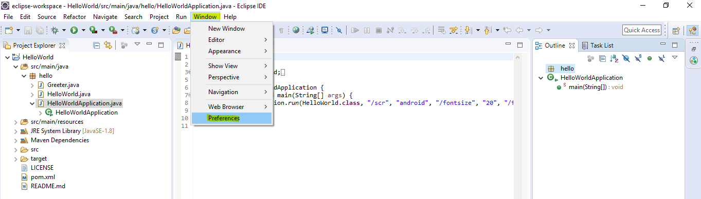
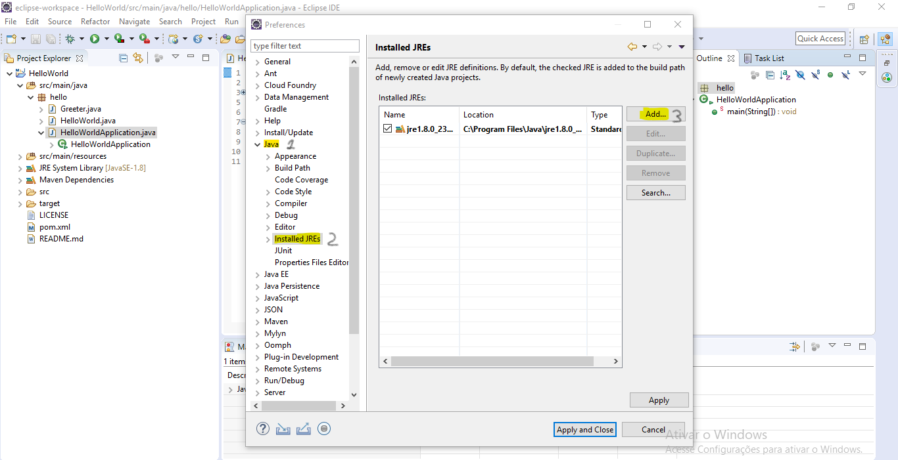
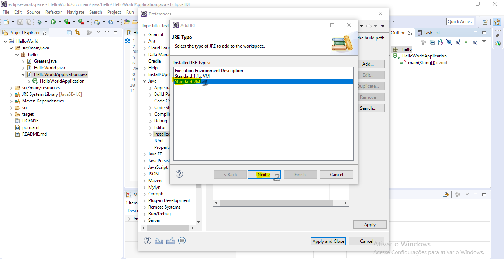
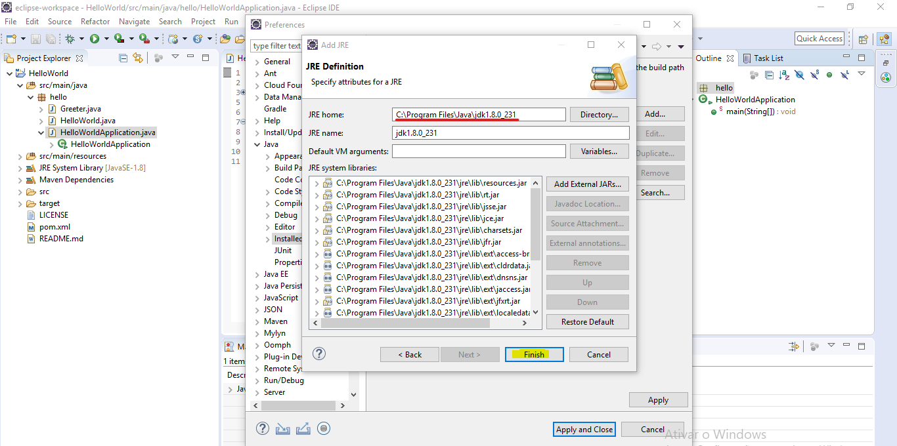
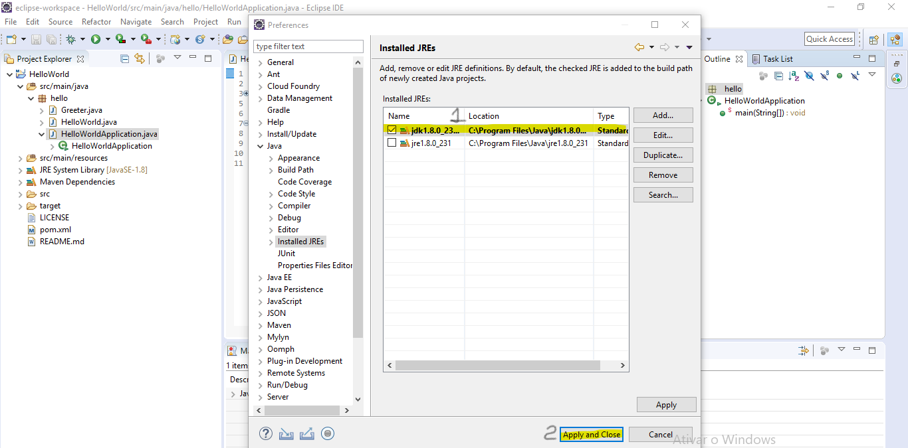

# FAQ

## How to solve "Could not find the file jarsigner.exe. Make sure you have installed a JDK than has this file in the bin folder" error?

Isso normalmente acontece por 2 motivos:

1. A **%JavaHome% environment variable** is using JRE instead of JDK. In this case you can see how to configure by **clicking** [**here**](https://www.ntu.edu.sg/home/ehchua/programming/howto/environment_variables.html).
2. Eclipse itself is pointing erroneously at the JRE. In this case, just go to the top bar in **Windows &gt; Preferences**.  Then it will open a window and you click on **Java &gt; Installed JREs &gt; add**.  Another window will appear, just click "**Next**" and then click "**Directory**" and **select the JDK folder that is inside the java folder**, where you installed it \(usually C: \Program Files\Java\).  Finally, just click select **folder&gt; finish**. **Confirm that JDK is selected** and then just click "**Apply and Close**" and then **restart** eclipse. 

See step-by-step from item 2 below:












## How to develop for RPI using TotalCross?

Just add in pom.xml instead of the totalcross SDK version, the following command: 

```markup
<scope>system</scope>
<systemPath>caminho\TotalCross\dist\tc.jar</systemPath>
```

That done, you can deploy it. Already to develop, is the same way that develops for mobile. 

## We have a proxy and it is blocking the compilation of our app what do you suggest?

Just add iso to pom.xml:

```markup
<dependency>
  <groupId>com.totalcross</groupId>
  <artifactId>totalcross-sdk</artifactId>
  <version>5.1.1</version>
  <scope>system</scope>
  <systemPath> PATH__TO__YOUR__TOTALCROSS__JAR__FILE </systemPath>
</dependency>

<dependency>
   <groupId>org.xerial</groupId>
   <artifactId>sqlite-jdbc</artifactId>
   <version>3.8.7</version>
   <scope>compile</scope>
</dependency>
```


Attention: Please be aware if the version indicated on the pom is the same as your machine.


## How to disable backup / restore in TotalCross?

To disable backup just add `Settings.allowBackup = true` within the constructor method in your application's MainWindow

## Every time there is a touch on the screen, the event is triggered. How to fix?

This may be happening because you are using the `pendown` instead of the `penup`. To better understand, follow the definitions:

* **`pendown` is triggered when there is a touch on the screen.**
* **`penup` is triggered when finger flips the screen** \(or mouse/key, depending on the platform\).

To find out if there was a click, it can be detected through the **`pendrag`**, and if it is positive, do not trigger the `penup`.

Another smarter solution is to use the **`this.hadParentScrolled()`** method within your pendown method, to **identify whether the action is being triggered during the scrolling of some parent component**. As shown below:

```java
if (!this.hadParentScrolled()) {
    // código de pen down
}
```

## How to navigate between screens \(Containers and Windows\)?

In the case of **Containers**:

* `swap(new InitialScreen());` - If you are in the Main Window and want to call a Container, simply use the `swap()` command.
* `MainWindow.getMainWindow().Swap(new SecondScreen());` - If you are in a container or Window and want to call a Container just use the command.

In the case of **Windows**: 

* `.popup()` - The execution **stops** after the `popup()`command is executed.
* `.popupNonBlocking()` - the execution **continues** right after the popup command, even with the window still open

To understand more in depth how best to use and other ways to navigate between user interfaces, click [here](https://totalcross.gitbook.io/playbook/guideline/container-x-window)

## Is it possible for the buttons to be round?

Yes, if it is an FAB we have a component of its own, the `FloatingButton`. In other cases, you can change using NinePatch or do the most recommended: use an ImageButton as in the following example: 

```java
Image original = Images.getTotalCrossLogo();
// If you need to resize it, this is the method call.
Image aumentada;
try {
	aumentada = original.hwScaledBy(0.5, 0.5);
	Button btn = new Button(aumentada);
	// If you want to change the image when the button is clicked, use this property
	// The "getTouchedUpInstance" method is a good place-holder.	btn.pressedImage = aumentada.getTouchedUpInstance((byte) 64, (byte) 0);
	// Finally, take a default button border and ninepatch
	btn.setBorder(Button.BORDER_NONE);
	btn.setNinePatch(null);
	
	add(btn, CENTER, CENTER);
} catch (ImageException e) {
	e.printStackTrace();
}

```

## Slowdown when opening in Windows with a Roboto font

Just use `Font.getFont ("Roboto Medium", true, FontSize);`

## Is there a maximum file size to be retrieved by the Vm.getFile \(String\) method?7

I checked it here, Vm.getFile looks for the file in the TCZs. An embedded file in TCZ has its size given in an int32 `uncompressedSize`; therefore, it can not be more than 4gb. As TotalCross apps are 32bits, as far as I can remember, I would still lower this limit to 2gb, because the system will not be able to allocate more than this contiguous memory.

## What is the difference between Window and Container?

First, the main function of each is different:

* **Container**: A control capable of containing other controls. It is primarily a form of organization.
* **Window**: it is a control capable of overlapping others, creating an illusion of depth. In addition, Windows is also containers, as they can accommodate several components within them.

To better understand the difference between them in specific cases and how to use both in the most appropriate way, access the [Windows X Container session](https://totalcross.gitbook.io/playbook/guideline/container-x-window).

## Is it possible to search for GPS position through Triangulation?

By default the **GPS class** performs location **only via GPS**, but on Android, you can change your behavior to use Google Play Services to get the location. To do this, change the **field precision** value to to **`LOW_GPS_PRECISION`**. 

Location by Google Play Services is based on a _variety of information_, including **Wifi and Bluetooth**. If you specifically want information about the network location used, you can use the CellInfo class in WinCE or Android.

## How to use the DecimalFormat on TotalCross?

Totalcross doesn't have the `java.text`  so the DecimalFormat is not on our SDK.

## How to ativate the OK \(ENTER\) button on Android

Just use the .addKeyListener and add an action in the specialkeyPressed method like no example below:

```java
Edit edtExit = new Edit();
    edtExit.addKeyListener(new KeyListener() {
        ...
        @Override
        public void specialkeyPressed(KeyEvent keyEvent) {
            if(keyEvent.isActionKey()){
                proximaTela();
            }
        }
    });
add(edtExit, CENTER, AFTER  + 40, PARENTSIZE, PREFERRED);
```


