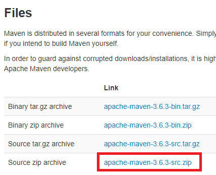

# Maven

## Introduction

TotalCross uses Maven to automate compilation, being quick and easy to use.

> _"Apache Maven is a software project management and comprehension tool. Based on the concept of a project object model \(POM\), Maven can manage a project's build, reporting and documentation from a central piece of information."_

This article targets users of Visual Studio Code and other IDEs that do not have Maven integration.

## Installation guide



Next steps requires _administrator_ privileges.

**Step 1:** go to [link](http://maven.apache.org/download.cgi). Download the latest Maven .zip:



**Step 2:** unzip into _C:/Program Files/Maven/_ \(recommended\);

**Step 3:** open CMD \(command line prompt\) as administrator;

**Step 4:** set _MAVEN\_HOME_ environment variable:

`C: \> setx MAVEN_HOME "C:\Program Files\Maven\apache-maven-3.6.3-src"`

**Step 5:** add _MAVEN\_HOME_ and bin subfolder to PATH :

`C: \> setx PATH "%MAVEN_HOME%;%MAVEN_HOME%\bin;%PATH%;"`



Install brew, it is pretty easy and straightforward. Paste the following command on your terminal.

```text
/usr/bin/ruby -e "$(curl -fsSL https://raw.githubusercontent.com/Homebrew/install/master/install)"
```

Brew is a package manager that easily allows you to install packages on macOS X, it is similar to the debian package manager apt-get. Paste the command bellow on you terminal and you will have the Java JDK 8 on your machine.

```text
brew install maven 
```



Next steps requires _sudo_ privileges.

**Step 1:** open terminal \(CTRL+ALT+T\);

**Step 2:** update APT:

`$ sudo apt-get update`

**Step 3:** install Maven:

`$ sudo apt-get -y install maven`

**Step  4:** check installation:

`$ mvn -version`


TotalCross needs Maven 3.6.X or later




## See more

With these requirements, it's possible to [start](https://totalcross.gitbook.io/playbook/learn-totalcross/getting-started) with TotalCross!

