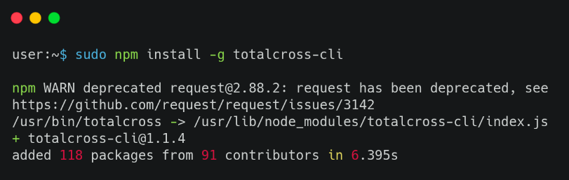
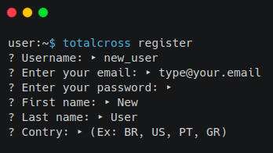
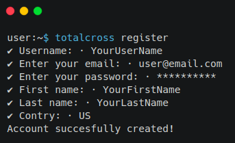

# Register

## 

Before registering you will need to install the CLI. 

### Installing TotalCross CLI Tool


This is the alpha version of the CLI. It is still in the testing phase and will be launched on 02/24/2020.


Installing our CLI tool is pretty simple, you just have to get [Node.js](https://nodejs.org/) installed in your machine an then type in your terminal:

```text
sudo npm install -g totalcross-cli
```




And Voilá!  🎉🥂🍾 

You have TotalCross CLI tool installed and ready to use. To know how to use click [here](https://learn.totalcross.com/get-started/write-your-first-app).


### Register



To register using the CLI, write in your terminal:

```text
totalcross register
```

You will be asked for some information about yourself:



After complete, your account this is created!






The register with web browser is under development!





The register with VS Code Plugin is under development!




