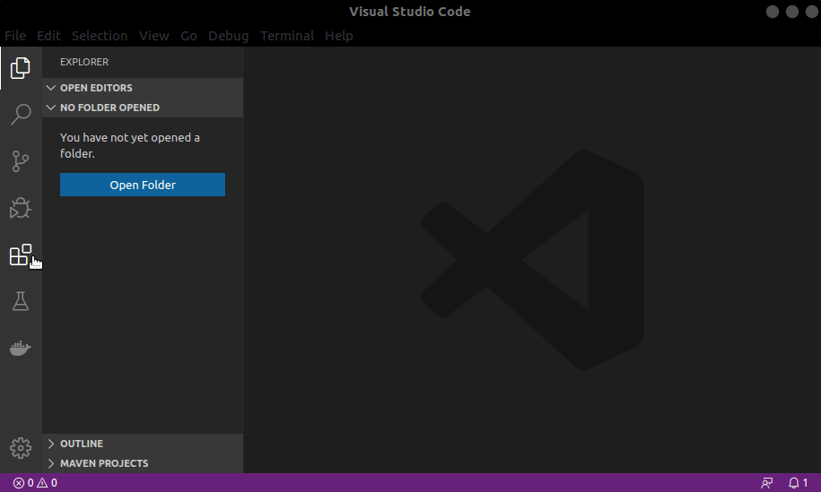

# 2. Setting up Environment

In order to turn your development environment very much fast and easy, we offer two tools for helping setting up projects since creation to deploy to devices. These tools are: 

1. **TotalCross VS Code Plugin** 
2. **TotalCross CLI Tool**

Thus chose on one of the options bellow to get your development environment set up.

## VS Code Plugin

### Installing VS Code



The easiest way to install Visual Studio Code for Debian / Ubuntu based distributions by opening the .deb package via Software Center GUI. If your distribution is debian based download your VS Code .deb Package in [https://code.visualstudio.com/Download](https://code.visualstudio.com/Download) and install it. If you prefer to install using your terminal, type the command: `sudo apt-get install code`


For more information access: [https://code.visualstudio.com/docs/setup/linux](https://code.visualstudio.com/docs/setup/linux)



Download the Visual Studio Code installer from the site: [https://code.visualstudio.com/Download](https://code.visualstudio.com/Download) and run the installer. Or download a Zip archive, extract it and run Code from there. 

For more information access: [https://code.visualstudio.com/docs/setup/windows](https://code.visualstudio.com/docs/setup/windows)



Download Visual Studio Code installer from the site: [https://code.visualstudio.com/Download](https://code.visualstudio.com/Download) and double-click on the downloaded archive to expand the contents. In the next step drag Visual Studio Code.app to the Applications folder, making it available in the Launchpad and add VS Code to your Dock by right-clicking on the icon and choosing  Options Keep in Doc.


You can also use [brew](https://brew.sh/) to install it by typing the following command: 

```text
brew cask install visual-studio-code
```


For more information access: [https://code.visualstudio.com/docs/setup/mac](https://code.visualstudio.com/docs/setup/mac)



### **Installing Plugin**

**Step 1:** open VS Code and go to _Extensions_.



**Step 2:** type TotalCross in the search bar and  click to install.


Done, the plugin is successfully installed! To know how to use click [here](https://learn.totalcross.com/get-started/write-your-first-app).

## CLI Tool


This is the alpha version of the CLI. It is still in the testing phase and will be launched on 02/24/2020.


Installing our CLI tool is pretty simple, you just have to get [Node.js](https://nodejs.org/) installed in your machine an then.

**Step 1:** type in your terminal:



You may need to run with privileges


**Step 2:** verify your installation:



And Voilá!  🎉🥂🍾 

You have TotalCross CLI tool installed and ready to use. To know how to use click [here](https://learn.totalcross.com/get-started/write-your-first-app).


