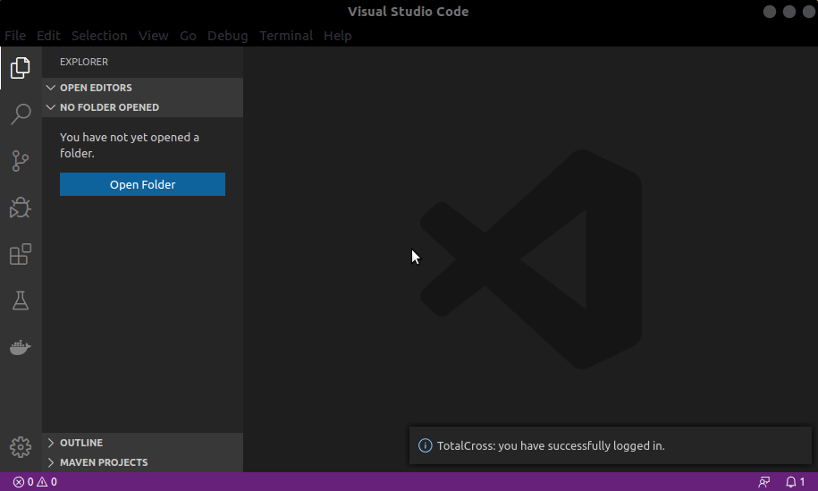
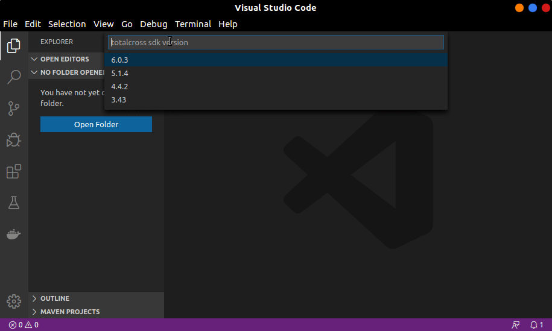

# 3. Test Drive

## Register

To have access to all features of these tools you need to have a TotalCross account!



**Step 1:** open VS Code terminal _CTRL+SHIFT+P_ and search _TotalCross_:

**Step 2:** select _TotalCross: Register_ option and fill in the fields with your information:




**Step 1:** open your Terminal/CMD/Powershell

**Step 2:** type `totalcross register` and you will be asked for some information about yourself. 





After complete, your account will be created!


## Login

You can now login!



**Step 1:** open VS Code _Command Palette_ \(_CTRL+Shift+P_\) and search _TotalCross_:

**Step 2:** select _TotalCross: Login_ option and fill in the fields with your information:




**Step 1:** open your Terminal/CMD/Powershell

**Step 2:** run `totalcross login` then write your e-mail and password already registered. 





Ready! You are logged in.


## Create

Creating your first application is really simple and straightforward. Once you have accomplished all the basic requirements, you will be able to run your first application in about 5 minutes. Thus, choose the environment that makes you feel more comfortable:



**Step 1:** open VS Code _Command Palette_ \(_CTRL+Shift+P_\) and type _TotalCross_ autocomplete should help! Select _TotalCross: Create new Project._ Then __create a folder called _HelloWorld_ and select it.

**Step 2:** _GroupId_ will be `com.totalcross`, but you can replace with the name of your company \(as you would chose a domain for your company backwards, example: `org.wikipedia` for `wikipedia.org`\).

**Step 3:** _ArtifactId is the name of your application, in this example it_ will be `HelloWorld`. Select the latest version of TotalCross SDK and choose whatever platform you intend to deploy an application.

**\(Optional\)** A new window with the new project structure will be open. Right click on the`RunHelloWorldApplication.java` inside `src> main> com> totalcross` and choose click _Run_ \(IDE\). This will make your new application run on our Java simulator:



**Step 1:** open your Terminal/CMD/Powershell

**Step 2:** run `totalcross create` and you will be asked for the following information that you will be typing into the terminal as they appear.

**Step 3:** after answering the questions, your project will be created and ready to be developed. You can give a `ls` in the terminal to check if your project was created in a folder with the name of the project.





Now you know how to create TotalCross projects


## Package

As Totalcross is a cross platform SDK, packaging is one of the most important phases in the development process. Using Totalcross, you can deliver application for the following platform.



**Step 1:** open VS Code _Command Palette_ \(_CTRL+Shift+P_\) and search for _TotalCross_: _Package_

**Step 2:** after the package process is finished the target program will take place inside the folder _target/install/&lt;platform&gt;_



**Step 1:** open your Terminal/CMD/Powershell

**Step 2:** `cd` into your project folder:

**Step 3:** run `totalcross package` :

**Step 4:** wait a minute. The result of the package will be in the folder `target/install/<platform>`





Now you know how to package TotalCross projects!


## Deploy

In addition, you can still deploy in an uncomplicated way, in the environment you want.


Deploy is working only for _linux arm_ programs. This feature performs the implementation and execution of the platform via ssh.




**Step 1:** open VS Code _Command Palette_ \(_CTRL+Shift+P_\) and search for _TotalCross_: _Deploy_

**Step 2:** fill in the device information to deploy.

**Step 3:** see the result on the screen or with VNC



**Step 1:** open your Terminal/CMD/Powershell

**Step 2:** `cd` into your project folder

**Step 3:** run `totalcross deploy`, fill in the device information to deploy.





You've learnt how to create a new project, package and deploy.  


