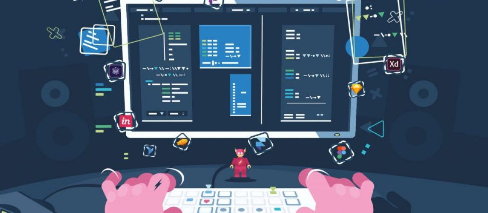

# Separation of concepts: What is the best way to create UI interfaces?

## Overview

To create the user interfaces there are two controls: Containers and Windows. Whatever you are drawing to be displayed to the user must be within one of those controls. In the next topics of this session we will understand what the function of each one is and what factors that make Containers or Windows are preferable in certain cases.



## Differences Between Containers and Windows

First let's understand what the main function of each one is:

### Definition

* **Container**: is a control **capable of containing other controls**. It is primarily a form of **organization**. To fully understand the attributes and methods of this control, access the Container documentation in the API session by clicking below:



* **Window**: é a control capable **of overlapping others**, creating an illusion of **depth**. In addition, _Windows is also containers_, as they can accommodate several components within them. Windows **allow animations**, while the pure container exchange does not. As an example, we have the [Sliding](https://totalcross.gitbook.io/playbook/components/sliding-window) and the [Material ](https://totalcross.gitbook.io/playbook/components/material-window)Window, which have more modern transition effects.

To fully understand which attributes and control methods, access the Windows documentation in the API session by clicking below: 



### Which one to use?

How much is thought in a `MessageBox`, it is clear that it is a Window and not only a Container, since it does not occupy the entire screen.

In cases where Window occupies the entire screen, the difference between Window and Container becomes narrower. **A full screen window does not "delete" the screen underneath, it is still there**. Ithis means that the status of the "bottom" screen remains **unchanged**. In addition, execution locks in the `popup` until `unpop` occurs \(Windows are modal by default\). 

In the case of container hot-swap exchanges, the container that left the scene actually leaves the scene and may even be **deleted if no reference to it is retained.**

Now that you know the definition of each becomes easier to identify where they should be used.

## Best Practices

Opting for mixed approach is the best way to use UI controls well. For, as shown, using only Containers deprives you of having transition animations. Using only Windows can generate an overuse of resources \(**especially memory**\).

With the mixed approach, one searches for the _best of both worlds_. However, it is worth mentioning some extra points:

* It's common for programmers to create whole systems for more control. It is not impossible to have a system of BaseContainers that can have animations or make a Windows system that **is not** heavy when there are many overlapping screens.
* It is also important to take into account the **designer's vision**. Some applications do **not** need animated transitions or only use animated transitions. This kind of thing can help you decide which approach to use.
* Finally, there are also other options. Using `SideMenu` is a form of pre-ready screen management. Some applications use a full screen `TabbedContainer` and switch screens with side swipes or programmatically. 

In cases of Processes and Flows of the application are "BaseContainers", since there is no need to keep the other screens in the background \(and in memory\) then we use Container.

As for the internal screens of a stream, it makes sense to use Windows and other features like `Scroll` or `Tabbed Containers` to perform transitions and organizations. You can have several examples of organization of interfaces in [MaterialTemplates in github,](https://github.com/TotalCross/MaterialTemplates) where we created several interface templates following the recommendations of the [Material](https://material.io/tools/color/).

In this way, Windows is used for animations and screen transitions within a stream and uses BaseContainers to switch from one stream to another of the application.

Taking a practical example, our implementation of SideMenu uses Containers for each screen and uses a TopMenu to create the Menu itself, which appears overlapping the current screen.

In [TCSample](https://github.com/TotalCross/TCSample),many of the screens use the `Material Window` to create a "second screen" within the current screen.

## Navigating between interfaces

### Container

To call a Container, just use:

* `swap(new InitialScreen());` - If you are in the Main Window and want to call a Container, simply use the `swap()` command.
* `MainWindow.getMainWindow().Swap(new SecondScreen());` - If you are in a container or Window and want to call a Container just use the command.

### Window

To call a window, just use: 

* `.popup()` - The execution **stops** after the `popup()`command is executed.
* `.popupNonBlocking()` - the execution **continues** right after the popup command, even with the window still open.

### Other Ways

As we mentioned in the previous topic, you can use BaseContainers to exchange flows in the application, in this case we use the `show()` and `back()`.  See the example below:


```java
public class BaseContainer extends Container {

    protected static final Vector containerStack = new Vector(5);

    public void show() {
    	//containerStack.
        containerStack.push(this); // push ourself
        MainWindow.getMainWindow().swap(this);
    }

    public void back() {
        if (parent == null || getParentWindow() == Window.getTopMost()) {
            try {
                containerStack.pop();
                MainWindow.getMainWindow().swap((Container)containerStack.peek());
            } catch (ElementNotFoundException enfe) {
                MainWindow.exit(0);
            }
        }
    }
}

```


Another way to work with interface changes without losing the data of each is through the design pattern called **Singleton**, where you **will create a single object for which there is only one instance**. To delve deeper into this pattern, just click [here](https://www.devmedia.com.br/padrao-de-projeto-singleton-em-java/26392).

## References

* To better illustrate where each of them is used, you can download the [Nubank\_Sample project in GitHub.](https://github.com/totalcross/Nubank_Sample)
* Reading [JavaDoc ](https://rs.totalcross.com/doc/)can be very useful.

