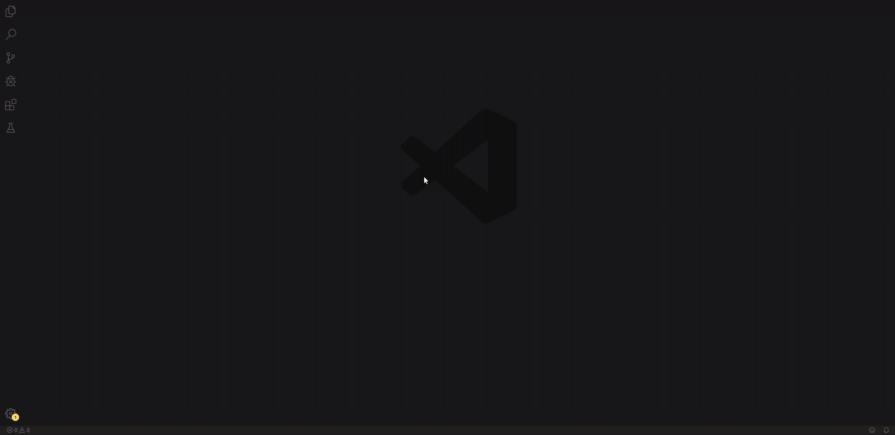
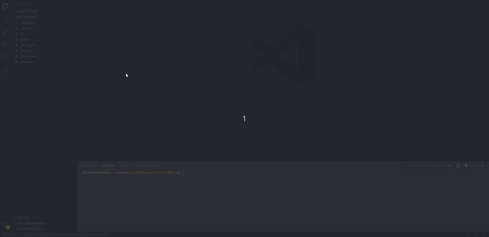
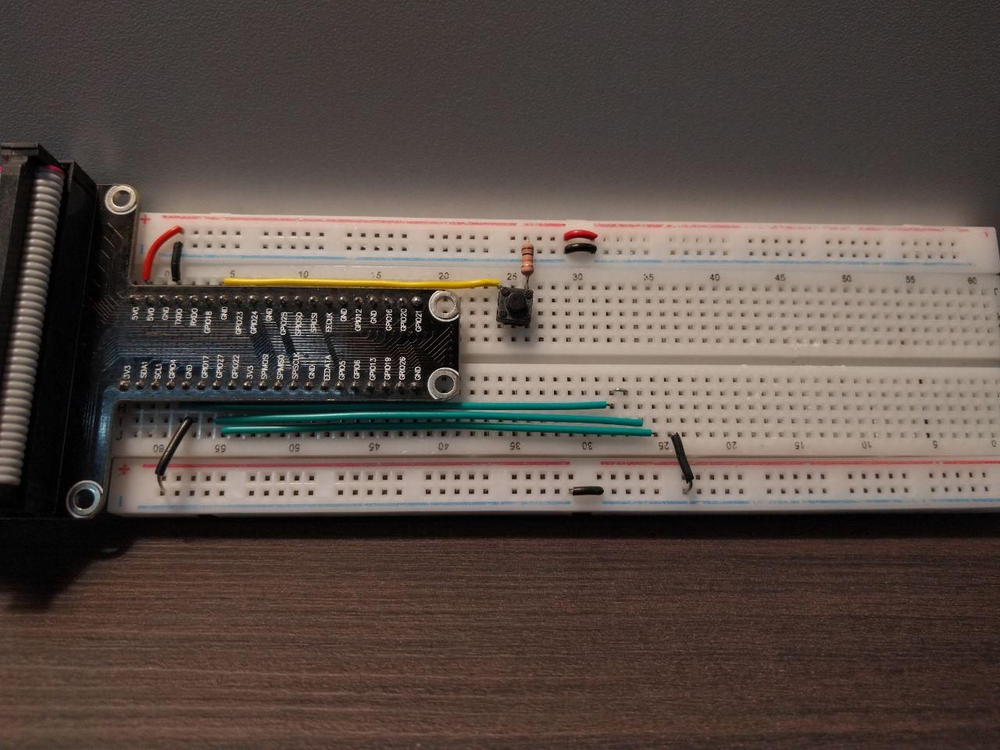
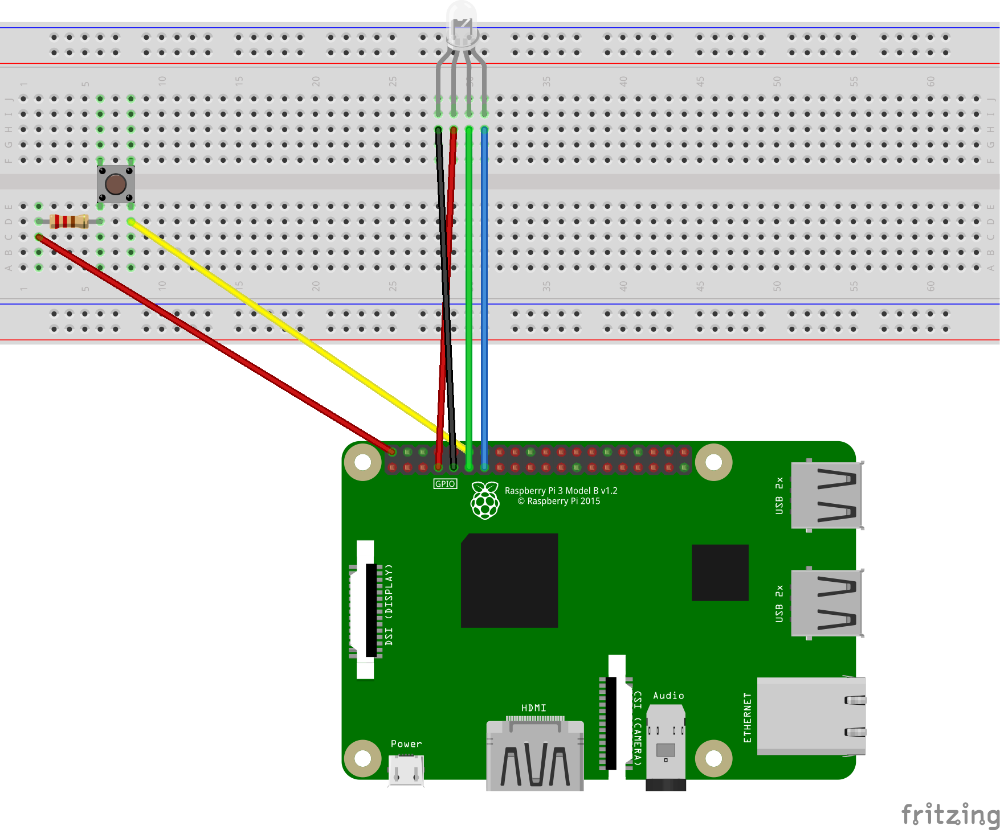
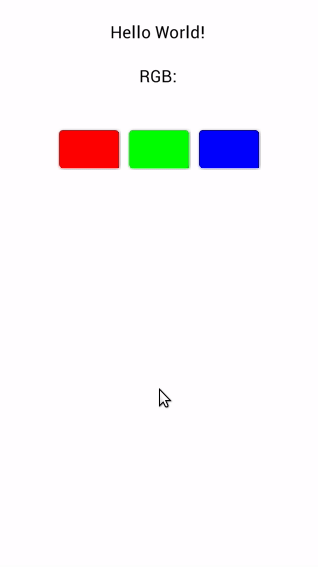
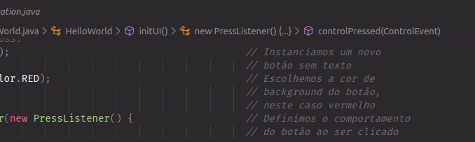
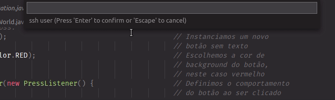
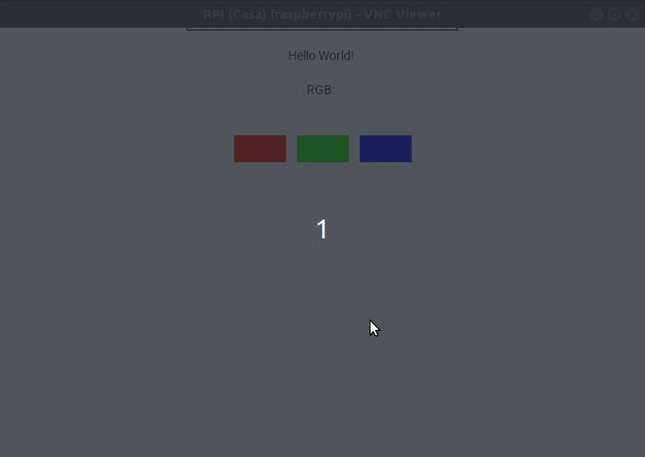
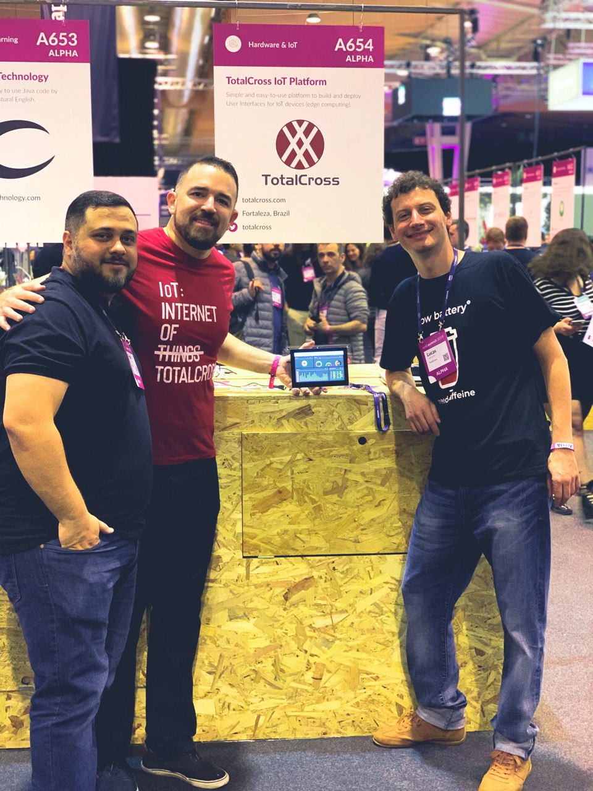

# Understanding TotalCross for Linux ARM

## Introduction

See at this guide:

* Discover ****plugin for VS Code;
* Getting your Hello World App cooler;
* How to deploy; 
* After basics;

## Requirements

Basic requirements must be met:

And complete the Getting Started:



The following electronic components are also required:

* Raspberry Pi 3;
* 7x jumpers male-female;
* Protoboard;
* LED RGB module \(or common 4 pins LED RGB\);
* Push-button module \(or common push-button\).

## **Guide**

### Discover VS Code plugin

A quick way to start using TotalCross is installing the [TotalCross extension for VS Code](https://marketplace.visualstudio.com/items?itemName=Italo.totalcross). 

**Step 1:** open VS Code console  \(CTRL + Shift + P\) and type TotalC… autocomplete should help!


**Step 2:** select _TotalCross: Create new Project;_ 

**Step 3:** create a folder called _HelloWorld_ and select it; 

**Step 4:** _GroupId_ will be `com.totalcross`;

**Step 5:** _ArtifactId_ will be `HelloWorld`_;_

**Step 6:** select the latest version of TotalCross SDK and `-linux-arm` platform;



**Step 7:** open`RunHelloWorldApplication.java` and click _Run_ \(IDE\). The result should be:



**Step 8:** watch the integrated simulator!

### Getting your Hello World App even more Cooler 🥶 😅 

The following project deals with the control of an RGB LED with user interface buttons and a pin reset button!



**Step 1:** follow the schematic:



**Step 2:** to work with pin logic after `public class HelloWorld extends MainWindow {` add:

```java
// Integers to store pin numbers
private int    R = 4, G = 17, B = 27, pushButton = 18;
// Integers to store state of each LED pin, 0 (LOW) and 1 (HIGH)
private int    sttR, sttG, sttB;
// Buttons to control colors 
private Button btnR, btnG, btnB;
```


If you need to work with different pinouts check the manufacturer manual!


**Step 3:** at  _HelloWorld.java_ in `initUI()` code add:

```java
// Label helloWorld made on project creation
Label helloWorld = new Label("Hello World!");
// Change the position of label on the Y axis, with TOP (beginning of Y) + a fill of 20
add(helloWorld, CENTER, TOP + 20);
```

**Step 4:** then, board setup:

```java
// Board Setup
GpiodChip gpioChip = GpiodChip.open(0);
GpiodLine pinR = gpioChip.line(R);
GpiodLine pinG = gpioChip.line(G);
GpiodLine pinB = gpioChip.line(B);
GpiodLine pinPushButton = gpioChip.line(pushButton);
```

**Step 5:** pins setup:

```java
// Set LED pins as outputs and default value sttX
pinR.requestOutput("CONSUMER",sttR);
pinG.requestOutput("CONSUMER",sttG);
pinB.requestOutput("CONSUMER",sttB);
// Set Reset pin as input
pinPushButton.requestInput("CONSUMER");
```

**Step 6:** the red button:

```java
// The TotalCross button:
btnR = new Button("R");                                       // Button instantiation
                                                              // without text
btnR.setBackColor(Color.RED);                                 // Set background color (red)
btnR.addPressListener(new PressListener() {                   // Press event listener
    @Override
    public void controlPressed(ControlEvent controlEvent) {
        sttR = 1 - sttR;                                      // Invert pin state 
        pinR.setValue(sttR);                                  // Set value (HIGH or LOW)
    }
});
add(btnR, CENTER - 70, AFTER + 40);                           // To make horizontally aligned 
                                                              // buttons in the 'RGB' sequence,
                                                              // take the center reference and 
                                                              // decrease 70 to place the 
                                                              // leftmost R. In the Y axis just
                                                              // take the reference of the
                                                              // previous component and add 40
```

**Step 7:** and the other buttons: 

```java
btnG = new Button("G");
btnG.setBackColor(Color.GREEN);
btnG.addPressListener(new PressListener() {
    @Override
    public void controlPressed(ControlEvent controlEvent) {
        sttG = 1 - sttG;                                      // Pay attention to change pin!!!
        pinG.setValue(sttG);
    }
});
add(btnG, CENTER, SAME);                                      // The green button will be 
                                                              // placed at the center and in 
                                                              // the same line of previous 
                                                              // button

btnB = new Button("B");
btnB.setBackColor(Color.BLUE);
btnB.addPressListener(new PressListener() {
    @Override
    public void controlPressed(ControlEvent controlEvent) {
        sttB = 1 - sttB;                                       // Pay attention to change pin!!!
        pinB.setValue(sttB);      
    }
});
add(btnB, CENTER + 70, SAME);                                  // The last button will be placed 
                                                               // to the right of the center.
```

**Step 8:** finally we use a thread to check the state of the reset button:

```java
// A thread will be used to check every 20 ms, if the reset button has been pressed: if yes then 
// the pin state goes to LOW
new Thread() {
    @Override
    public void run() {
        while(true){
            if(pinPushButton.getValue() == 1) {
                sttG = 1 - sttG;
                sttR = 1 - sttR;
                sttB = 1 - sttB;
                pinR.setValue(sttR);
                pinG.setValue(sttG);
                pinB.setValue(sttB);
            }
            Vm.sleep(100);
        } 
    }
}.start();
```

**Step 9:** run _RunHelloWorldApplication.java_ again and watch the results! 




View fully code [here](https://gist.github.com/acmlira/e6c18f0a82688f750c1648af4d101344) 


### How to deploy

**Step 1:** open VS Code console  \(CTRL + Shift + P\) and select _TotalCross: Deploy_



**Step 2:** a second dialog box will appear and just fill in the board's information:



**Step 3:** see the results in screen or VNC



### After basics

This was the beginning of application development for TotalCross embedded systems, how about taking a look at [TCSample](https://github.com/TotalCross/TCSample) and seeing all that can be done? See dashboard made especially for Web Summit 2019:


## See more

Are you interested in development with embedded systems? Contact us via [Telegram](https://t.me/comunidadetotalcross)! 



## References

* [Fritzing ](https://fritzing.org/home/)

