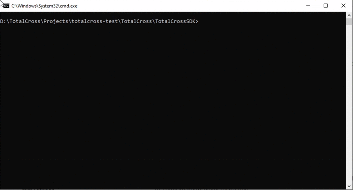
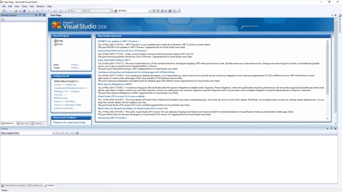
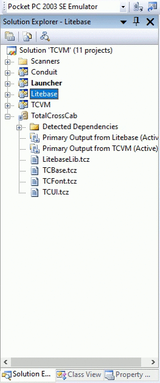
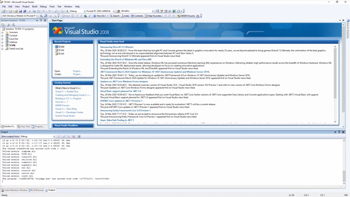

# Debugging WinCE on VS 2008

## Overview

This guid will show you how to debug using an emulator on Visual Studio 2008 Professional Edition, it will not only help you see your application running on the device faster, but also help finding and identifying a bug, which should better your experience while using this.

### Requirements

Visual Studio 2008 Professional Edition

**Step 1:** [package](https://learn.totalcross.com/get-started/test-drive#package) your application to get the .exe and .tcz of your application:

**Step 2:** build your SDK, this can be done by going to your TotalCrossSDK folder on a prompt and running `gradlew dist` \(this step is only needed if you haven't done it before\)

**Step 3:** open the TCVM solution with Visual Studio 2008 Professional Edition, the TCVM.sln file is located at TotalCrossVM/builders/vc2008:

**Step 4:** set TCVM as the StartUp Project:

**Step 5:** change the emulator to USA Windows Mobile 5.0 Pocket PC T2 Emulator and the solution platform to Pocket PC 2003\(ARMV4\):

**Step 6:** set your application for deployment:`YourApp.tcz|path\to\you\app\tcz|\TotalCross|0 YourApp.exe|path\to\you\app\exe|\TotalCross|0`change the path accordingly to your application wince folder\(if you didn't change anything it should be on target/install/wince on your app folder\).

**Step 7:** run the debug:

