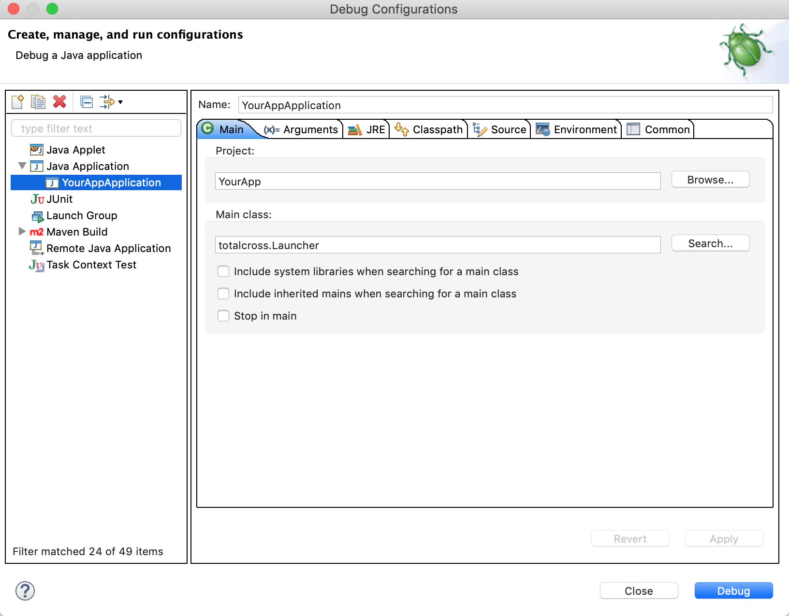
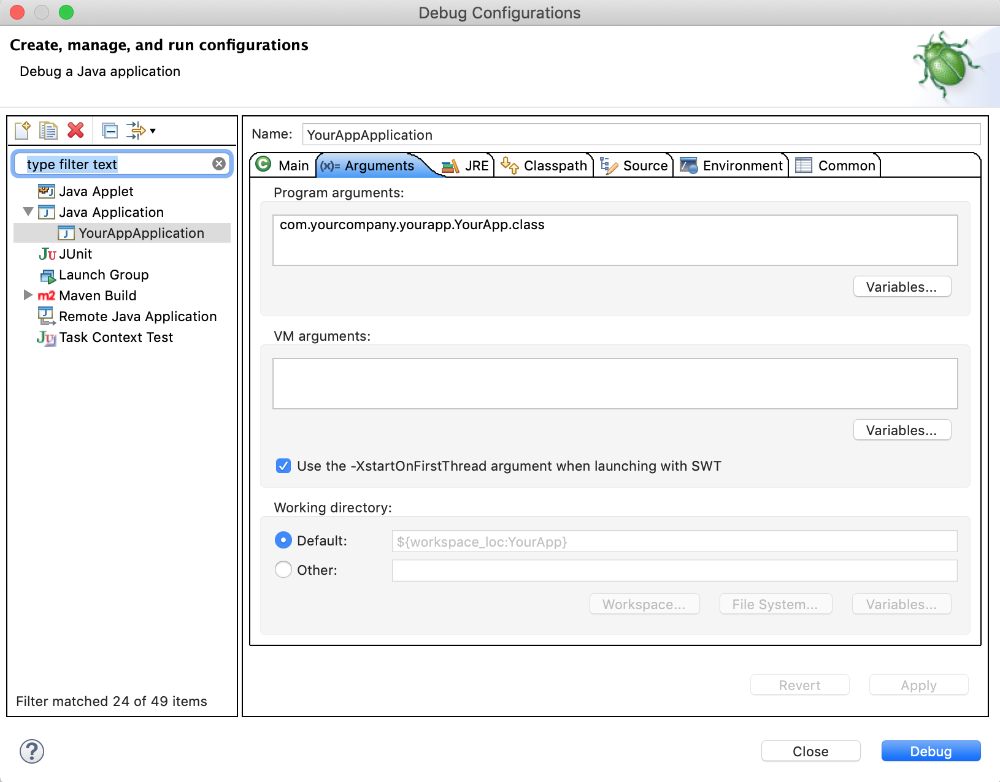

# Device Simulator

## Overview

TotalCross has its own simulator to help you test and visualize the app before sending the app to the mobile device. **The simulator comes embedded with TotalCross SDK**, you don't need to download anything else besides the SDK or configurate your pom.xml.

The simulator is a Java application that allows you to run a TotalCross application over the installed JDK, providing you a quick way to run and test your app, for different screen sizes, resolutions and DP just changing a few parameter.

Some people think that running the application on the desktop under an IDE \(such as Eclipse or Netbeans\) will use the TotalCross virtual machine. This is not true: the actual virtual machine used is the one provided in the Java Development Kit installed \(or java.exe\) on the desktop.

## Running the simulator

To run the simulator, we recommend you to create a class with a main method like this:

```text
public class YourAppApplication {
	public static void main(String[] args) {
		TotalCrossApplication.run(YourApp.class);
	}
}
```


**YourApp.class** must extend MainWindow and must be the only MainWindow in your project 


Now, just run YourAppApplication like a regular Java application and the simulator will works fine =\)


**TotalCross Key**: Probably you will need a TotalCross Key to run your simulator. First time you open the simulator without the key as a parameter, the simulator will ask you the key and store it at your O.S. Also, take a look at the "/r" parameter


You may also pass arguments to the launcher to simulate different resolutions and styles, and have an idea of how your application is going to look like on a particular device.

The basic format for using the parameters is:

```text
TotalCrossApplication.run(YourApp.class, "parameter1", "value", "parameter2", "value");
```

## Screen Sizes Parameters

The optional arguments can be any combination of the following \(not case sensitive\):

### **Screen resolution and color depth**

/scr x: sets the width and height.

```text
// E.g.: If you need to simulate iPhone Xs Resolution you should do like this 
TotalCrossApplication.run(YourApp.class, "/scr", "1125x2436");
```


You can simulate any screen size and resolution with TotalCross Simulator. You just need to search for the specific device that you want to simulate and use the **"/scr"** parameter to configure the resolution


### **Usage of DP**

Since TotalCross 5, the SDK supports Density-independent pixels \(DP\) for components positioning and size, following the [Material Design specs](https://material.io/design/). 

/scale &lt;0.1 to 4&gt;: scales the screen, magnifying the contents \(if greater than 1\) or shrinking \(if between 0 and 1\).

The right way to use this parameter and simulate iPhone Xs, for example, is shown below 

```text

TotalCrossApplication.run(YourApp.class, "/scr", "1125x2436", "/scale", "0.33");
```

### **Font Size**

Devices with different resolutions must have different font sizes too. With this parameter you can simulate different font sizes together with scale and screen configurations. 

/fontSize  : set the default font size to the one passed as parameter


**We strongly recommend** you to set a default font size to your application directly on your MainWindow. If you let the application uses the font configuration of the device, your app can experience some differences running on different devices. Take a look at the chapter "[Colors, Fonts & Images](https://totalcross.gitbook.io/playbook/guideline/colors-fonts-and-images)" for more details.


## **Other Parameters**

### **TotalCross Key**

* /r: you can provide your TotalCross key directly through this parameter

```text
		TotalCrossApplication.run(YourApp.class, "/r", "YOUR TC KEY");
```

### **Color depth**

* /bpp 8: emulates 8 bits per pixel screens. \(256 colors\). No used anymore on modern devices.
* /bpp 16: emulates 16 bits per pixel screens. \(64K colors\).
* /bpp 24: emulates 24 bits per pixel screens. \(16M colors\).
* /bpp 32: emulates 32 bits per pixel screens. \(16M colors without transparency\).

### **User interface style**

* /uiStyle Flat: Flat user interface style.
* /uiStyle Flat: Flat user interface style.
* /uiStyle Android: Android user interface style.

#### **@Device characteristics**

* /penlessDevice: acts as a device that has no touch screen. Note that all currently supported devices have touch screen.
* /geofocus: uses geographical focus \(also activates penlessDevice\).
* /fingerTouch: simulates the use of fingers \(since a finger is less precise than a pen, uses an algorithm to find the control near the finger and also activates drag and flick\).
* /unmovableSip: specifies that the Soft Input Panel \(SIP\) is unmovable, and simulates the screen shift that’s made when an Edit or MultiEdit gains focus.
* /virtualKeyboard: specifies that the device does not have a physical keyboard \(or it has but the keyboard is closed\).

### **Others**

* /pos x,y: sets the opening position of the application.
* /dataPath : sets where the PDB and media files are stored. This is also the default path for Litebase table files.
* /cmdLine &lt;...&gt;: the rest of the arguments \(except the last one\) are passed as the command line to the application being launched.
* /showmousepos: shows the mouse position \(only when running on JavaSE\).

## Function Keys

When running the application, the emulator shows some function keys that can be used to emulate a device key. 

* F2 Take screenshot and save to current folder
* F6 opens the application menu
* F7 back \(escape\)
* F9 tests the screen rotation using the launcher  
* F11 opens the keyboard \(or calendar\) in an Edit field.

## Quick parameter guide in simulator

Possible Arguments \(in any order and case insensitive\). Default is marked as \*.

<table>
  <thead>
    <tr>
      <th style="text-align:left">Arguments</th>
      <th style="text-align:left">Definition</th>
    </tr>
  </thead>
  <tbody>
    <tr>
      <td style="text-align:left">/scr WIDTHxHEIGHT</td>
      <td style="text-align:left">sets the width and heightException in thread &quot;main&quot;</td>
    </tr>
    <tr>
      <td style="text-align:left">/scr WIDTHxHEIGHTxBPP</td>
      <td style="text-align:left">sets the width, height and bits per pixel (8, 16, 24 or 32)</td>
    </tr>
    <tr>
      <td style="text-align:left">/scr Win32</td>
      <td style="text-align:left">Windows 32 (same of /scr 240x320x24)</td>
    </tr>
    <tr>
      <td style="text-align:left">/scr iPhone</td>
      <td style="text-align:left">iPhone (same of /scr 640x960x24)</td>
    </tr>
    <tr>
      <td style="text-align:left">*/scr android</td>
      <td style="text-align:left">Android (same of /scr 320x568x24)</td>
    </tr>
    <tr>
      <td style="text-align:left">/pos x,y</td>
      <td style="text-align:left">Sets the openning position of the application</td>
    </tr>
    <tr>
      <td style="text-align:left">/uiStyle Flat</td>
      <td style="text-align:left">Flat user interface style</td>
    </tr>
    <tr>
      <td style="text-align:left">*/uiStyle Vista</td>
      <td style="text-align:left">Vista user interface style</td>
    </tr>
    <tr>
      <td style="text-align:left">/uiStyle Android</td>
      <td style="text-align:left">Android 4 user interface style</td>
    </tr>
    <tr>
      <td style="text-align:left">/uiStyle Holo</td>
      <td style="text-align:left">Android 5 user interface style</td>
    </tr>
    <tr>
      <td style="text-align:left">/uiStyle Material:</td>
      <td style="text-align:left">Material 6 user interface style</td>
    </tr>
    <tr>
      <td style="text-align:left">/penlessDevice</td>
      <td style="text-align:left">acts as a device that has no touchscreen</td>
    </tr>
    <tr>
      <td style="text-align:left">/fingerTouch</td>
      <td style="text-align:left">acts as a device that uses a finger instead of a pen</td>
    </tr>
    <tr>
      <td style="text-align:left">
        <p>/unmovablesip</p>
        <p></p>
      </td>
      <td style="text-align:left">acts as a device whose SIP is unmovable (like in Android and iPhone).</td>
    </tr>
    <tr>
      <td style="text-align:left">/geofocus</td>
      <td style="text-align:left">enables geographical focus.</td>
    </tr>
    <tr>
      <td style="text-align:left">/virtualKeyboard</td>
      <td style="text-align:left">shows the virtual keyboard when in an Edit or a MultiEdit</td>
    </tr>
    <tr>
      <td style="text-align:left">/showmousepos</td>
      <td style="text-align:left">shows the mouse position.</td>
    </tr>
    <tr>
      <td style="text-align:left">/bpp 8</td>
      <td style="text-align:left">emulates 8 bits per pixel screens (256 colors)</td>
    </tr>
    <tr>
      <td style="text-align:left">/bpp 16</td>
      <td style="text-align:left">emulates 16 bits per pixel screens (64K colors)</td>
    </tr>
    <tr>
      <td style="text-align:left">/bpp 24</td>
      <td style="text-align:left">emulates 24 bits per pixel screens (16M colors)</td>
    </tr>
    <tr>
      <td style="text-align:left">/bpp 32</td>
      <td style="text-align:left">emulates 32 bits per pixel screens (16M colors without transparency)</td>
    </tr>
    <tr>
      <td style="text-align:left">/scale</td>
      <td style="text-align:left">scales the screen, magnifying the contents using a smooth scale.</td>
    </tr>
    <tr>
      <td style="text-align:left">/fastscale</td>
      <td style="text-align:left">scales the screen, magnifying the contents using a fast scale.</td>
    </tr>
    <tr>
      <td style="text-align:left">/dataPath</td>
      <td style="text-align:left">sets where the PDB and media files are stored</td>
    </tr>
    <tr>
      <td style="text-align:left">/cmdLine &lt;...&gt;</td>
      <td style="text-align:left">the rest of arguments-1 are passed as the command line</td>
    </tr>
    <tr>
      <td style="text-align:left">/fontSize</td>
      <td style="text-align:left">set the default font size to the one passed as parameter</td>
    </tr>
    <tr>
      <td style="text-align:left">/r</td>
      <td style="text-align:left">specify a registration key to be used to activate TotalCross when required.
        You may use %key%, where key is an environment variable The class name
        that extends MainWindow must always be the last argument</td>
    </tr>
  </tbody>
</table>## Another way to run the simulator

Another way to run the simulator is calling the **totalcross.Launcher** class directly through the command line or "Run" from Eclipse IDE like the images below





The results will be exactly the same in both ways. You can choose which one is the best for you.


