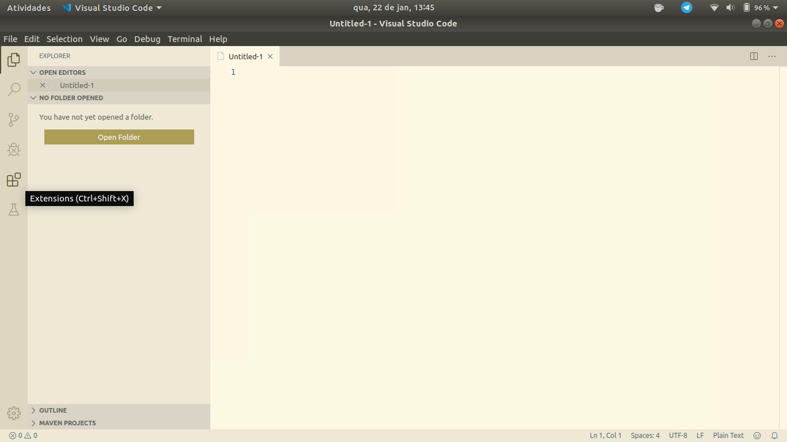
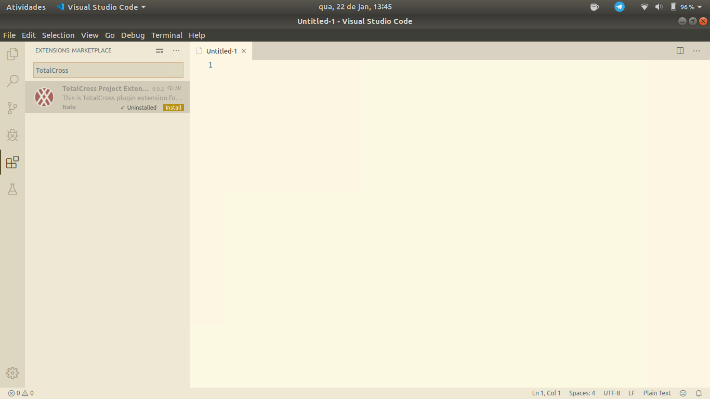
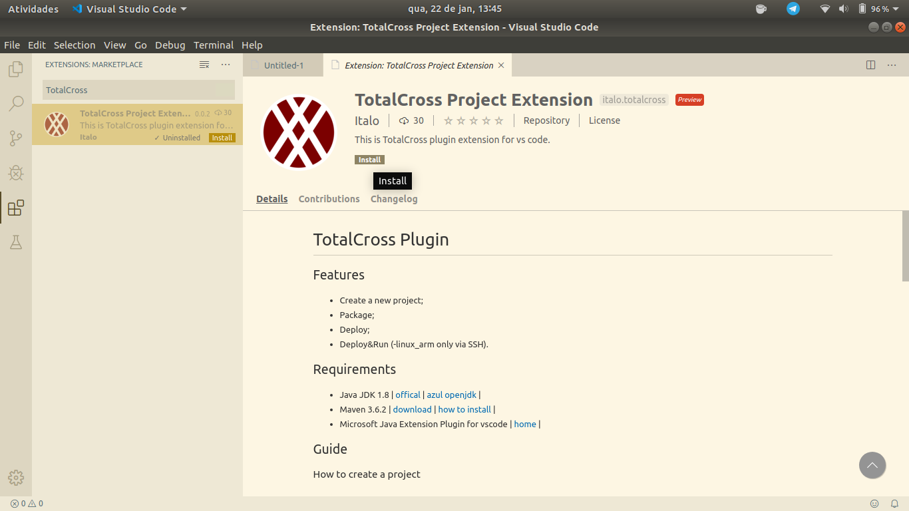

# Getting started

We've prepared a simple way for you to create your own apps and deliver to any platform, using only **Java** and **TotalCross** \(no iOS or Android knowledge required\)!

## **Basic Requirements**

To create apps with TotalCross, you just need to:

* get a[ TotalCross key](https://learn.totalcross.com/learn-totalcross/requirements/totalcross-key)
* have [Java JDK 8](https://learn.totalcross.com/learn-totalcross/requirements/java-8) installed;
* have[ Maven](https://app.gitbook.com/@totalcross/s/playbook/~/drafts/-LckZfuWjUhttQtTbzGx/primary/learn-totalcross/getting-started/basic-requirements/maven) installed;
* [your favorite IDE](https://learn.totalcross.com/learn-totalcross/getting-started/first-totalcross-app);

## VS Code

We recommend the plug in VS Code as it is light and complete for your project, with it you create, run and deploy!

**Installing VsCode**

**Linux**

The easiest way to install Visual Studio Code for Debian / Ubuntu based distributions is to install the .deb package, via the graphics software center, if available on your Linux distribution, or download from [https://code.visualstudio.com/Download](https://code.visualstudio.com/Download) the .deb file and install it with the following command in the terminal: `sudo apt install ./<file>.deb`

Or through the command line with: `sudo apt-get install code`  

For more information access: [https://code.visualstudio.com/docs/setup/linux](https://code.visualstudio.com/docs/setup/linux)

 **Windows**

Download the Visual Studio Code installer from the site: [https://code.visualstudio.com/Download](https://code.visualstudio.com/Download) and run the installer. Or download a Zip archive, extract it and run Code from there. 

For more information access: [https://code.visualstudio.com/docs/setup/windows](https://code.visualstudio.com/docs/setup/windows)  

**Mac OS**

Download Visual Studio Code installer from the site: [https://code.visualstudio.com/Download](https://code.visualstudio.com/Download) and double-click on the downloaded archive to expand the contents. In the next step drag Visual Studio Code.app to the Applications folder, making it available in the Launchpad and add VS Code to your Dock by right-clicking on the icon and choosing  Options Keep in Doc.  

For more information access: [https://code.visualstudio.com/docs/setup/mac](https://code.visualstudio.com/docs/setup/mac)  

**Installing plugin**

Open VS Code and go to Extensions.

Type in the TotalCross search bar.

Click install.

**Using the plugin**

\*\*\*\*

## Your First TotalCross app

This page shows how to create a simple app using TotalCross SDK together with IDEs.



