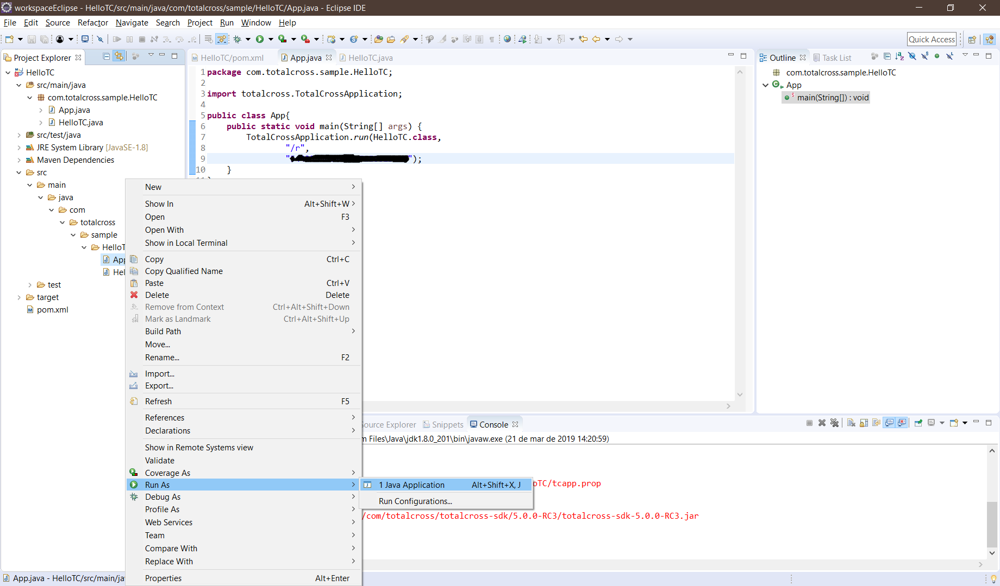

# Hello World App

## About this tutorial

On this tutorial we will create a simple Hello World project, where we will have a label being changed by a button event

The tutorial will be divided into two sections

[Intellij IDE](https://totalcross.gitbook.io/playbook/~/drafts/-La_2CQv07ad2w8y5f3J/primary/learn-totalcross/getting-started/your-first-totalcross-app#intellij-ide) and [Eclipse](https://totalcross.gitbook.io/playbook/~/drafts/-La_2CQv07ad2w8y5f3J/primary/learn-totalcross/getting-started/your-first-totalcross-app#eclipse)

## Intellij IDE

### Create a new project


Click in `Create New Project`, select Maven and click in next


Put this data: `GroupId = com.totalcross.sample` , `ArtifactId = HelloTC` in whitespace and click in next.


In `Project Location` place the directory of your choice, after this, click in finish


#### TotalCross Sources and JavaDocs

In order, to make your development easier, Go to: `Preference > Build, Execution and Deployment > Build Tools > Maven > Importing.` and mark options Automatically Download Sources and Documentation. As shown in the Figure bellow:


Click Ok in the Preferences panel and proceed to the next steps.

### Project

#### Structures

You need to leave the structure of your project the same as the example below.

To add new package you have to right-click in Java package  **select new -&gt; package**

```text
└── src
    └── main
        └── java
            └── com
                └── totalcross
                    └── sample
                        └── HelloTC

```


In the **pom.xml** file, add the following code snippet to the file inside the  **project tag**.

```markup
<properties>
    <maven.compiler.source>1.8</maven.compiler.source>
	<maven.compiler.target>1.8</maven.compiler.target>
</properties>

<dependencies>
	<dependency>
		<groupId>com.totalcross</groupId>
		<artifactId>totalcross-sdk</artifactId>
		<version>5.0.0</version>
	</dependency>
</dependencies>
<repositories>
	<repository>
		<id>totalcross-repo</id>
		<name>ip-172-31-40-140-releases</name>
		<url>http://maven.totalcross.com/artifactory/repo1</url>
	</repository>
</repositories>

```


After this, you need import the pom file changes





Remember the download dependencies may take according to your internet :D


### Creating Classes

To create classes, you have to do right click in package **sample** and select **new -&gt; java class.**


Beware classes begin with the first capital letter


#### Create HelloTC


#### Create HelloTCApplication


### Add Code

#### Class HelloTC

This class will be responsible for mounting the screen.

```java
package com.totalcross.sample.HelloTC;

import totalcross.ui.Button;
import totalcross.ui.Label;
import totalcross.ui.MainWindow;

public class HelloTC extends MainWindow {

    @Override
    public void initUI() {
         Label label = new Label("Hello World");
        add(label,CENTER,TOP + 50);

        Button button = new Button("Click Here");
        button.addPressListener(e->{
            label.setText("Hello Totalcross");
            label.reposition();
        });
        add(button, SAME, CENTER);

    }
}

```

#### Class HelloTCApplication

This class will be responsible for start your project.

```java
package com.totalcross.sample.HelloTC;

import totalcross.TotalCrossApplication;

public class HelloTCApplication {
    public static void main(String[] args) {
        TotalCrossApplication.run(HelloTC.class,
                "/r",
                "PLACE_YOUR_KEY_HERE");
    }
}

```


Be sure the put your TotalCross Key in line 9


### Run Project

To start your application you can righ-click on class HelloTCApplication and click in Run.


Take a look at the section below for more details about the TotalCross Simulator 





## Eclipse 

### Create a new project

Click in **file -&gt; new -&gt; Maven Project**


Just click **Next** 


Select the column `Artifact Id maven-archetype-quickstart` and click in **Next**.


Put this data in `Group id = com.totalcross.sample` and `Artifact id = HelloTC`, after this click in finish.


### Project


In the pom file, add the following code snippet in line 13 replacing the current contents of the file.

```markup
<properties>
    <maven.compiler.source>1.8</maven.compiler.source>
	<maven.compiler.target>1.8</maven.compiler.target>
</properties>

<dependencies>
	<dependency>
		<groupId>com.totalcross</groupId>
		<artifactId>totalcross-sdk</artifactId>
		<version>5.0.0</version>
	</dependency>
</dependencies>
<repositories>
	<repository>
		<id>totalcross-repo</id>
		<name>ip-172-31-40-140-releases</name>
		<url>http://maven.totalcross.com/artifactory/repo1</url>
	</repository>
</repositories>

```


Remember the download dependencies may take according to your internet :D


### Creating Classes

To create classes, you have to do right click in package HelloTC e select **new -&gt; other...**



Beware classes begin with the first capital letter


#### Create HelloTC


### Add Code

#### Class HelloTC

This class will be responsible for mounting the screen.

```java
package com.totalcross.sample.HelloTC;

import totalcross.ui.Button;
import totalcross.ui.Label;
import totalcross.ui.MainWindow;

public class HelloTC extends MainWindow {

    @Override
    public void initUI() {
         Label label = new Label("Hello World");
        add(label,CENTER,TOP + 50);

        Button button = new Button("Click Here");
        button.addPressListener(e->{
            label.setText("Hello Totalcross");
            label.reposition();
        });
        add(button, SAME, CENTER);

    }
}

```

#### Class App

This class will be responsible for start your project.

```java
package com.totalcross.sample.HelloTC;

import totalcross.TotalCrossApplication;

public class App{
    public static void main(String[] args) {
        TotalCrossApplication.run(HelloTC.class,
                "/r",
                "PLACE_YOUR_KEY_HERE");
    }
}

```


Be sure the put your TotalCross Key in line 9


### Run Project

To start your application you can righ-click on **class App** and select **Run as -&gt; 1 Java Application**



